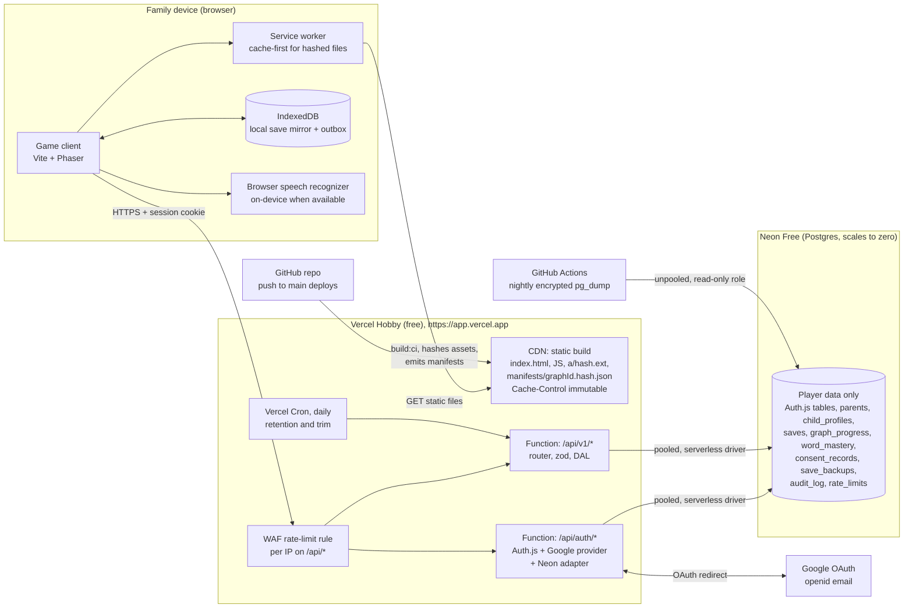
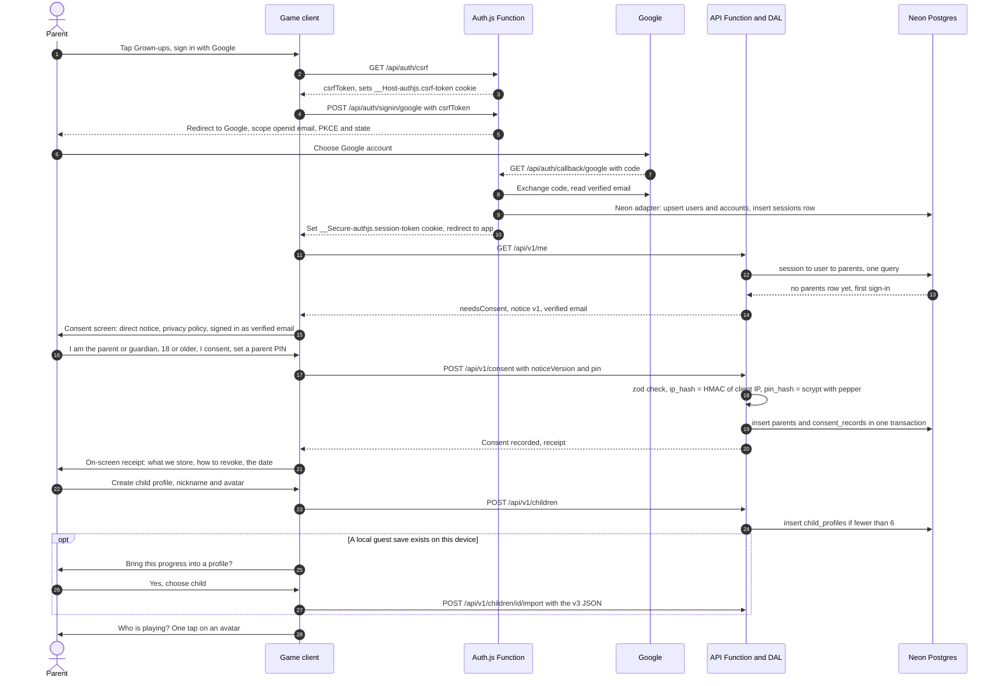
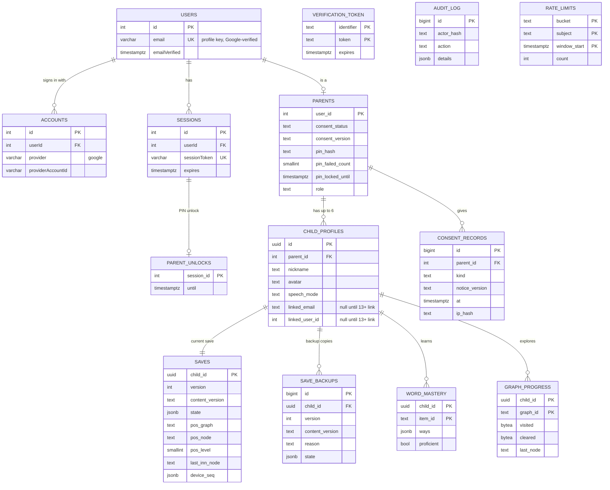
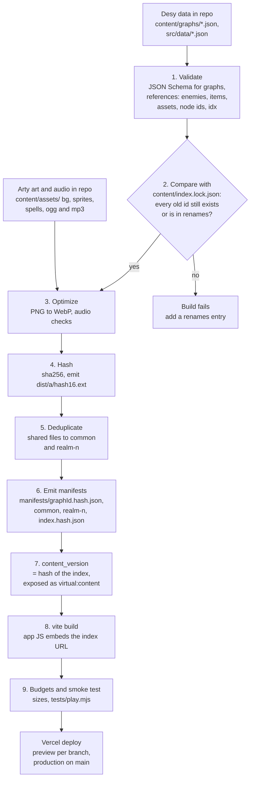
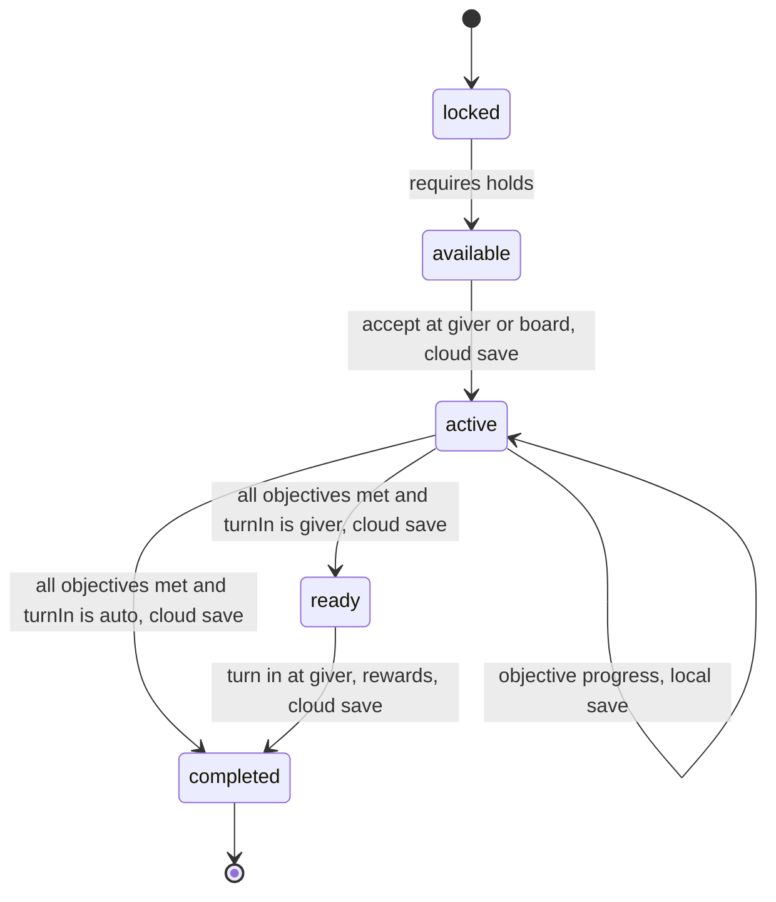

# Architecture proposal: accounts, cloud saves, and a node-graph world

**Status: ✅ APPROVED, and final for this stack.** On 2026-10-02 (PT) Jack approved **Vercel (Hobby) + Neon Postgres (Free) + Auth.js with Google sign-in**. This is revision 3. It folds in Jack's second round of decisions: a **$0 budget**, **static content on the Vercel CDN**, and **no Supabase**. It also adds the dialogue and quest data hooks (§11, design only). **Monetization is deferred until the game is complete** (ads are under "future", §3.4 and §5.9). Nothing here has been built, and no accounts have been created yet.
**Owner:** GameDev. **Graph spec (§6):** a shared proposal. Desy is writing `world-graph.md`, the JSON Schemas, and example data for realm 1 and a 3-level dungeon on top of it.
**Scope:** parent accounts with child profiles, cloud saves, the world as a node graph, and how content and assets ship.

**Revision 3 in one paragraph.** The database now holds **player data only**. Art, music, animation, and the graph and content JSON all ship **as static files with the frontend build** on Vercel's CDN. They get content-hashed names, per-graph manifests, a service worker cache, and `immutable` headers. There are no content tables, no storage bucket, no publish-to-storage job, and no content-pointer endpoint any more. Sign-in is **Google only, through Auth.js**, with **database sessions** in an httpOnly cookie. Without row-level security, per-parent access is enforced by **one data-access layer** in the API. Every piece fits a free tier (Vercel Hobby, Neon Free, a Google OAuth client). §13 shows where those tiers break: **Neon compute hours run out first, at roughly 700–1,000 monthly active players.**

## Contents

1. [Executive summary and decisions](#1-executive-summary-and-decisions)
2. [What exists today (grounded in the code)](#2-what-exists-today-grounded-in-the-code)
3. [Hosting on free tiers](#3-hosting-on-free-tiers)
4. [Architecture diagram](#4-architecture-diagram)
5. [Accounts, Auth.js, COPPA and consent](#5-accounts-authjs-coppa-and-consent)
6. [The world as a node graph (shared proposal with Desy)](#6-the-world-as-a-node-graph-shared-proposal-with-desy)
7. [Database schema and ER diagram (player data only)](#7-database-schema-and-er-diagram-player-data-only)
8. [API, data-access layer and the Neon driver](#8-api-data-access-layer-and-the-neon-driver)
9. [Save and sync strategy](#9-save-and-sync-strategy)
10. [Static content delivery and the build pipeline](#10-static-content-delivery-and-the-build-pipeline)
11. [Dialogue scenes and quest data hooks (design only)](#11-dialogue-scenes-and-quest-data-hooks-design-only)
12. [Migration from localStorage, and guest mode](#12-migration-from-localstorage-and-guest-mode)
13. [Cost: $0, and where the free tiers break](#13-cost-0-and-where-the-free-tiers-break)
14. [Privacy and security notes](#14-privacy-and-security-notes)
15. [Risks](#15-risks)
16. [Phased plan](#16-phased-plan)
17. [What Jack needs to set up](#17-what-jack-needs-to-set-up)
18. [Open questions, and sources](#18-open-questions-and-sources)

---

## 1. Executive summary and decisions

### 1.1 Recommendation

| Layer | Choice | Free tier used |
|---|---|---|
| Frontend + static content | The Vite build on **Vercel Hobby**, at `https://<app>.vercel.app`. All art, audio, animation, graph JSON and content JSON are build output with content-hashed names. | Vercel Hobby |
| API | **Vercel Functions** (Node.js runtime): one Auth.js function plus one routed API function | Vercel Hobby |
| Auth | **Auth.js** (`@auth/core`) with the **Google provider** and **`@auth/neon-adapter`**. **Database sessions** in an httpOnly, Secure, SameSite=Lax cookie. | Free (open source) |
| Database | **Neon Postgres, Free plan** (scale to zero, wakes on the next query), created through the **Vercel Marketplace** integration | Neon Free |
| Access control | No RLS. A **central data-access layer** (`server/dal/`) scopes every query by the session's `parent_id` and checks child ownership on every request. zod validates every input, all SQL is parameterized, and tests prove cross-parent access is denied. | — |
| Rate limiting | **One Vercel WAF rate-limit rule** (included on Hobby) per IP on `/api/*`, plus a **Postgres fixed-window limiter** per parent and per child | Vercel Hobby, Neon Free |
| Email | **None for now.** There's no custom domain, so there's no sending domain. Consent is confirmed on screen (§5.4). | — |

**Cost today: $0 a month.** It stays $0 up to roughly 700–1,000 monthly active players (MAU). Beyond that, the cheapest step is Neon Launch at about $12–20 a month (§13).

### 1.2 Decision log

| # | Decision (Jack) | Date | Where it's applied |
|---|---|---|---|
| D1 | Parent account keyed by the parent's (Google-verified) email. Child profiles sit under it, each with a separate save, items and word mastery, and a one-tap picker. Children need no email. | 2026-10-02 | §5.1, §7 |
| D2 | A child's own email link at 13+ is designed, not built | 2026-10-02 | §5.1.1 |
| D3 | Graph scale: about 15 nodes per graph early, up to about 200 later. Maze-like. One graph per dungeon level, linked by stairs or portals. Towns, villages and inns can sit anywhere. | 2026-10-02 | §6 |
| D4 | **Budget is $0 until ads are integrated.** Every piece must fit a free tier. | 2026-10-02 | §3, §13 |
| D5 | **Art, music and animation never go in the DB or object storage.** They ship as static assets with the frontend on Vercel's CDN. Graph and content JSON is static too, versioned with the build. **The DB holds player data only.** | 2026-10-02 | §7, §10 |
| D6 | **Neon Postgres (Free) + Vercel Functions + Auth.js with Google.** Supabase is removed completely. | 2026-10-02 | §3, §5, §7, §8 |
| D7 | Non-commercial, on **Vercel Hobby**. **Future:** ads would force Vercel Pro or a move to Cloudflare Pages, and kid-directed ads must be **COPPA-compliant contextual ads only**. | 2026-10-02 | §3.4, §5.9 |
| D8 | **No custom domain** at first (`*.vercel.app`), so no email-sending domain and no DNS | 2026-10-02 | §5.4, §17 |
| D9 | **Guest mode is kept** | 2026-10-02 | §12 |
| D10 | **The parent area is behind a PIN** (hashed, with lockout) | 2026-10-02 | §5.5 |
| D11 | **At most 6 children per parent** | 2026-10-02 | §7.2, §8.3 |
| D12 | **Google sign-in only** | 2026-10-02 | §5.2 |
| D13 | **On a save conflict, the save with more progress wins**, and the other is kept as a backup copy | 2026-10-02 | §9.4 |
| D14 | **Legal review is deferred** until the game opens to the public. The COPPA design principles stay. | 2026-10-02 | §5.6 |
| D15 | §6 stays the shared graph proposal. **Graph data is static build content, not DB rows.** Only `graph_progress` (and the position fields on `saves`) live in the DB. | 2026-10-02 | §6, §7 |
| D16 | **Stack approved and final:** Vercel + Neon + Auth.js (Google) | 2026-10-02 | whole doc |
| D17 | **Monetization is deferred until the game is complete.** Ads are future work. | 2026-10-02 | §3.4, §5.9, §16 |
| D18 | Add **dialogue-scene and quest data hooks** (design only). Desy owns story, dialogue and quest data. Arty owns portraits. | 2026-10-02 | §11 |

### 1.3 What changed from revision 2

- **Removed:** Supabase (Auth, Postgres, RLS, Storage, Edge), Resend, the email domain and DNS, the content tables (`content_releases`, `graphs`, `graph_nodes`, `graph_edges`, `graph_events`, `assets`, `graph_assets`), the `content` bucket, the publish-to-storage workflow, `GET /api/v1/content/current`, and `progress_events`.
- **Replaced by:** a build step that emits hashed assets and `manifests/<graphId>.<hash>.json` (§10), a **`content_version` baked into the build** and recorded on every save, so old saves can be migrated (§10.2), Auth.js tables plus a `parents` extension (§7), and a DAL with tests instead of RLS (§8).
- **Renamed:** `save_history` → `save_backups`.
- **Added:** §11, dialogue scenes and quest data hooks (design only, schemas proposed for Desy).

---

## 2. What exists today (grounded in the code)

### 2.1 Save module: `src/engine/state.ts`

- One global `S: SaveState`, stored in `localStorage` under the key **`chinese-rpg-proto-v3`** with `version: 3`. `load()` accepts only version 3 and back-fills `spells` and `quests`. `save()` writes the whole object on every call. `resetAll()` and `replaceState()` exist as well.
- `SaveState` fields: `version`, `consent {given, speech, at}`, `level`, `exp`, `hp`, `mp`, `gold`, `inv` (consumable id → count), `gear[]`, `equip {weapon, armor, shield, charm}`, `skills[]`, `skillsEquipped[]`, `slotsSeen`, `courage`, `lastDefeatLoc`, **`where`** (`'town'` or a location id), **`lastInn {place, node}`**, `practice`, **`locs`** (per location: `unlocked`, `bossDefeated`, `pathCleared`, `previewSeen`, `patrolsLeft`, `approachArmed`, `bossCheckpoint`, `patrolsFought`), **`prog`** (word mastery: item id → `{seen, recentMiss, ways: {rZE, rEZ, sZE, sEZ}}`, where each way is `{c, a, box, last, due, wrongRun, pc?}`), `stats`, `log` (the last 300 answers), `spells[]`, and `quests` (id → `{s: 'active'|'claimed', n, base?, at, done?}`).
- `save()` is called about 40 times across `src/ui/screens.ts`, `src/engine/battle.ts`, `src/engine/quests.ts` and `src/ui/practice.ts`: shop purchases, equipping, battle end, the boss checkpoint, inn rest (`screens.ts`, the inn handler), quest `accept()` and `claim()`, `onKill()`, delivery on arrival (`onArrive()`), the Return Feather, and defeat.
- Audio settings live separately under `chinese-rpg-audio-v1` (`src/audio/audio.ts`). They are device preferences and stay local.
- **Size:** there are 1,051 curriculum items in `desy/core-curriculum.csv`, 268 of them in the build now. A full `prog` record is about 340 bytes per item, so about **360 KB** for the whole curriculum. The rest of the state is under 10 KB. That gap is the reason for the hybrid schema in §7.
- **Debug:** `DEBUG` (`src/ui/dom.ts`) is on for `?debug` **in production too**, and the debug panel can set HP, MP, tier gear, spells, quests, unlocks and cleared paths. This matters for anti-cheat (§9.6).

### 2.2 Content and data loading: `src/data.ts`

- Static JSON imports bundled by Vite: `balance`, `items` (`items` plus `pools` keyed by location), `enemies`, `locations`, `shop` (gear and consumables), `skills`, `spells` (`rules`, `spells`, `falloff`), `quests` (`rules`, `quests`) and `towns`. `src/data/spellfx.json` is imported by `src/phaser/spellfx.ts`, and `src/data/v3.json` (companion, chests, drops, practice, safety nets) is generated alongside them. These are built by `tools/build_data.py` from Desy's `/workspace/desy/data/combat_data.json`, `curriculum_location_pools.csv`, `core-curriculum.csv` and `enemies.json`, plus Arty's sprite manifest.
- Items carry `id` (for example `C001`), `zh`, `trad`, `en`, `enPrimary`, `type`, `pos`, `topic`, `loc` (Desy's pool id, for example `L1.1`), `speaking`, `reading`, `altZh` and `altEn`.
- Today all content ships inside the JS bundle. Shipping content with the build **stays the model** (D5), but split per graph instead of one bundle (§10). Adding a realm means a deploy, which is a `git push`.

### 2.3 World map and locations

- `src/data/locations.json` has 2 locations, `meadow` (tier 1, Desy pool `L1.1`) and `forest` (tier 2, `L2.1`). Each has `roster`, `boss`, `elite`, `packs`, `scripted` (fight number → enemies), `pathFights: 8`, `unlockRequires`, `bossReward`, and **`mapNodes`**: 13 positioned nodes with `kind` set to `inn | fight | gate | boss` (inn, 4 fights, inn, 4 fights, inn, gate, boss).
- `src/data/towns.json` lists 9 towns (`town`, `zh`, `en`, `G`, `realmLocs`, `inBuild`, `hub`, `arriveAt`, `gearSetPrice`). Towns 1–2 are in the build, and both use the `village` hub.
- `worldMap()` in `src/ui/screens.ts` shows location cards, and `locationScreen()` walks a hero token along `mapNodes`. This is already a linear graph, so the node graph generalizes it (§6).

### 2.4 Assets and audio

- `public/` is 31 MB in 148 files: `bg/` (9.8 MB), `sprites/` (6.7 MB, with Arty's `sprites/manifest.json`: 17 sheets with `frameWidth`, `frameHeight`, `origin` and `animations`), `spells/` (4.9 MB: `icons/` plus `fx/manifest.json`), and `audio/` (9.1 MB, `.ogg` and `.mp3` pairs).
- `public/assets-manifest.json` is generated by `tools/sync_assets.py` and has the keys `bg`, `sfx`, `music`, `vo`, `spellIcons` and `spellFx`. Audio entries are `{urls: [ogg, mp3], loopStart, loopEnd, volume}`. `src/assets.ts` reads it, and `src/phaser/view.ts` loads only the files it lists. Background keys follow `bg_battle_<realm slug>[_boss]` and `bg_map_<realm slug>`.
- File names are **not content-hashed**: Vite copies `public/` as-is. On GitHub Pages they're served with a short default cache lifetime that we can't change.

### 2.5 Hosting and consent

- Hosting today is GitHub Pages. `.github/workflows/deploy.yml`: on a push to `main` it runs `npm ci`, then `npm run build:ci` (`tsc && vite build`, which skips the `prebuild` sync scripts because the source art exists only locally), then uploads `dist` to Pages.
- `consentScreen()` (`src/ui/screens.ts`): a parent check (one multiplication question) and a speech checkbox. Its copy says: *"In Chrome the voice audio is sent to Google's speech service… This game does not record or store audio"* and *"Progress is saved only in this browser."* That copy has to change in account mode (§5.8).

---

## 3. Hosting on free tiers

All limits below were checked on **2026-10-02 (PT)** at the cited URLs (§18.3). Free-tier terms change, so check them again before launch.

### 3.1 The stack, and why

- **Vercel Hobby** serves the static build from its CDN and runs the API as Vercel Functions in the same project. One `git push` deploys code and content together. Preview deployments come free with every branch.
- **Neon Free** is plain Postgres that **scales to zero** after 5 minutes idle and wakes on the next query, so an idle game costs nothing. Its serverless driver works over HTTP and WebSockets from Functions (§8.7). The Vercel Marketplace integration creates the database and injects the env vars (§17).
- **Auth.js** is free and open source and has an official Neon adapter. It does Google OAuth, sessions and CSRF for us, and our data stays in our own database.
  - **Maintenance status (checked 2026-10-02):** Auth.js is now maintained by the Better Auth team. It gets security and urgent fixes; the July 2026 security release shipped `@auth/core` 0.41.3. For new projects, Better Auth recommends Better Auth itself. We stay on Auth.js as decided (D6), because its Google + Neon setup is small and documented. **Better Auth** (also free, also Postgres, also Google) is the fallback if Auth.js maintenance stalls (§15). The DAL hides which one is in use.
- **Not used:** Supabase (removed, D6), object storage of any kind (D5), and paid add-ons.

### 3.2 Vercel Hobby limits that matter (per month)

| Resource | Hobby includes | Our use |
|---|---|---|
| Fast Data Transfer (CDN → browser) | **100 GB** | Static art and audio, the biggest cost driver |
| CDN requests | **1,000,000** | Every static file request plus every API request |
| Fast Origin Transfer | 10 GB | Function responses (small JSON) |
| Function invocations | **1,000,000** | API calls |
| Active CPU | **4 hours** | Function CPU time (JSON, zod, hashing) |
| Provisioned memory | 360 GB-hours | Function instance time |
| WAF rate limiting | 1 rate-limit rule per project, fixed window 10 s–10 min, keyed by IP or JA4 | Our per-IP limit on `/api/*` |
| Runtime logs | Kept 1 hour | Enough for debugging, and short retention is a privacy plus |
| Deployments | 100 a day | |
| Over a limit | **No overage billing on Hobby.** Features stop until the 30-day window resets, unless you upgrade. | See §13.3 |
| Use | **Non-commercial only.** Vercel's fair-use page lists "the inclusion of advertisements, including … Google AdSense" as commercial use. Asking for donations isn't. | D7 |

Sources: https://vercel.com/docs/plans/hobby, https://vercel.com/docs/limits, https://vercel.com/docs/limits/fair-use-guidelines, https://vercel.com/pricing, https://vercel.com/docs/vercel-firewall/vercel-waf/rate-limiting (all 2026-10-02).

### 3.3 Neon Free limits that matter

| Resource | Free includes | Notes |
|---|---|---|
| Compute | **100 CU-hours per project per month** | At 0.25 CU that's **400 awake hours**, about 13 hours a day. **This is the first limit we'd hit** (§13.3). |
| Autoscaling | Up to 2 CU | We **cap it at 0.25 CU** so a busy hour can't burn 8× the hours |
| Scale to zero | After **5 minutes** idle. **Can't be disabled on Free.** It wakes "within a few hundred milliseconds" on the next query. | Cold starts, §8.7 |
| Storage | **1 GB per project** | Player data only, about 0.25–0.5 MB per active child (§7.5) |
| Public network transfer (egress) | **5 GB per project per month** | Small JSON responses |
| Branches | 10 per project | Preview and test branches |
| Restore window | **6 hours** of history, 1 manual snapshot, no scheduled backups | So we add our own nightly encrypted backup (§14.4) |
| Over a limit | Running out of CU-hours or egress **suspends compute until next month**. Going over storage makes **writes fail**. No data is deleted. | The game keeps working offline from its local outbox (§9.7) |
| Upgrade | **Launch** plan: pay as you go, $0.106 per CU-hour and $0.35 per GB-month, no minimum | §13.4 |

Sources: https://neon.com/pricing, https://neon.com/docs/introduction/plans, https://neon.com/docs/introduction/scale-to-zero (all 2026-10-02).

### 3.4 Future: if ads come (D7, D17: deferred until the game is complete)

- **Ads make the site commercial**, which Vercel Hobby doesn't allow. The choices then:
  1. **Vercel Pro**: $20 a month per seat (with $20 of usage credit included), 1 TB transfer and 10M CDN requests. Nothing in the architecture changes.
  2. **Cloudflare Pages**: Cloudflare's Pages page says "all plans come with unlimited sites, seats, requests, and bandwidth". The free plan allows 500 builds a month, 20,000 files per site and 25 MiB per file. Pages Functions count against the Workers request quota. Neon's driver and Auth.js both run on Workers, so the move is mostly the function wrapper and the headers file (`_headers`, up to 100 rules). **Confirm Cloudflare's terms allow commercial use on the free plan before relying on it.** Source: https://developers.cloudflare.com/pages/platform/limits/ and https://pages.cloudflare.com/ (2026-10-02).
- **Kid-directed ads must be COPPA-compliant contextual ads only** (§5.9).

### 3.5 GitHub Pages

Today's GitHub Pages deploy keeps working as the guest-only build until the Vercel site is live. After that it becomes a redirect or is taken down (open question, §18.1).

---

## 4. Architecture diagram



- **No audio path** goes anywhere near our servers (§5.7).
- **Static content never touches the database.** The Functions bundle a read-only copy of the content index, used only to validate ids in saves (§8.4).

---

## 5. Accounts, Auth.js, COPPA and consent

### 5.1 Model (D1, D10, D11, D12)

- **One parent account, keyed by the parent's email.** It's created by **Google sign-in** through Auth.js (scope `openid email` only). The Auth.js `users` row is the identity, and `users.email` (the Google-verified address, unique) is the account's profile key. Our own `parents` row extends it one-to-one (§7.2). Internally everything joins on the integer `users.id`, so a changed Google email doesn't orphan anything.
- **Child profiles under it, at most 6** (D11): a `nickname` (with a hint not to use a real name, and a filter that blocks emails, phone numbers and URLs) and an `avatar` (a preset id). **Children need no email and have no login.** Each child has **a separate save, items and word mastery** (its own `saves`, `word_mastery`, `graph_progress` and `save_backups` rows).
- **Switching is one tap**: the profile picker ("Who's playing?") shows each child's avatar and nickname. There's no PIN between children.
- **Parent area** (consent, children, export, delete, speech mode, backups and restore): behind the **parent PIN** (§5.5, D10).
- **Google only** (D12). Parents without a Google account can use guest mode (§12).

#### 5.1.1 Later: linking a child's own email at 13+ (designed, not built)

- Columns that exist from day one but stay **null**: `child_profiles.linked_email text null`, `linked_user_id int null` (FK → `users.id`), `link_status text check in ('none','invited','linked') default 'none'`, `linked_at timestamptz null`. A partial unique index applies `where linked_email is not null`, and a check constraint keeps them null until the feature ships.
- **Upgrade flow (future):** (1) The parent opens the parent area → "My child is 13 or older: give them their own sign-in", and attests to the age. (2) The parent enters the teen's email. We store it with `link_status = 'invited'` and show a link to share (there's no email sending yet, D8). (3) The teen signs in with Google using that email. The API checks the email matches and sets `linked_user_id` and `link_status = 'linked'`. (4) The DAL's ownership check (§8.3) adds "or `linked_user_id` = the session user" for that child only. The save, items and mastery carry over unchanged, because they belong to the child profile and not to the login.
- Open points before building it (§18.1): parent rights after linking, whether the teen can detach, and state teen-privacy laws. **No child email is ever collected before 13**, and nothing here is implemented now.

### 5.2 Auth.js setup and the session choice

**Packages:** `@auth/core`, `@auth/neon-adapter` and `@neondatabase/serverless` (https://authjs.dev/getting-started/adapters/neon). The frontend is a Vite app, not Next.js, so Auth.js runs through `@auth/core`'s `Auth(request, config)` inside one Vercel Function at **`api/auth/[...auth].ts`**, with `basePath: '/api/auth'`. That gives the Google callback **`https://<app>.vercel.app/api/auth/callback/google`**.

```ts
// api/auth/[...auth].ts  (sketch)
import { Auth } from '@auth/core';
import Google from '@auth/core/providers/google';
import NeonAdapter from '@auth/neon-adapter';
import { Pool } from '@neondatabase/serverless';

export default {
  async fetch(request: Request) {
    const pool = new Pool({ connectionString: process.env.DATABASE_URL });   // created per request, per the adapter docs
    try {
      return await Auth(request, {
        basePath: '/api/auth',
        trustHost: true,                         // Vercel sets x-forwarded-host
        secret: process.env.AUTH_SECRET,
        adapter: minimalAccounts(NeonAdapter(pool)),   // wrapper drops Google tokens, see below
        session: { strategy: 'database', maxAge: 30 * 24 * 3600, updateAge: 24 * 3600 },
        providers: [Google({
          clientId: process.env.AUTH_GOOGLE_ID, clientSecret: process.env.AUTH_GOOGLE_SECRET,
          authorization: { params: { scope: 'openid email', prompt: 'select_account' } },
          profile: (p) => ({ id: p.sub, email: p.email, emailVerified: p.email_verified ? new Date() : null, name: null, image: null }),
        })],
        callbacks: { signIn: ({ profile }) => profile?.email_verified === true },  // verified Google emails only
      });
    } finally { await pool.end(); }
  },
};
```

- **Data minimization in Auth.js:** the `profile()` override stores no name and no photo, and `minimalAccounts()` wraps the adapter's `linkAccount` to **null out `access_token`, `refresh_token` and `id_token`**. We never call Google APIs, so we don't keep Google tokens.
- **Database sessions, not JWT (decision proposed here).** The session cookie holds a random token, and the row in `sessions` is the truth.
  - **Why database sessions:** (1) **Instant revocation.** "Sign out everywhere", revoking consent and deleting the account must cut off every device at once. A JWT stays valid until it expires. (2) The adapter already gives us `sessions`. (3) Every API call already touches the database for the save, so the session lookup costs **no extra Neon wake-up**, only one indexed read in the same request.
  - **The cost:** one `sessions` lookup per API request. We fold it into the DAL's first query (§8.3), so it's not a separate round trip.
  - **JWT would only win** on requests that never touch the DB. We have almost none, because static content needs no session at all.
- **Cookie:** `__Secure-authjs.session-token`, **httpOnly, Secure, SameSite=Lax, Path=/**. It lasts 30 days and is extended at most once a day (`updateAge`), so a family tablet stays signed in.
- **CSRF**, in two places:
  1. **Auth.js endpoints** (sign-in, sign-out): Auth.js's built-in **double-submit CSRF token** (the `__Host-authjs.csrf-token` cookie plus the `csrfToken` form field, from `GET /api/auth/csrf`). It's on by default and stays on.
  2. **Our `/api/v1/*` endpoints:** **SameSite=Lax** stops the cookie riding on cross-site POST, PUT and DELETE. On top of that, the router **rejects any state-changing request** whose `Origin` isn't the app's own origin, or whose `Sec-Fetch-Site` is `cross-site`. It requires `Content-Type: application/json`, and every write needs a custom `X-App-Request: 1` header, which makes a cross-site form or `fetch` without CORS impossible. **No CORS headers are ever sent**, so other origins can't read responses. All reads are `GET` with no side effects.

### 5.3 Sign-in sequence, with parental consent at first sign-in



- On later sign-ins, if the notice version has gone up (a material change to the privacy notice), the consent screen shows again and writes a new record.
- **The IP hash** is `HMAC-SHA256(IP_HASH_KEY, client IP)`, computed in the Function from the `x-forwarded-for` header that Vercel sets. **The raw IP is never stored.**
- Until consent is recorded, **no child data can be written**: the DAL refuses every child-scoped call while `parents.consent_status` isn't `granted` or `confirmed` (§8.3).

### 5.4 Confirming consent without email (D8)

There's no custom domain (D8), so there's no sending domain and no transactional email. Consent is confirmed **on screen**:

1. **At first sign-in:** the consent screen shows **the Google-verified email** ("Signed in as j•••@gmail.com, verified by Google"). After the parent consents, an **on-screen receipt** lists what we store, how to export or delete, and how to revoke. It can be printed or saved as a PDF from the browser.
2. **Delayed confirmation, on screen:** the next time the parent opens the parent area **at least 24 hours later**, a one-time screen asks them to confirm: "On <date> you allowed <n> child profiles to save progress. Keep this?" The choices are Confirm or Revoke and delete. Confirming sets `consent_status = 'confirmed'` and writes a `consent_records` row (`kind = 'confirmation'`). This mirrors the "plus" step of email plus without needing email.
3. **The receipt and the full consent history** stay in the parent area for the life of the account.

**Honest caveat:** the COPPA "email plus" method (16 CFR 312.5(b)(2)(viii)) literally expects a confirmatory **email, letter or phone call**. On-screen confirmation is our free stand-in for the private, invite-only stage. Legal review is deferred to public launch (D14), and **before the public launch** we should add one of these:

- **A free option without a domain:** send the confirmation from a dedicated project Gmail account through Gmail SMTP with an app password. Vercel Functions can open SMTP connections on the Node.js runtime. It costs nothing but is subject to consumer Gmail sending caps and deliverability.
- **With a domain** (about $10–15 a year): a transactional email service on its free tier.

### 5.5 Parent PIN (D10)

- **Set at first sign-in** with the consent (4–6 digits). Hash: `scrypt(HMAC-SHA256(PIN_PEPPER, pin), per-parent random salt)` using Node's built-in `crypto.scrypt` (no paid service, and no native module). Only the hash and salt are stored, in `parents.pin_hash`.
- **Lockout:** 5 wrong PINs → locked for 15 minutes. 10 in 24 hours → locked for 1 hour, with an audit row. The counters live on `parents` (`pin_failed_count`, `pin_locked_until`). The check is atomic in one SQL statement, so parallel guesses can't race past it.
- **Unlock lasts 10 minutes** for the current session only (`parent_unlocks`, §7.2). Destructive actions (delete a child, delete the account, revoke consent) ask for the PIN again every time.
- **Forgot the PIN:** sign in with Google again with `prompt=login`. A session less than 5 minutes old may set a new PIN. Google's own login is the recovery factor.
- The PIN is a **gate against children**, not a second factor against attackers. Google sign-in is the real authentication.

### 5.6 COPPA design principles (D14: kept, with legal review deferred)

| Principle | What this design does |
|---|---|
| **Verifiable parental consent (VPC)** | No child profile can store anything on the server until the parent has signed in with Google, read the direct notice and consented (§5.3), followed by the delayed on-screen confirmation (§5.4). The parent's email is collected first only to get consent (312.5(c)(1)). If consent isn't completed within 14 days, the account is deleted. This relies on **not disclosing** children's data: no ads, no sale, no sharing. Vercel, Neon and Google act as service providers. |
| **Data minimization** | Per parent: the Google-verified email, the consent records (IP stored only as a keyed hash), and the PIN hash. **No name or photo from Google, and no Google tokens.** Per child: a nickname, an avatar, game progress and word mastery. No real name, birthday, location, photo, contacts, chat or voice. The answer log (`S.log`) and speech transcripts **stay on the device**. No analytics SDK and no third-party scripts. |
| **Persistent identifiers** | Child ids and session tokens are used **only for internal operations** (saving progress and security). No cross-site tracking, no advertising ids. |
| **Parental review, export and deletion** | The parent area shows each child's progress, a **JSON export**, **delete child** and **delete account**. Deletion is a hard delete (a cascade from `users`). Neon's 6-hour restore window and our 7-day encrypted backups age the data out within 7 days. One audit tombstone stays, holding no personal information. |
| **Revoking consent** | Stops collection right away, deletes the sessions, makes the profiles local-only, and offers deletion. |
| **No ads, no tracking** | None in child surfaces, ever: no ads, behavioural profiling, or marketing. Vercel Web Analytics and Speed Insights stay **off**. If ads ever come, see §5.9. |
| **Retention** (required by the 2025 amended Rule) | A written policy: `save_backups` copies for 30 days, audit rows for 2 years, inactive accounts deleted after 18 months. With no email, the warning is shown in the parent area from month 15 (§18.1). |
| **Security program** (required by the 2025 amended Rule) | §14: the DAL with tests, least-privilege DB roles, 2FA on every vendor account, encrypted backups, and an incident plan. |
| **Schools** | Out of scope. School consent has different rules (`docs/design/research-tech-market.md`). |

*This is an engineering reading of the Rule, not legal advice.* Legal review is deferred to public launch (D14). A safe-harbor program (PRIVO, kidSAFE, iKeepSafe) is worth pricing at that point.

### 5.7 Speech audio: the exact statement

> **The game's servers never receive, store or process audio.** No API endpoint accepts audio, the CSP `connect-src` allows only our own origin, and nothing records the microphone. Speech is turned into text by the **browser's own recognizer**, and the game keeps only whether the answer was right.

- **Today** (`src/engine/speech.ts`, using `SpeechRecognition`/`webkitSpeechRecognition` with default settings): **Chrome may send the audio to Google's speech service**, and Safari sends it to Apple. The current consent screen says so. It's the browser vendor's service, not ours, but it is audio leaving the device.
- **Account mode (proposed):** set `recognition.processLocally = true` and check `SpeechRecognition.available({langs: ['zh-CN','en-US'], processLocally: true})`. If a language pack is missing, offer `SpeechRecognition.install(...)` (Chrome 139+, MDN "processLocally"). With on-device recognition, **audio never leaves the device**.
- **If on-device isn't available** (Safari, older Chrome): speaking questions are **off by default** and the game uses tapping. A parent may turn on *"Use the browser's online speech service (audio goes to Google or Apple, not to us)"* as a **separate, recorded consent** (`consent_records.kind = 'speech_cloud'`). Whether to offer this at all is an open question (§18.1).

### 5.8 Consent-screen copy in account mode

`consentScreen()` stays as it is for **guest mode**. Account mode replaces "Progress is saved only in this browser" with: *"Progress is saved to your family account. We store your email, your children's nicknames and avatars, and game progress. No ads, no tracking, no audio. You can export or delete everything at any time."* The final wording comes with the legal review at public launch.

### 5.9 Future: ads (D7, D17: deferred until the game is complete)

- Ads need **Vercel Pro** or a move to **Cloudflare Pages** (§3.4).
- **Kid-directed ads must be COPPA-compliant contextual ads only**: chosen from the page's content, never from behaviour. No behavioural or retargeting ads, no ad-network cookies or device ids that track across sites, and no third-party tracking pixels. The ad network must support child-directed treatment.
- An ad SDK is a third party on the page, so adding one **changes the privacy posture**: the direct notice, maybe the VPC method (once data could be disclosed, email plus is no longer allowed), and the CSP. **Get the legal review before ads ship.**

---

## 6. The world as a node graph (shared proposal with Desy)

> **Status (D15, 2026-10-02):** this section is the **shared proposal**. Desy is building her world-graph spec on it: `world-graph.md`, JSON Schemas, and example data for realm 1 and a 3-level dungeon. Where her spec differs, hers wins, and this section will point to it.
>
> **Graph data is static build content, not database rows.** Graph files are authored as JSON, validated at build time, and shipped as hashed manifests on the CDN (§10). The database holds **only the player's progress through graphs**: `graph_progress` (the visited and cleared node bitsets, and the last node per graph) plus the position fields on `saves` (current graph and node, dungeon and dungeon level, and the last inn). There are no `graphs`, `graph_nodes`, `graph_edges` or `graph_events` tables.

### 6.1 What exists in Desy's files

On 2026-10-02 (PT) I searched `/workspace/desy/` for `graph`, `node`, `edge`, `event` and `miitopia`. **No graph or event schema drafts exist.** What's there:

- `chinese-rpg-design-memo.md` §1.2 and the Region row: *"Pick a stage on a world map, and the party auto-walks with occasional path/chest choices… At the end of each stage you stop at an inn"*, and *"3–4 short linear stages (Miitopia-style path with 1–2 branch choices)"*.
- `ui-layout-review.md`: *"Put the nodes on the painted path… Place the 13 nodes (inn, 4 fights, inn, 4 fights, inn, patrol gate, boss)… Keep node positions as data per background"*. That's today's `mapNodes`.
- `data/curriculum_locations.csv`: 20 locations, ids `L1.1`…, each with a `realm_no` and a pool.

So **everything below is a draft for Desy** to accept, change or replace. It's written to cover today's `mapNodes`, `scripted`, `unlockRequires`, gate readiness and `bossReward` with nothing lost.

### 6.2 Concepts and scale (confirmed by Jack, 2026-10-02)

- **Scale:** about **15 nodes per graph in the early realms**, growing to about **200 in the final realm**. Graphs are **maze-like**: forks, dead ends, loops, and shortcuts that open later.
- **Hierarchy:** realm → graphs. A graph is one of these kinds:
  - `overworld`: a realm's surface map (or part of it)
  - `dungeon_level`: **one graph per dungeon level**, with `dungeon` (for example `goblin_caves`) and `level` (1, 2, 3…). Levels link through **`stairs`** or **`portal`** edges.
  - `world`: optional. It links the realms' overworlds, if Desy wants a top-level map.
- **Towns, villages and inns are node types that can sit anywhere**, including inside an overworld maze or deep in a dungeon level. An `inn` is a rest and save point and the **respawn point**. A `town` or `village` opens the hub screen (shop, quest board, inn, magic shop).
- **Edges** have a `kind`: `path` (the default, two-way), `oneway`, `stairs` and `portal` (they cross to another graph: `to: {graph, node}`), `shortcut` (locked until opened, for example by a lever or by clearing a node, and then **open for good**), and `exit` (leaves the realm).
- **Stable node index:** every node has an `id` (a readable string) **and** an `idx` (a small integer, 0…n−1). Both are **never reused** once released. `idx` drives the compact bitsets in the save (§6.4).
- **Loading unit = one graph** (one dungeon level or one overworld section), never a whole realm (§10.5).
- **Manifest**: everything a graph needs, as one static JSON file (`manifests/<graphId>.<hash>.json`) holding the graph data plus the hashed asset URLs it uses. Shared assets sit in a `common` or `realm-<n>` manifest and are deduplicated by content hash (§10.3).

Today's `meadow` and `forest` become two small `overworld` graphs (13 nodes each, from `mapNodes`).

### 6.3 Draft schema (JSON, engine-neutral)

```jsonc
// DRAFT FOR DESY: content/graphs/goblin_caves_L2.json in the repo (copied from /workspace/desy/graphs/), static build input
{
  "schema": "graph/0.2",
  "id": "goblin_caves_L2",              // stable forever, because saves reference it
  "kind": "dungeon_level",              // "overworld" | "dungeon_level" | "world"
  "realm": 3, "dungeon": "goblin_caves", "level": 2,
  "title": { "zh": "哥布林洞穴 2层", "en": "Goblin Caves, Level 2" },
  "pool": "L3.2", "recLevel": [12, 14],
  "background": { "map": "bg_map_r3_goblin_caves", "battle": "bg_battle_r3_goblin_caves" },
  "music": { "map": "mus_cave", "battle": "mus_battle_field", "boss": "mus_battle_boss" },
  "unlock": { "all": [ { "bossDefeated": "goblin_caves_L1_boss" } ] },
  "entry": "up1",
  "idxMax": 57,                         // highest idx ever used (retired idx values are never reused)
  "nodes": [
    { "id": "up1",     "idx": 0,  "kind": "stairs_up",   "x": 120, "y": 600 },
    { "id": "n01",     "idx": 1,  "kind": "fight",       "x": 210, "y": 560 },
    { "id": "n02",     "idx": 2,  "kind": "fork",        "x": 300, "y": 520 },
    { "id": "inn_deep","idx": 3,  "kind": "inn",         "x": 380, "y": 470, "save": true },     // inns can sit anywhere
    { "id": "vil_mole","idx": 4,  "kind": "village",     "x": 460, "y": 430, "hub": "mole_village" },
    { "id": "lever3",  "idx": 5,  "kind": "lever",       "x": 520, "y": 610 },
    { "id": "chest7",  "idx": 6,  "kind": "chest",       "x": 560, "y": 380, "table": "chest_t3" },
    { "id": "boss",    "idx": 7,  "kind": "boss",        "x": 900, "y": 160, "fight": { "enemies": ["goblin_chief"] } },
    { "id": "down1",   "idx": 8,  "kind": "stairs_down", "x": 960, "y": 120 }
    // … up to about 200 nodes in the final realm
  ],
  "edges": [
    { "id": "e1", "from": "up1",  "to": "n01" },
    { "id": "e2", "from": "n01",  "to": "n02" },
    { "id": "e3", "from": "n02",  "to": "inn_deep" },
    { "id": "e4", "from": "n02",  "to": "lever3", "label": { "zh": "小路", "en": "Side tunnel" } },
    { "id": "s1", "from": "lever3", "to": "up1", "kind": "shortcut", "opens": { "on": "enter", "node": "lever3" } },
    { "id": "g1", "from": "chest7", "to": "boss", "cond": { "wordsReady": { "pool": "L3.2", "n": 30 } } },
    { "id": "x_up",   "from": "up1",   "kind": "stairs", "to": { "graph": "goblin_caves_L1", "node": "down1" } },
    { "id": "x_down", "from": "down1", "kind": "stairs", "to": { "graph": "goblin_caves_L3", "node": "up1" },
      "cond": { "bossDefeated": "goblin_caves_L2_boss" } }
  ],
  "roster": [ { "enemy": "goblin", "weight": 3 }, { "enemy": "cave_bat", "weight": 2 } ],
  "events": [
    { "id": "ev_intro", "node": "up1", "on": "firstEnter", "do": [ { "dialogue": "dlg_l2_intro" } ] },
    { "id": "ev_boss_reward", "node": "boss", "on": "clear", "once": true,
      "do": [ { "defeatBoss": "goblin_caves_L2_boss" }, { "giveGear": "goblin_buckler" }, { "setFlag": "caves_l2_cleared" } ] }
  ],
  "dialogue": {
    "dlg_l2_intro": [ { "speaker": "xiaolong", "zh": "这里很黑!", "en": "It's dark down here!", "vo": "vo_dlg_l2_intro_1" } ]
  },
  "npcs": { "xiaolong": { "name": { "zh": "小龙", "en": "Little Dragon" }, "sprite": "companion_dragon" } }
}
```

(The enemy, gear and pool ids in this example are placeholders for realm 3. Today's `meadow` converts the same way: 13 nodes with `idx` 0–12, and `scripted` fights become `fight.enemies` on the matching node.)

**Node kinds (draft):** `town`, `village`, `inn` (all three can sit anywhere), `fight`, `elite`, `boss`, `gate` (passable when its outgoing edge's `cond` holds), `chest`, `npc` (dialogue, quest giver), `shop`, `lever` (opens a shortcut), `fork`, `stairs_up`, `stairs_down`, `portal`, `exit`.
**Edge kinds:** `path`, `oneway`, `shortcut`, `stairs`, `portal`, `exit`.
**Triggers:** `enter`, `firstEnter`, `clear` (fight won), `leave`, `rest` (at an inn), `talk` (an NPC node, §11).
**Conditions:** `all` / `any` / `not`, `flag`, `questActive`, `questClaimed`, `bossDefeated`, `wordsReady {pool, n}`, `levelAtLeast`, `hasItem`, `shortcutOpen`.
**Actions:** `dialogue`, `toast`, `fight`, `giveItem`, `giveGear`, `giveSkill`, `giveGold`, `startQuest`, `setFlag`, `openShortcut`, `defeatBoss`, `unlockGraph`, `heal` (inns only, per spec), `teleport`, `scene` (play a dialogue scene, §11.1).

### 6.4 Save state for a graph world

The snapshot (`saves.state`) holds **where the hero is** and the realm-wide facts, and the API copies the position into indexed columns on `saves` (`pos_graph`, `pos_node`, `pos_dungeon`, `pos_level`, `last_inn_graph`, `last_inn_node`). **Per-graph visit and clear sets** live in their own table (`graph_progress`, §7.2), so a 200-node maze doesn't make every save bigger.

```ts
// in saves.state (the snapshot)
pos:       { realm: 3, graph: 'goblin_caves_L2', node: 'n02', dungeon: 'goblin_caves', level: 2 },  // dungeon and level are null on an overworld
lastInn:   { graph: 'goblin_caves_L2', node: 'inn_deep' },   // the respawn point (defeat and Return Feather)
shortcuts: ['goblin_caves_L2:s1'],                           // opened shortcut edges, "graph:edge" (grow-only)
bosses:    ['meadow_boss', 'forest_boss', 'goblin_caves_L1_boss'],  // defeated bosses (grow-only)
flags:     ['caves_l2_intro_seen'], eventsDone: ['goblin_caves_L2:ev_boss_reward'],
graphState:{ 'goblin_caves_L2': { patrolsLeft: 0, approachArmed: true, bossCheckpoint: false } }  // only non-default values

// per graph, in graph_progress (sent as deltas only for graphs that changed)
{ graph: 'goblin_caves_L2', n: 58, visited: 'AAH4…', cleared: 'AAB8…', lastNode: 'n02' }   // base64url bitsets indexed by node idx
```

**Why bitsets, and how compact they are.** A set of `n` nodes is `ceil(n/8)` bytes:

| Nodes in the graph | Bitset (bytes) | base64url (chars) | Both sets (visited + cleared) | The same as an array of ids like `"n047"` |
|---|---|---|---|---|
| 15 (early realm) | 2 | 3 | about 6 bytes | about 100 bytes |
| 200 (final realm) | 25 | 34 | **about 70 bytes** | about 1.4 KB |

- Even a long game (say 20 realms × about 8 graphs = about 160 graphs) is about **11 KB** of bitsets in total, and a single save only sends the one or two graphs that changed.
- Bits are addressed by **`idx`**, which never changes or gets reused. A graph that grows just gets longer bitsets (missing bits read as 0). A removed node's bit is simply ignored.
- Visited, cleared, shortcuts and bosses **only grow**, so they merge across devices with a bitwise **OR** or a set union, with no conflict (§9.4).
- On the server, `graph_progress` also stores `visited_n` and `cleared_n` (popcounts) for parent reports and indexing.
- `S.locs` (today's `LocState`) maps to `graph_progress` (`pathCleared` → the cleared bits) plus `graphState` (the patrol and checkpoint fields). `where` → `pos`, and `lastInn {place, node}` → `lastInn {graph, node}`.

**Rule for Desy:** node ids, `idx` values, edge ids and event ids are **never reused** once released. A rename ships in the build's `content/renames.json` (§10.2), and the build fails if a node id from the previous `content_version` disappears without a rename. Every save records the `content_version` it was made against, so the client can migrate it on load.

### 6.5 Questions for Desy

These are listed in §18.2.

---

## 7. Database schema and ER diagram (player data only)

**The database holds player data only** (D5). Content (graphs, items, enemies, quests, art and audio) is static build output (§10). Text ids for content (`'meadow'`, `'q1_bounty'`, `'C001'`, `'horn_dagger'`) appear in player rows only as references, and they're checked against the build's content index (§8.4).

### 7.1 Normalized or snapshot? A hybrid, and why

| Data | Storage | Reasoning |
|---|---|---|
| Game state: level, EXP, HP, MP, gold, `inv`, `gear`, `equip`, skills, spells, `quests`, `practice`, `pos`, `lastInn`, `shortcuts`, `bosses`, flags, `graphState`, `stats` | **One JSONB snapshot** per child (`saves.state`), with a `version` counter and the `content_version` it was made against | It matches `SaveState` one-to-one, so the client only swaps `save()` for an adapter. It's small (under 10 KB), always read and written whole, and its shape changes often while Desy iterates. |
| Position (graph, node, dungeon, level, last inn) | **Columns on `saves`**, copied out of the snapshot by the DAL | Indexed for ops queries ("who is standing in graph X before a build changes it?") and parent reports |
| Word mastery (`prog`) | **Normalized** `word_mastery`: one row per (child, item), the 4 ways as JSONB | The big part (up to about 360 KB per child) and growing with the curriculum. Saves send only changed words. Parent reports query it. Counters only grow, so **deltas merge** across devices (§9.4). |
| Visited and cleared nodes per graph | **Normalized** `graph_progress`: one row per (child, graph) with two **bitsets** indexed by node `idx` | A save touches 1–2 graphs, so deltas stay tiny. Sets only grow, so they merge with a bitwise OR (§6.4). |
| Quests and inventory | **Inside the snapshot**, exposed as SQL views (`v_quests`, `v_inventory`) through `jsonb_each` | Few rows, changing together with gold in the same write. Views give reports a table shape without dual writes. |
| Older snapshots | `save_backups` | Conflict losers (D13), pre-import copies, and a rolling daily copy. Restored from the parent area. |

**Dropped from revision 2:** `progress_events` (a per-event log). It cost storage on a 1 GB free tier and wasn't needed to rebuild state. Idempotency moved to a per-device sequence on `saves` (§9.2), and security-relevant events go to `audit_log`.

### 7.2 Tables

**Auth.js tables** (exactly the schema `@auth/neon-adapter` expects: SERIAL integer ids and quoted camelCase columns; https://authjs.dev/getting-started/adapters/neon):

| Table | Columns | Notes |
|---|---|---|
| `users` | `id serial PK`, `name varchar(255)`, `email varchar(255)`, `"emailVerified" timestamptz`, `image text` | **The parent identity.** We add `unique index on lower(email)`. `name` and `image` stay null (§5.2). |
| `accounts` | `id serial PK`, `"userId" int not null`, `type`, `provider`, `"providerAccountId"`, `refresh_token`, `access_token`, `expires_at bigint`, `id_token`, `scope`, `session_state`, `token_type` | One row per parent (provider `google`). **The token columns are always null** (`minimalAccounts`, §5.2). We add `unique (provider, "providerAccountId")` and an FK to `users on delete cascade`. |
| `sessions` | `id serial PK`, `"userId" int not null`, `expires timestamptz not null`, `"sessionToken" varchar(255) not null` | Database sessions (§5.2). We add `unique ("sessionToken")`, an index on `"userId"`, and an FK to `users on delete cascade`. |
| `verification_token` | `identifier text`, `expires timestamptz`, `token text`, PK `(identifier, token)` | Required by the adapter but **unused** with Google-only sign-in. Stays empty. |

**Parents and children:**

| Table | Columns | Notes |
|---|---|---|
| `parents` | `user_id int PK FK → users(id) on delete cascade`, `consent_status text check in ('none','granted','confirmed','revoked') default 'none'`, `consent_version text`, `consent_granted_at timestamptz`, `pin_hash text`, `pin_salt bytea`, `pin_failed_count smallint default 0`, `pin_locked_until timestamptz null`, `role text default 'parent' check in ('parent','dev')`, `locale text default 'en'`, `last_active_at timestamptz`, `created_at` | **Maps Auth.js `users` to a parent one-to-one.** The email stays in `users` (the profile key). Created by `POST /api/v1/consent`, so "no `parents` row" means "consent not given". |
| `parent_unlocks` | `session_id int PK FK → sessions(id) on delete cascade`, `until timestamptz` | The 10-minute PIN unlock, per session (§5.5) |
| `child_profiles` | `id uuid PK default gen_random_uuid()`, `parent_id int FK → parents(user_id) on delete cascade`, `nickname text check (char_length between 1 and 16)`, `avatar text`, `speech_mode text check in ('off','on_device','cloud') default 'on_device'`, `sort smallint`, `created_at`, `archived_at null`, **later, 13+ only, always null for now:** `linked_email text null`, `linked_user_id int null FK → users(id)`, `link_status text default 'none'`, `linked_at null` | **At most 6 per parent** (D11): enforced by the DAL's insert (§8.3) **and** a `before insert` trigger as a backstop. Child ids are UUIDs, so they can't be guessed or counted. |
| `consent_records` | `id bigserial`, `parent_id int FK`, `kind text check in ('vpc_onscreen','confirmation','speech_cloud','revocation')`, `notice_version text not null`, `at timestamptz not null`, **`ip_hash text not null`** (HMAC-SHA256 with `IP_HASH_KEY`), `user_agent_family text` (for example `Chrome/macOS`), `auth_provider text default 'google'`, `method_detail jsonb` | Append-only. The proof of consent. Kept for the life of the account, then reduced to a tombstone in `audit_log`. |

**Saves and progress:**

| Table | Columns | Notes |
|---|---|---|
| `saves` | `child_id uuid PK FK → child_profiles on delete cascade`, `version int not null default 0`, `schema smallint not null` (4), **`content_version text not null`**, `state jsonb not null`, `progress_key int[]` (§9.4), `pos_realm smallint`, `pos_graph text`, `pos_node text`, `pos_dungeon text null`, `pos_level smallint null`, `last_inn_graph text`, `last_inn_node text`, `bosses text[]`, `device_seq jsonb default '{}'` (device id → last applied sequence, §9.2), `flags text[] default '{}'`, `updated_at` | One row per child. Written only through the DAL's `saveProgress()`. |
| `graph_progress` | `child_id uuid FK`, `graph_id text`, `node_count smallint`, `visited bytea`, `cleared bytea`, `visited_n smallint`, `cleared_n smallint`, `last_node text`, `first_at`, `updated_at`; **PK (child_id, graph_id)** | The only graph data in the DB (D15). Merged with a bitwise OR. |
| `word_mastery` | `child_id uuid FK`, `item_id text` (for example `'C001'`), `seen bool`, `recent_miss smallint`, `ways jsonb` (`{rZE:{c,a,box,last,due,wrongRun,pc}, …}`), `proficient bool`, `updated_at`; **PK (child_id, item_id)** | `proficient` uses the rule from `proficient()` in `src/engine/learning.ts` (every active way `c ≥ proficientCorrect`, which is 2 today). |
| `save_backups` | `id bigserial`, `child_id uuid FK on delete cascade`, `version int`, `content_version text`, `progress_key int[]`, `state jsonb`, `reason text check in ('conflict_lost','pre_import','pre_restore','daily')`, `from_device text`, `saved_at` | **The "kept as a backup copy" half of D13.** Trimmed daily to the last 10 per child and 30 days. |

**Audit and operations:**

| Table | Columns | Notes |
|---|---|---|
| `audit_log` | `id bigserial`, `at`, `actor_type text` (`parent`, `system`, `admin`), `actor_hash text` (a salted hash of the parent id, using `AUDIT_HASH_SALT`), `child_hash text null`, `action text` (`consent_granted`, `consent_confirmed`, `consent_revoked`, `child_created`, `child_deleted`, `account_deleted`, `export`, `import`, `restore`, `save_flagged`, `pin_locked`, `cross_parent_denied`), `details jsonb` | **No FKs and no raw ids**, so rows survive deletion as tombstones. No email or nickname in `details`. Kept for 2 years. |
| `rate_limits` | `bucket text`, `subject text`, `window_start timestamptz`, `count int`; **PK (bucket, subject, window_start)** | The Postgres fixed-window limiter (§8.5). Rows older than a day are purged by the daily cron. |
| *view* `v_quests` | `child_id, quest_id, s, n, accepted_at, done_at` from `saves.state->'quests'` | Read-only |
| *view* `v_inventory` | `child_id`, `kind` (consumable, gear or spell), `item_id`, `qty`, `equipped_slot` | Read-only |

**Removed from revision 2:** `content_releases`, `graphs`, `graph_nodes`, `graph_edges`, `graph_events`, `assets`, `graph_assets` (all now static, §10), `devices` (sessions cover "sign out other devices"), and `progress_events`.

### 7.3 ER diagram



(`VERIFICATION_TOKEN`, `AUDIT_LOG` and `RATE_LIMITS` stand alone on purpose. The first is unused with Google-only sign-in, and the other two have no foreign keys, so audit rows survive deletions as tombstones.)

### 7.4 Indexing

| Table | Index | Serves |
|---|---|---|
| `users` | `unique (lower(email))` | Sign-in lookup, the profile key |
| `accounts` | `unique (provider, "providerAccountId")`; `("userId")` | The adapter's `getUserByAccount`, the cascade |
| `sessions` | `unique ("sessionToken")`; `("userId")` | **Every API request** (the session lookup, §8.3), "sign out everywhere" |
| `child_profiles` | `(parent_id)`; `unique (linked_email) where linked_email is not null` | The picker, the ownership check, the future teen link |
| `saves` | PK `(child_id)`; `(pos_graph)`; `(content_version)` | Load and save. Ops: who is in graph X, and who is still on an old content version |
| `graph_progress` | PK `(child_id, graph_id)` | Load all of a child's graphs in one scan, and save-time upserts |
| `word_mastery` | PK `(child_id, item_id)`; `(child_id) where proficient` | Load, upserts, the "words proficient" count |
| `save_backups` | `(child_id, saved_at desc)` | Restore and the daily trim |
| `consent_records` | `(parent_id, at desc)` | The current consent and its version |
| `audit_log` | `(at)` | Retention purge |
| `rate_limits` | PK `(bucket, subject, window_start)` | Fixed-window counters |

### 7.5 Storage estimate (Neon Free has 1 GB)

| Per active child | Size |
|---|---|
| `saves` row (snapshot under 10 KB, plus columns and TOAST) | about 12 KB |
| `word_mastery` (about 250 bytes per row with index; 100 words in the first months, up to 1,051) | about 25 KB, growing to about 260 KB |
| `graph_progress` (≤ about 160 graphs, under 100 bytes each) | ≤ about 16 KB |
| `save_backups` (≤ 10 copies of about 10 KB) | ≤ about 100 KB |
| **Total** | **about 0.15 MB early, about 0.4 MB for a child deep in the curriculum** |

Per parent, the Auth.js rows, the `parents` row and consent records add about 2 KB. **1,000 active children fit in about 150–400 MB.** The 1 GB limit is reached somewhere around **2,500–6,000 children**, depending on how far they've played (§13.3).

---

## 8. API, data-access layer and the Neon driver

### 8.1 Layout: two Functions

Each Vercel Function is one file under `api/`. To stay well inside Hobby limits and keep cold starts rare, there are **just two**:

```
api/auth/[...auth].ts     # Auth.js (§5.2): /api/auth/signin/google, /callback/google, /signout, /session, /csrf
api/v1/[...route].ts      # our router: every /api/v1/* endpoint
server/
  http.ts                 # origin, Sec-Fetch-Site, content-type and X-App-Request checks; JSON errors; no CORS
  session.ts              # reads __Secure-authjs.session-token → ctx { userId, parentId, sessionId, role, consent }
  schemas.ts              # zod schemas, shared with the client as types
  db.ts                   # the ONLY file that imports @neondatabase/serverless
  dal/                    # the ONLY place SQL is written
    parents.ts children.ts saves.ts mastery.ts graphs.ts backups.ts consent.ts audit.ts rateLimit.ts
  content-index.json      # copied from the build: valid ids for items, gear, skills, spells, quests, graphs, nodes
```

### 8.2 Endpoints

All are JSON. **Every `:childId` is checked against the session's parent on every request** (§8.3). 🔒 = needs the parent PIN unlock (§5.5).

| Method and path | Purpose |
|---|---|
| `GET /api/v1/me` | Parent status (`needsConsent`, `needsConfirmation`, notice version, verified email), and the children list (id, nickname, avatar, last played) |
| `POST /api/v1/consent` | `{noticeVersion, pin}` → creates `parents`, writes `consent_records` (`vpc_onscreen`), sets the PIN hash |
| `POST /api/v1/consent/confirm` 🔒 | The delayed on-screen confirmation (§5.4) |
| `POST /api/v1/consent/revoke` 🔒 | Revokes, deletes sessions, offers deletion |
| `POST /api/v1/parent/unlock` | `{pin}` → `parent_unlocks` for 10 minutes, or 423 Locked |
| `POST /api/v1/parent/pin` | Change the PIN (🔒), or reset it with a session under 5 minutes old (§5.5) |
| `POST /api/v1/children` 🔒 | `{nickname, avatar}` → a new profile, **409 at 6** |
| `PATCH /api/v1/children/:childId` 🔒 | Nickname, avatar, speech mode, order |
| `DELETE /api/v1/children/:childId` 🔒 | Hard delete (cascade) plus an audit tombstone |
| `GET /api/v1/children/:childId/save` | Snapshot, version, `content_version`, all `graph_progress` rows, all `word_mastery` rows |
| `PUT /api/v1/children/:childId/save` | `{baseVersion, deviceId, seq, contentVersion, state?, mastery[], graphs[]}` → `{ok, version}` or `{conflict, winner, server}` (§9) |
| `POST /api/v1/children/:childId/import` | The raw v3 guest JSON → converted server-side (§12) |
| `GET /api/v1/children/:childId/backups` 🔒 | List `save_backups` |
| `POST /api/v1/children/:childId/restore` 🔒 | `{backupId}` → the current save goes to `save_backups` (`pre_restore`) first |
| `GET /api/v1/export` 🔒 | Everything for the account as JSON (COPPA review) |
| `DELETE /api/v1/account` 🔒 | `{confirm: "DELETE"}` → deletes the `users` row (everything cascades), signs out |
| `GET /api/v1/cron/daily` | Vercel Cron with `Authorization: Bearer CRON_SECRET` → retention, trims, rate-limit purge |

### 8.3 The data-access layer replaces RLS

There's no row-level security in this design, so the API is the only gate. The rules:

1. **No SQL outside `server/dal/`.** Only `server/db.ts` imports the Neon driver, and an ESLint `no-restricted-imports` rule fails CI if anything else does. Handlers call typed DAL functions and never see a connection.
2. **Every DAL function takes `ctx` first** (`{ parentId, sessionId, ... }`, built only by `server/session.ts` from the session cookie). **There's no DAL function that takes a `parentId` from the request.** A handler can't scope a query to someone else, even by mistake.
3. **Every child-scoped query joins on ownership** in the same statement, so the check can't be skipped or raced:

   ```ts
   // server/dal/saves.ts (sketch)
   export async function loadSave(ctx: Ctx, childId: string) {
     const rows = await sql`
       select s.* from saves s
       join child_profiles c on c.id = s.child_id
       where s.child_id = ${childId} and c.parent_id = ${ctx.parentId} and c.archived_at is null`;
     if (rows.length === 0) throw new NotFound();      // also when the child exists but belongs to another parent
     return rows[0];
   }
   ```

   Writes use the same `where ... and c.parent_id = ${ctx.parentId}` pattern, or an `insert ... select ... from child_profiles where id = $1 and parent_id = $2`. Zero rows affected means **404**.
4. **404, never 403**, for another parent's child, so ids can't be probed. Every such denial writes an `audit_log` row (`cross_parent_denied`) so probing shows up.
5. **Consent gate:** child-scoped DAL functions also require `ctx.consent in ('granted','confirmed')`, which comes from the same session query.
6. **The session lookup is the DAL's first query**, and it returns the whole `ctx` in one round trip:

   ```sql
   select u.id as user_id, p.user_id as parent_id, p.consent_status, p.role, s.id as session_id,
          (pu.until > now()) as unlocked
   from sessions s join users u on u.id = s."userId"
   left join parents p on p.user_id = u.id
   left join parent_unlocks pu on pu.session_id = s.id
   where s."sessionToken" = $1 and s.expires > now()
   ```

7. **The 6-children limit** is one statement: `insert into child_profiles (...) select ... where (select count(*) from child_profiles where parent_id = $1 and archived_at is null) < 6`, plus the trigger backstop.
8. **The DB role** used by the Functions owns no schema and can't `drop` or `alter`. Migrations run with a separate owner role over `DATABASE_URL_UNPOOLED` from CI or Jack's machine.

### 8.4 Input validation and parameterized queries

- **zod on every request body, path and query param**, before the DAL is called. For example: `childId: z.string().uuid()`, `nickname: z.string().min(1).max(16).refine(noContactInfo)`, `pin: z.string().regex(/^\d{4,6}$/)`. The save body has strict schemas for `state` (version 4), `mastery[]` (≤ 300 items, `dc ≤ da`), and `graphs[]` (base64url bitsets ≤ 64 bytes). There's a **body size cap of 256 KB** (the import allows 1 MB). Unknown keys are rejected (`.strict()`).
- **Ids are checked against `content-index.json`** from the same build: items, gear, skills, spells, quests, graph ids, and node ids per graph. An unknown id is a plausibility **flag**, not a rejection (§9.6), so a save from a newer build is never lost.
- **Parameterized queries only:** the Neon driver's `` sql`...${value}` `` tagged template sends values as parameters, never as concatenated strings. `sql.unsafe` and string building are banned by lint.

### 8.5 Rate limiting at no cost

| Layer | Rule | Why |
|---|---|---|
| **Vercel WAF rate-limit rule** (Hobby includes 1 rule per project) | `/api/*`, keyed by IP, **300 requests per 60 s**, then 429 | Stops floods **before** a Function runs or Neon wakes. It costs nothing on Hobby. |
| **Postgres fixed window** (`rate_limits`) | Per parent: 60 saves a minute and 600 an hour. Per parent: 10 PIN tries an hour (on top of the lockout). Per parent: 5 imports a day, 10 exports a day. Per IP hash: 20 consents a day. | Per-account limits the WAF can't key on. It's one `insert ... on conflict do update set count = count + 1 returning count` in the same transaction as the write, so it adds no round trip. |

The client's own triggers (§9.1) produce far fewer requests than these limits, so a child playing normally never hits one.

### 8.6 Tests (CI, free on GitHub Actions)

- **Cross-parent denial suite** (`tests/api/cross-parent.test.ts`): create parents A and B, each with a child. With **B's session**, call **every endpoint that takes a `:childId`** with A's child id: load, save, import, backups, restore, patch, delete, and export. Each must return **404**, change nothing in A's rows (checked by a row hash before and after), and write a `cross_parent_denied` audit row. A test enumerates the router table and **fails if a new child-scoped route has no denial test**.
- Also tested: no session → 401. Consent missing → 403 on child routes. The 7th child → 409. A wrong PIN 5 times → 423. A cross-origin `Origin` or a missing `X-App-Request` → 403. Oversized or unknown-key bodies → 400. Expired sessions → 401.
- **Where they run:** a GitHub Actions `postgres` service container with the same migrations. The DAL takes a `Queryable` interface, so tests use `pg` locally and the Neon driver in production. Optionally a Neon branch per PR (10 branches are free).

### 8.7 Neon: the serverless driver, pooling and cold starts

**Driver** (`@neondatabase/serverless`, https://neon.com/docs/serverless/serverless-driver):

- **`neon()` over HTTP** for the API: each query is one HTTPS request, with no connection to open or leak. **`sql.transaction([...])`** sends several statements as one non-interactive transaction in **one round trip**, which is what `saveProgress()` uses (the rate-limit bump, the version-checked upsert, the mastery and graph upserts, and the backup insert). The conflict branch is done in SQL (`case`/CTEs), so it needs no second round trip.
- **`Pool` over WebSockets** only where an interactive session is required: the Auth.js adapter. Per the adapter docs, the Pool is **created inside the request handler and closed** (`pool.end()`) before it returns.

**Pooling:** the Vercel integration sets `DATABASE_URL` to Neon's **pooled** endpoint (the `-pooler` host, PgBouncer in transaction mode), which the Functions use. `DATABASE_URL_UNPOOLED` is the direct endpoint, used **only for migrations** and the nightly backup. Serverless instances come and go, so the pooler protects Postgres's connection limit.

**Cold starts:** two can stack.

| Cold start | Typical | Mitigation |
|---|---|---|
| Neon compute waking from zero (after 5 minutes idle, which can't be changed on Free) | "within a few hundred milliseconds" (Neon docs) | Cloud saves are **background** (§9). The game never waits for them. |
| A Vercel Function instance starting | a few hundred ms | Two small Functions, bundled with few dependencies, Node.js runtime |

- **On first launch of the day**, `GET /me` and `GET /save` may take about 1 second. The client shows the local mirror right away (from IndexedDB) with a small "syncing" cloud icon, then reconciles (§9.5).
- **Timeouts and retries:** the client times out at 10 s and retries with backoff (§9.2). The DAL retries **once** on a connection error, never on a constraint error.
- **No keep-alive pinging.** Pinging Neon to keep it awake would burn the 100 CU-hours (§13.3).

---

## 9. Save and sync strategy

### 9.1 Two layers

1. **Local (every `save()` call, as today):** the current ~40 `save()` calls keep writing the local mirror right away. In account mode the mirror moves from `localStorage` to IndexedDB, keyed by child id. That keeps the game crash-safe and offline-safe.
2. **Cloud (on triggers):** a `SaveSync` module (new, `src/net/sync.ts`) marks the state dirty and **pushes only on the required triggers**:

| Trigger | Where it fires today | Push |
|---|---|---|
| **Quest given** | `accept()` in `src/engine/quests.ts` | Right away |
| **Quest completed** | `claim()` and the delivery inside `onArrive()` | Right away |
| **Graph node change** | the hero token's `walk()` / entering a node in `locationScreen()`, plus `enterLocation`, `worldMap` and `town()`, and later the graph runtime's `enterNode()` | Debounced by 20 s, so a run of node steps through a maze becomes one push |
| **Graph change** (stairs, portal, exit, a new dungeon level) | the graph runtime's `enterGraph()` | Right away, so the new `pos` (realm, graph, level) and the old graph's bitsets are safe before the next bundle loads |
| **Shortcut opened, boss defeated** | `openShortcut` and `defeatBoss` actions | Right away |
| **Inn** | the inn rest handler (`screens.ts`, "HP and MP restored"), the Return Feather, waking after a defeat (`applyDefeat()`) | Right away |
| **Safety flushes** | `visibilitychange → hidden`, `pagehide`, every 3 minutes while dirty, and on reconnect (`online`) | `fetch(..., {keepalive: true, credentials: 'same-origin'})` with the `X-App-Request` header. `sendBeacon` is ruled out because it can't set that header (§5.2). |

Shop purchases, equipping and battle results are saved locally right away and reach the cloud with the next trigger. The worst case if a device is lost mid-session is about one node's worth of progress.

### 9.2 Offline queue (outbox)

IndexedDB store `outbox/<childId>`:

- `pendingState`: **only the latest snapshot** (each new one replaces the old, since snapshots coalesce).
- `pendingMastery`: per (item, way) **summed deltas** (`da`, `dc`) plus the newest `box`, `due`, `last` and `wrongRun`.
- `pendingGraphs`: per graph, the visited and cleared bitsets (already OR-merged locally) and `lastNode`.
- `baseVersion`: the last version the server acknowledged, and `seq`: a per-device counter that goes up by 1 per flush.

A flush sends one `PUT /api/v1/children/:childId/save` with all of it, plus `deviceId`, `seq` and the build's `contentVersion`. On `ok` it clears what was sent. On a network error, a 5xx or a 429, it keeps everything and retries with exponential backoff (1 s → 2 s → … capped at 60 s). **Retries are idempotent:** `saves.device_seq` records the last `seq` applied per device, and a repeat `seq` returns the stored result without re-adding mastery deltas. The UI shows a small cloud icon: ☁️✓ synced, ☁️… pending, ☁️✗ offline with the number of saves waiting. It never blocks play.

Ask for durable storage once with `navigator.storage.persist()`. Safari can still evict script-writable storage after 7 days without a visit (§15), so flush as soon as the device is online.

**Cost-aware batching.** Each flush wakes Neon if it's asleep, and Neon then stays up for 5 minutes (§13.3). So node steps are debounced, the safety flush runs every 3 minutes rather than every minute, and a flush carries everything pending in one request.

### 9.3 Conflict detection: a version counter

`saves.version` goes up by 1 on each accepted snapshot. The client sends `baseVersion`. If it equals the server's version, the snapshot is accepted. If the server's is higher, another device saved in between, which is a **conflict**.

**Why a version counter rather than plain last-writer-wins on timestamps:** device clocks on family tablets are often wrong, and a tablet that was offline for a day would otherwise overwrite newer progress just because it synced later. A counter makes conflicts *visible*, and they're rare, because one child plays on one device at a time.

### 9.4 Conflict resolution

1. **Word mastery never conflicts.** The server applies deltas: `a += da`, `c += dc` (capped at the rules' maximum), and `box`, `due`, `last` and `wrongRun` come from whichever side has the newer `last`. Learning on both devices is kept.
2. **Graph progress never conflicts.** The visited and cleared bitsets are merged with a bitwise **OR**, and `shortcuts` and `bosses` with a set union. They only ever grow.
3. **Snapshot: the save with more progress wins, and the other is kept as a backup copy** (D13). The server compares a monotonic **progress key**, stored as `saves.progress_key int[]`: `[bosses defeated, quests claimed, level, exp, nodes cleared, battles]`, compared in that order.
   - If the incoming key is greater, the incoming snapshot is accepted, and the server copy goes to `save_backups` with `reason = 'conflict_lost'`.
   - Otherwise the server keeps its copy, **stores the incoming snapshot in `save_backups` (`conflict_lost`) in the same transaction**, and returns `conflict: true` with the server copy. The client adopts it and shows a toast: *"Your adventure from another device was loaded."*
   - A tie on the key goes to the server copy (it was saved first).
   - The parent area can restore any backup (`POST .../restore`, 🔒).
4. Gold and potions from the losing branch are lost unless a parent restores them. That's acceptable for a single-player kids' game and much simpler than merging inventories field by field.

### 9.5 Load on start

Sign-in → "Who's playing?" → the local mirror shows right away, and `GET .../save` runs in the background. If the outbox has unsent changes, they're pushed first (the normal conflict rules apply). Otherwise the server copy is taken if it's newer. **Before the engine sees any state**, two migrations run on the client: the `schema` step (3 → 4, §12), and the **content step**: if `save.content_version` differs from the build's, apply `content/renames.json` entries from that version to this one (renamed node, item and quest ids), and drop references to removed content with a logged note (§10.2).

### 9.6 Anti-cheat, at the level that matters

There are no leaderboards, no trading, no PvP and no real-money items, so cheating hurts only the cheater and **the accuracy of the parent's progress report**. Goal: keep data plausible, never punish a child.

- **Plausibility checks in `save_progress()`** (they **flag**, they don't reject):
  - `level` and `exp` match the `expToNext(L) = B.hero.expToNextPerLevel × L` curve
  - gold gained per save ≤ a bound from battles and quests since the last save (the gold tables in `docs/data/combat/economy_prices.csv`)
  - every id in `inv`, `gear`, `spells` and `skills` exists in the build's content index, and equipped items are owned
  - a quest is `claimed` only once, and only if it was `active` in the previous snapshot or the same save
  - per save, `da` ≤ 300 and `dc ≤ da` for word mastery
  - `pos.node` exists in `pos.graph` in the content index
- Flagged saves get `saves.flags` plus an `audit_log` row (`save_flagged`). Parent reports show *"some numbers look edited"* instead of hiding the data.
- **Debug panel:** in account mode, `?debug` stays available only for accounts with `parents.role = 'dev'`. Saves made with debug on carry `state.debug = true` and are left out of the parent's reports.
- **Rate limits** (§8.5) stop scripted spam.
- If real-money unlocks or leaderboards ever arrive, move rewards server-side (the server computes battle rewards). That isn't needed now.

### 9.7 When the free tier runs out: degraded mode

If Neon's monthly compute hours or egress run out, Neon **suspends compute until the next month** (§3.3), and every save returns a 5xx.

- The client treats that exactly like being offline: **play continues**, progress stays in the IndexedDB mirror and outbox, and the cloud icon shows ☁️✗ with *"Cloud saving is paused. Your progress is safe on this device."*
- The API answers `503` with `Retry-After` without trying the DB again for 60 s per instance, to avoid pointless retries.
- When compute resumes, outboxes flush and the normal merge rules apply. Nothing is lost unless a device is wiped while paused.
- Jack gets warning long before this happens: check the Neon usage page weekly, and upgrade to Launch when a month passes 70 CU-hours by day 20 (§13.4).

---

## 10. Static content delivery and the build pipeline

**Decision D5:** art, music, animation, and the graph and content JSON ship **as static files with the frontend build**, served from Vercel's CDN. Nothing content-related is in the database or in object storage. A content change is a commit plus a deploy.

### 10.1 Build output layout (`dist/`, served by Vercel)

```
dist/
  index.html                               # app shell, Cache-Control no-cache
  sw.js                                    # service worker, no-cache
  assets/index-<vitehash>.js               # Vite's own hashed JS and CSS (immutable). The content index URL is baked in here.
  manifests/index.<hash>.json              # content index: content_version, graphs, adj, sizes, renames (immutable)
  manifests/common.<hash>.json             # always loaded: balance, items index, skills, shop, towns, UI sfx, hero sprite, shared music
  manifests/realm-1.<hash>.json            # shared by 2+ graphs of realm 1: enemy sprites, realm music, tilesets
  manifests/meadow.<hash>.json             # one per graph: graph data + the hashed URLs of its own assets
  manifests/goblin_caves_L1.<hash>.json    # one per dungeon level
  a/3f9c11ab52e0d1c4.webp                  # every binary, named by the first 16 hex chars of its sha256 (immutable)
  a/90bd77aa1c3e5f02.ogg
```

**Sources in the repo** (moved out of `public/`, so Vite no longer copies them unhashed): `content/graphs/*.json` (Desy's graph files, §6), `src/data/*.json` (built by `tools/build_data.py` as today), and `content/assets/{bg,sprites,spells,audio}/` (today's `public/` tree, with Arty's manifests). `public/` keeps only files that must have fixed names (favicon, `sw.js` source).

### 10.2 `content_version`, and how saves migrate

- **`content_version`** = the first 8 hex chars of the sha256 of the content index. It **changes only when content changes**, not on every code deploy.
- It's baked into the client (`import { contentVersion, indexUrl } from 'virtual:content'`), so the client never needs a "current release" endpoint. The HTML points to the JS, and the JS points to the index.
- **Every save records it** (`saves.content_version` and `save_backups.content_version`), so the client knows which content a save was made against.
- **`content/renames.json`** is an append-only list: `{ "from": "a1b2c3d4", "graph": "meadow", "nodes": { "f_old3": "f3" }, "items": {}, "quests": {} }`. On load, the client applies every entry between the save's version and the build's (§9.5).
- **The build fails** if any node id, item id or quest id present in the previous build's index disappears without a `renames` entry. CI keeps the previous index in the repo (`content/index.lock.json`) to compare against, so **no save is ever orphaned**.

### 10.3 The per-graph manifest

`manifests/<graphId>.<hash>.json` holds **everything a graph needs**: the graph (nodes, edges, events, §6.3), the **enemies** it uses, **NPCs**, **dialogue**, the **spells** sold there, its **quests**, its **word pool** (the items whose `loc` is in the graph's pool, plus distractors), and its **assets** as hashed URLs.

```jsonc
{
  "schema": "graph-manifest/1", "graph": "meadow", "contentVersion": "a1b2c3d4",
  "needs": ["common", "realm-1"],
  "data": { "graph": { … }, "enemies": { "rabbit": { … }, "rabbitking": { … } }, "npcs": { … }, "dialogue": { … },
            "words": { "pool": ["C001", "C002"], "items": { "C001": { "zh": "你好", "trad": "你好", "en": "hello", "altEn": ["hi"], "speaking": true, "reading": true } } },
            "spells": ["small_fireball"], "quests": ["q1_bounty"] },
  "assets": {
    "bg_map_r1_starter_meadow":    { "url": "/a/1b2c3d4e5f6a7b8c.webp", "bytes": 640000, "preload": true },
    "bg_battle_r1_starter_meadow": { "url": "/a/3f9c11ab52e0d1c4.webp", "bytes": 702000, "preload": true },
    "sprite:rabbit": { "url": "/a/77aa10b2c3d4e5f6.png", "frameWidth": 256, "frameHeight": 256, "origin": { "x": 0.5, "y": 0.92 },
                       "animations": { "idle": { "start": 0, "end": 1, "frameRate": 3, "repeat": -1 } } },
    "mus_battle_field": { "urls": ["/a/90bd77aa1c3e5f02.ogg", "/a/5e4f0a1b2c3d4e9a.mp3"], "loopStart": 0, "loopEnd": 54.857143, "volume": 0.5 }
  }
}
```

- **Deduplication by content hash:** every file is emitted once as `a/<hash>`, however many graphs use it, and the browser and service-worker caches key on that URL. A file used by 2+ graphs of one realm moves to `realm-<n>`, and one used in 2+ realms moves to `common`.
- The `assets` block **merges today's three manifests** (`public/assets-manifest.json`, `public/sprites/manifest.json`, `public/spells/fx/manifest.json`), keeping the same keys, so `src/assets.ts` and the Phaser loader in `src/phaser/view.ts` keep their lookup-by-key code. Only the URL becomes hashed.
- **The content index** (`manifests/index.<hash>.json`) lists each graph's manifest path, `realm`, `kind`, `dungeon`, `level`, `nodes`, `bytes`, `assetBytes` and **`adj`** (the graphs linked by stairs, portals or exits). That's about 200 bytes per graph, so about 32 KB raw (8 KB gzip) for about 160 graphs. If it grows past about 100 KB, split it per realm.

### 10.4 Cache headers (`vercel.json`)

```json
{
  "headers": [
    { "source": "/a/(.*)",         "headers": [{ "key": "Cache-Control", "value": "public, max-age=31536000, immutable" }] },
    { "source": "/manifests/(.*)", "headers": [{ "key": "Cache-Control", "value": "public, max-age=31536000, immutable" }] },
    { "source": "/assets/(.*)",    "headers": [{ "key": "Cache-Control", "value": "public, max-age=31536000, immutable" }] },
    { "source": "/sw.js",          "headers": [{ "key": "Cache-Control", "value": "no-cache" }, { "key": "Service-Worker-Allowed", "value": "/" }] },
    { "source": "/",               "headers": [{ "key": "Cache-Control", "value": "no-cache" }] }
  ]
}
```

Hashed names change whenever the bytes change, so `immutable` is safe: a browser never revalidates them. Only `index.html` and `sw.js` are revalidated (`no-cache` with the ETag Vercel adds). The CSP and other security headers go in the same file (§14.3).

### 10.5 Loading, preloading and offline

- **Load one graph at a time:** the current overworld section or **the current dungeon level**, never a whole realm. Entering a graph needs `common` (cached once) + `realm-<n>` (once per realm) + the graph manifest + its `preload: true` assets.
- **Preload neighbouring graphs:** on entering a graph, fetch the **manifest JSON** of every graph in its `adj` list right away (about 25 KB gzip each). When the hero is **within 2 hops** of a stairs, portal or exit node (a BFS over at most 200 nodes takes microseconds), prefetch that neighbour's `preload: true` assets with `requestIdleCallback` and `fetch(..., {priority: 'low'})`, for at most 3 neighbours at a time. The rest stream in on entry behind a short "the stairs creak…" transition.
- **Service worker** (`sw.js`, Workbox or hand-written):
  - **Precache** the app shell (Vite output), the fonts, the content index and `common`.
  - **Cache-first** for `/a/*`, `/manifests/*` and `/assets/*`, since they're immutable.
  - Keep **every graph visited in the current realm, plus its neighbours**. Evict the least recently used once the cache passes about 150 MB (`navigator.storage.estimate()`), and drop files no longer referenced by the current index.
- **Offline start:** the app shell comes from the SW, and the save from IndexedDB. Any graph already cached is fully playable. The world map marks uncached graphs as *"Needs internet to download"*.
- **Budgets** (the build fails above them): a graph manifest at most 200 KB raw (about 100–150 KB at 200 nodes, 25–40 KB gzip), and at most 10 MB of binaries per graph beyond `common` and `realm`. Converting backgrounds from PNG to WebP at build time should roughly halve today's `bg/` (9.8 MB). Arty keeps the PNG masters.

### 10.6 After a deploy: old tabs

A new deploy replaces the files at the production URL, so a tab still running the **previous** build may ask for a manifest hash that's gone.

- Files whose bytes didn't change **keep the same hashed name**, so most requests still succeed.
- Anything the tab already used is in the **service worker cache**, so the current graph keeps working.
- On a 404 for a manifest, the client **flushes the outbox, then reloads** to the new build: *"New adventures are ready! Loading…"*. The reload migrates the save through `renames` (§10.2).
- We **don't rely on Vercel's Skew Protection**.

### 10.7 Build pipeline (replaces the publish-to-storage job)

It runs inside the normal deploy: `npm run build:ci` on Vercel, and the same on GitHub Actions for PR checks. One `git push` ships code and content together.



- It's implemented as a Vite plugin (`tools/vite-content-plugin.ts`) so `vite dev` serves the same manifests with unhashed names for fast iteration.
- `prebuild`'s local-only sync scripts (`tools/sync_assets.py`) stay local: they copy Desy's and Arty's latest files into `content/` on the box, and the result is committed. The CI build reads only the repo.
- **Repo size:** today's 31 MB of assets is fine in git. At about 20 realms, assets may reach a few hundred MB. Keep every file well under GitHub's 100 MB per-file limit, keep masters outside the repo, and revisit (§15) if the repo passes about 1 GB.

---

## 11. Dialogue scenes and quest data hooks (design only)

> **Design only. Nothing here is built.** **Desy owns the content** (story, dialogue and quest data), and **Arty owns the portraits**. The schemas below are **proposals for Desy to align with** in `world-graph.md` and her JSON Schemas. Where her spec differs, hers wins. Like graphs, dialogue and quests are **static build content** (§10): JSON in the repo, validated and hashed at build time, shipped in the per-graph manifests. Only the **player's** dialogue and quest state goes in the save.

### 11.1 Dialogue scenes (Fire Emblem style)

**Layout:**

- A **portrait slot on the left and one on the right** (optionally two per side, so up to 4 characters on stage).
- The **speaker is highlighted**: full brightness and slightly larger. Everyone else is dimmed (about 50% brightness).
- The **text box is in the middle at the bottom**. It shows the speaker's name plate on their side, the Chinese line (large, the same font as battles), and the English gloss (smaller, below it).
- Tap to advance, and tap during typing to finish the line. There's a ▶ button for the voice clip when one exists, and a skip button for scenes already seen. Choices appear as 2–3 buttons above the text box.

**One static JSON file per scene**, `content/dialogue/<sceneId>.json` (proposed):

```jsonc
{
  "schema": "scene/0.1",
  "id": "sc_meadow_intro",
  "background": "bg_map_r1_starter_meadow",          // an asset key, resolved through the manifest
  "music": "mus_town",                                 // optional
  "slots": {                                           // who stands where at the start
    "L1": { "char": "hero",     "expr": "neutral" },
    "R1": { "char": "xiaolong", "expr": "happy" }
  },
  "lines": [
    { "id": "l1", "speaker": "xiaolong", "side": "R1", "expr": "happy",
      "zh": "你好!我是小龙。", "en": "Hello! I'm Little Dragon.", "vo": "vo_sc_meadow_intro_l1" },
    { "id": "l2", "speaker": "hero", "side": "L1", "expr": "surprised",
      "zh": "你会说话?", "en": "You can talk?" },
    { "id": "l3", "speaker": "xiaolong", "side": "R1", "expr": "neutral",
      "zh": "我们去草原吧!", "en": "Let's go to the meadow!",
      "choices": [
        { "zh": "好!",       "en": "OK!",        "goto": "l4", "setFlag": "intro_eager" },
        { "zh": "等一下。",  "en": "Wait a bit.", "goto": "l5" }
      ] },
    { "id": "l4", "speaker": "xiaolong", "side": "R1", "expr": "happy", "zh": "太好了!", "en": "Great!", "goto": "end" },
    { "id": "l5", "speaker": "xiaolong", "side": "R1", "expr": "sad", "zh": "好吧……", "en": "Okay…",
      "if": { "flag": "met_rabbitking" }, "else": "l6" }
  ],
  "onEnd": [ { "setFlag": "intro_seen" }, { "startQuest": "q1_bounty" } ],
  "once": true,
  "words": ["C001"]                                    // optional: curriculum items this scene teaches or reuses
}
```

- **Lines:** `speaker` (a character id), `side` (`L1`, `L2`, `R1`, `R2`), `expr` (an expression id), `zh` (the Chinese text), `en` (the English gloss), an optional `vo` (a voice clip asset key), and optional `choices`.
- **Branching:** a line can `goto` another line id, or `end`. `if` (a condition, with the same grammar as graph conditions in §6.3: `flag`, `questActive`, `questClaimed`, `bossDefeated`, `levelAtLeast`, `hasItem`, `all`, `any`, `not`) plus `else` skip lines. Choices can `goto`, `setFlag` and `clearFlag`.
- **Effects** at the end (`onEnd`) or on a choice use the graph action list (§6.3): `setFlag`, `startQuest`, `giveItem`, `giveGear`, `giveGold`, `fight` (start a battle, for example a boss), `unlockGraph`.
- **Triggers come from graph events** (§6.3) with a new `scene` action: `{ "on": "firstEnter", "node": "up1", "do": [ { "scene": "sc_caves_l2_intro" } ] }`.
  - Entering a node: `enter` or `firstEnter`.
  - **Before a boss:** on the boss node, `enter` → `scene`, then `fight`.
  - **After a boss:** `clear` → `scene`.
  - **Talking to an NPC:** an `npc` node's `talk` trigger, which picks the first of its scenes whose `if` holds, such as a quest offer, a "come back when…" line, or a turn-in scene (§11.2).
- **Words and fonts:** every `zh` string in scenes (and quests) is included in the **font-subset build**. Today `tools/build_fonts.py` subsets Noto Sans SC to the CJK characters in `src/` and the curriculum. It will also scan `content/dialogue/` and `content/quests/`, and **the build fails if a scene uses a character missing from the committed subset**, so no box ever shows a blank glyph. The optional `words` list ties a scene to curriculum items, and the build checks that those items are in the graph's **word pool** (§10.3), so dialogue reuses the words the child is learning. Lines may also reference items inline with `{C001}`, which the renderer shows with that item's `zh` and lets the child tap it for the gloss.

**Portraits are static assets from Arty:** `content/assets/characters/<id>/<expression>.png` (for example `characters/xiaolong/happy.png`), with a `characters/<id>/portrait.json` for the crop, the anchor and the name plate colour. Like all assets, the build hashes them to `a/<hash>.png` and lists them in the **per-graph manifest** of every graph whose scenes use them (`"portrait:xiaolong:happy": { "url": "/a/…png" }`), deduplicated to `realm-<n>` or `common` when they're shared (the hero and 小龙 end up in `common`). The scene loader preloads a scene's portraits when the hero is within 2 hops of the node that triggers it (§10.5).

**Save state** (in the snapshot `saves.state`, not in new tables):

```ts
seenScenes: ['sc_meadow_intro', 'sc_meadow_boss_before'],  // grow-only, merged by set union (§9.4)
flags:      ['intro_seen', 'intro_eager', 'met_rabbitking'], // story flags, shared with graph events (§6.4)
```

Both only grow (a `clearFlag` is recorded as a separate `flagsCleared` list if Desy needs one), so they merge across devices without conflicts. Seeing a scene doesn't trigger a cloud save by itself. Its effects do (for example `startQuest`).

### 11.2 Quests: about 50 from Desy, given by NPCs on graph nodes

**What exists today:** `src/data/quests.json` has **36 quests**, built by `tools/build_data.py` from Desy's `quests.json` and `quests_full.json`: 9 towns × 4 types (`bounty`, `collect`, `words`, `delivery`). Each is accepted and claimed **on the town's quest board**. `src/engine/quests.ts` derives the status (`locked`, `open`, `active`, `done`, `claimed`) and stores `S.quests[id] = {s: 'active'|'claimed', n, base?, at, done?}`. `accept()` and `claim()` call `save()`.

**The proposal** extends that to about 50 quests with **NPC quest givers placed on graph nodes**, while keeping the board:

- An **`npc` node** in a graph (§6.3) has `"npc": "farmer_li"`. Talking to it runs that NPC's scenes, and a quest offer is a scene whose `onEnd` contains `startQuest`.
- **The town board stays** as one kind of giver (`"giver": { "board": 1 }`), so the 36 existing quests carry over unchanged. Desy can move any of them to an NPC by changing only the `giver`.

**One static JSON file per quest**, `content/quests/<questId>.json` (or one file per realm), proposed:

```jsonc
{
  "schema": "quest/0.1",
  "id": "q3_lost_lantern",
  "title": { "zh": "找灯笼", "en": "Find the Lantern" },
  "giver": { "npc": "miner_wang", "graph": "goblin_caves_L1", "node": "npc_wang" },   // or { "board": 3 }
  "turnIn": "giver",                     // "giver" = must return to the giver, "auto" = completes the moment objectives are met
  "requires": { "all": [ { "questClaimed": "q3_bounty" }, { "levelAtLeast": 12 }, { "flag": "met_wang" } ] },
  "objectives": [
    { "id": "o1", "type": "kill",    "enemy": "cave_bat", "n": 5, "where": { "dungeon": "goblin_caves" } },
    { "id": "o2", "type": "collect", "item": "lantern_oil", "n": 3, "dropFrom": ["goblin"], "dropChance": 0.35 },
    { "id": "o3", "type": "reach",   "graph": "goblin_caves_L2", "node": "chest7" },
    { "id": "o4", "type": "talk",    "npc": "old_lamp_keeper" },
    { "id": "o5", "type": "words",   "pool": "L3.2", "n": 10, "countFrom": "accept" }   // answer words: get N words Ready
  ],
  "order": "any",                        // "any" or "sequence" (objectives unlock one after another)
  "scenes": { "offer": "sc_wang_offer", "progress": "sc_wang_wait", "turnIn": "sc_wang_thanks" },
  "rewards": { "gold": 40, "exp": 30, "items": { "bigmanatea": 1 }, "gear": ["horn_dagger"], "skills": [], "flags": ["wang_friend"] },
  "repeatable": false
}
```

- **Objective types:** `kill` (an enemy id, optionally limited to a graph, dungeon or realm), `collect` (drops counted on kill, like today's `collectDrop: 0.35`), `reach` (enter a node), `talk` (talk to an NPC), `words` (get N words of a pool Ready, counted from acceptance as today's `wordsCountFrom: 'accept'`, or a run of N correct answers), and `deliver` (today's delivery: reach a town, which is a `reach` plus a carried item).
- **Prerequisites** use the shared condition grammar (§6.3): quests claimed, flags, bosses, level, items.
- **Rewards:** gold, EXP, consumables (`honey`, `manatea`…), gear, skills, spells, flags and cosmetics. Today's `rewardG × G of the town` gold formula can stay as `"gold": { "G": 6 }`.
- **The build validates** every quest: the giver NPC and node exist, the enemies, items and pools exist, the scenes exist, and nothing requires itself in a cycle.

**State machine** (per quest, per child):



- `locked` and `available` are **derived** from `requires` and never stored. Only `active`, `ready` and `completed` are stored.
- `ready` maps to today's `done` (shown with ❗ on the board or above the NPC). `completed` maps to today's `claimed`.
- An `auto` quest skips `ready`: the rewards are given as soon as the last objective is met, with a toast and an optional `turnIn` scene.

**Player quest state lives in the save snapshot** (`saves.state.quests`), extending today's shape:

```ts
quests: {
  q1_bounty:       { s: 'completed', at: 1759400000000, done: 1759480000000 },
  q3_lost_lantern: { s: 'active', at: 1759500000000,
                     obj: { o1: 3, o2: 1, o3: 0, o4: 0, o5: 4 },   // objective counters
                     base: { o5: ['C201', 'C204'] } }             // words already Ready at accept, as today's base
}
```

- Today's `{s: 'active'|'claimed', n, base?, at, done?}` converts in the v3 → v4 migration (§12): `n` → `obj.o1`, and `'claimed'` → `'completed'`.
- **A quest being given or completed triggers a cloud save right away** (§9.1): `active` (accepted), `ready` (objectives met), and `completed` (turned in, or auto). Objective progress (kills, drops) is saved locally and reaches the cloud with the next trigger.
- Quest status merges by the snapshot rule (§9.4). The progress key already counts quests completed, so the save with more completed quests wins.
- The views `v_quests` (§7.2) read the new shape for parent reports ("3 quests in progress, 12 completed").

**How this extends the town boards:** the board becomes **one giver type among several**. `questView()` in `src/engine/quests.ts` generalizes to evaluate `requires` and `objectives` from data instead of the four hard-coded types. `onKill()` and `onArrive()` become event hooks (`kill`, `reach`, `talk`, `wordReady`) that update every active objective that matches. Town boards still list every quest whose giver is that board, plus quests from NPCs in that town marked `"alsoOnBoard": true`, so children who don't explore can still find work.

### 11.3 Questions for Desy and Arty

- **Desy:** is the scene format above enough (up to 4 portraits, choices, flags)? Do quests come as one file each or one per realm? Which of the about 50 quests are `auto` and which turn in at the giver? Do any quests need timers, failure states or repeats?
- **Arty:** which expressions per character (proposed: `neutral`, `happy`, `sad`, `surprised`, `angry`, `thinking`)? What size and format (proposed: a 512×768 transparent PNG, converted to WebP at build time), and should portraits face right so the left slot mirrors them?

---

## 12. Migration from localStorage, and guest mode

### 12.1 Guest mode (kept, D9)

- **No sign-in required, ever.** "Play as guest" goes to today's `consentScreen()` (the parent check plus the speech checkbox) and saves to `localStorage` under `chinese-rpg-proto-v3` as now (or under a v4 key after Phase 1, with the v3 key read once and migrated).
- Guests **get all new content**: content is static files on the CDN and needs no session (§10). Guests just have no cloud save, and their play costs no Function calls and no Neon compute.
- **No anonymous server records for guests.** Nothing about a guest is stored on the server, because that would be data about a child **before** parental consent.
- A banner on the title screen (shown to grown-ups only, behind the parent check): *"Save progress across devices: create a free family account."*

### 12.2 Import on first sign-in

1. After consent and child creation (§5.3), if `localStorage['chinese-rpg-proto-v3']` exists and shows progress (`level > 1`, or any `prog`, or any `quests`), ask: *"Bring this device's adventure into [nickname]'s profile?"* The options are an existing child, a new child, or "Not now".
2. The client sends the **raw v3 JSON** to `POST /api/v1/children/:childId/import`. The server converts it (so there's one tested converter) and returns a v4 state stamped with the build's `content_version`:
   - `where: 'town'` → `pos: {realm: 1, graph: 'meadow', node: <its town or village node>}` (or the town of the highest unlocked realm). `where: '<locId>'` → `pos: {realm: tier, graph: locId, node: <the first fight node not cleared>}`.
   - `locs[id].pathCleared = k` → `graph_progress[id].cleared` = the bits of the first *k* fight nodes (the `mapNodes` index becomes `idx`), and `visited` = the same bits plus the inns before them. `bossDefeated` → `bosses`. The patrol and checkpoint fields go to `graphState`.
   - `lastInn {place, node}` → `{graph, node: <the inn node id at that index>}`.
   - `prog` → `word_mastery` rows (deltas from zero). `quests`, `inv`, `gear`, `equip`, `skills`, `spells`, `practice` and `stats` are copied as they are.
   - `consent` is dropped, because the account's `consent_records` replace it. `S.consent.speech` maps to `child_profiles.speech_mode` only after the parent confirms it in the parent area.
   - `log` is **not uploaded** (data minimization).
3. If the child already has cloud progress, the current cloud save is first copied to `save_backups` (`pre_import`), then the import goes through the §9.4 progress-key rule, and the losing copy goes to `save_backups` (`conflict_lost`), so either can be restored.
4. On success the client renames the local key to `chinese-rpg-proto-v3.imported-<date>`, keeps it for 30 days as a backup, and records `importedTo: <childId>` so the import prompt never comes back.
5. `chinese-rpg-audio-v1` stays a device setting.

---

## 13. Cost: $0, and where the free tiers break

**Budget: $0 until ads are integrated (D4).** Limits as checked on 2026-10-02 (§3.2, §3.3).

### 13.1 Assumptions

- **MAU** = monthly active players. Guests count for Vercel (they download content) but not for Neon (they have no cloud save).
- A player plays about 12 sessions a month, about 25 minutes each.
- **Static downloads:** 25–40 MB per player per month. That's the first load of `common` + realm 1 (about 20 MB once backgrounds are WebP), plus new graphs and content updates. The service worker serves repeat visits.
- **CDN requests:** about 150 files on the first load, then about 3 per launch (`index.html`, `sw.js`, the index) and about 20 per new graph. **API:** `me` and the save load per session, plus about 15 save pushes per session (§9.1), so about 200–250 API calls a month.
- **Neon awake time:** compute stays up while queries arrive and for 5 minutes after the last one. Families play mostly in the afternoon and evening, spread across US time zones. Autoscaling is **capped at 0.25 CU**, so 1 awake hour = 0.25 CU-hours.

### 13.2 Monthly cost at about 100 and about 1,000 players

| | ~100 MAU | ~1,000 MAU |
|---|---|---|
| Vercel Hobby | **$0** (transfer about 3–4 GB of 100, CDN requests about 60K of 1M, invocations about 25K of 1M) | **$0** (transfer about 25–40 GB, CDN requests about 500–650K, invocations about 250K, active CPU about 2,000 s of 14,400 s) |
| Neon Free | **$0** (awake about 4–8 h a day → about 30–60 CU-hours of 100. Storage about 20–40 MB of 1 GB. Egress under 0.1 GB of 5 GB) | **$0 only if play is concentrated.** Awake about 15–18 h a day → about **110–135 CU-hours, over the 100 limit**. Storage about 150–400 MB, egress about 0.5–1 GB. |
| Auth.js, Google OAuth, GitHub Actions, Vercel WAF rule and Cron | $0 | $0 |
| **Total** | **$0** | **$0 with about a week of "cloud saving paused" at month's end (§9.7), or about $12–15 a month on Neon Launch** |

### 13.3 Where the free limits break, in order

| # | Limit | Estimate | Breaks at about | What happens |
|---|---|---|---|---|
| 1 | **Neon 100 CU-hours a month** (0.25 CU cap) | 100 MAU: 30–60 CU-h. 1,000 MAU: 110–135 CU-h | **700–900 MAU** | Compute is suspended until the next month. Play continues on local saves (§9.7). |
| 2 | Vercel 1M CDN requests | about 500–650 per player a month (assets + API) | **1,500–2,000 MAU** | Hobby has no overage billing: usage stops until the window resets. **The whole site goes down**, not just saving. |
| 3 | Vercel 100 GB Fast Data Transfer | 25–40 MB per player | **2,500–4,000 MAU** | Same as above |
| 4 | Neon 1 GB storage | 0.15–0.4 MB per child, **cumulative**, because inactive accounts are kept 18 months | **2,500–6,000 children ever registered** | Writes fail. Reads still work. |
| 5 | Vercel 1M function invocations | about 250 per player | about 4,000 MAU | As for #2 |
| 6 | Neon 5 GB egress | about 0.5–1 MB per player | about 5,000–10,000 MAU | As for #1 |
| 7 | Vercel 4 h active CPU, 360 GB-h memory, 10 GB origin transfer | about 2 s of CPU, about 0.05 GB-h and about 1 MB per player | about 7,000+ MAU | As for #2 |

**Mitigations that keep us at $0 longer:** the 0.25 CU cap. Batched saves (§9.2). No keep-alive pings. WebP backgrounds and audio budgets. Precaching only `common` (realm files load on demand). Guests cost no Neon time. A free usage alert: check the Vercel and Neon usage pages weekly. **We don't recommend splitting players across several free Neon projects** to dodge the limit. It complicates everything, and Neon's and Vercel's fair-use terms frown on circumventing limits.

**Important difference:** running out on **Neon** degrades gracefully (local saves keep working). Running out on **Vercel Hobby** takes the **whole site** down until the window resets. So Vercel's limits must never be reached: move to Pro or Cloudflare at about 60% of any Vercel limit.

### 13.4 The upgrade path, and what it costs

| Step | When | Cost |
|---|---|---|
| **Neon Launch** (pay as you go: $0.106 per CU-hour, $0.35 per GB-month, no minimum) | When a month passes about 70 CU-hours by day 20 (about 700 MAU) | About **$12–15 a month** at 1,000 MAU. An always-on 0.25 CU compute (730 h = 182.5 CU-h) is about **$19 a month**. It also unlocks disabling scale to zero (no cold starts) and longer restore history. |
| **Vercel Pro** ($20 a month per seat, $20 of usage credit included, 1 TB transfer, 10M CDN requests) | At about 60% of a Hobby limit (about 1,000–1,200 MAU on CDN requests), **or as soon as there are ads** (D7) | **$20 a month** for one seat |
| **Or Cloudflare Pages** instead of Vercel Pro | Same triggers | Static requests and bandwidth are unlimited on all plans. Functions use the Workers request quota, and a Workers paid plan costs a few dollars a month when needed (check the current price). Port effort: about 1–2 days (§3.4). |
| A custom domain, and transactional email on a free tier | Before public launch, for confirmation emails (§5.4) | About $10–15 a year |
| **Typical totals** | | 1,000 MAU: **about $12–20 a month** (Neon only). 2,000 MAU with ads: **about $40–45 a month** (Neon + Vercel Pro), or **about $20–25** (Neon + Cloudflare). |

---

## 14. Privacy and security notes

### 14.1 Keys: which live where

| Variable | Where it lives | Notes |
|---|---|---|
| `AUTH_SECRET` | Vercel env (Production and Preview, **Sensitive**) | Auth.js signing and encryption secret. Generate with `npx auth secret` or `openssl rand -base64 33`. |
| `AUTH_GOOGLE_ID` | Vercel env | Google OAuth client id. Not secret, but comes from env. |
| `AUTH_GOOGLE_SECRET` | Vercel env, **Sensitive** | Google OAuth client secret |
| `DATABASE_URL` | Vercel env, **Sensitive**, set by the Neon integration | **Pooled** connection string, used by the Functions |
| `DATABASE_URL_UNPOOLED` | Set by the Neon integration. Also a GitHub Actions secret for migrations and backups. | Direct connection, for migrations and `pg_dump` only |
| `PIN_PEPPER` | Vercel env, **Sensitive** | HMAC key applied before scrypt on parent PINs. Rotating it invalidates every PIN (parents reset via Google, §5.5). |
| `IP_HASH_KEY` | Vercel env, **Sensitive** | HMAC key for `consent_records.ip_hash`. Rotating only stops new hashes matching old ones. |
| `AUDIT_HASH_SALT` | Vercel env, **Sensitive** | Salt for `audit_log.actor_hash` and `child_hash` |
| `CRON_SECRET` | Vercel env, **Sensitive** | Vercel Cron sends it as a Bearer token to `/api/v1/cron/daily` |
| `BACKUP_AGE_RECIPIENT` | GitHub Actions secret | The **public** key of the backup encryption key pair. The private key stays only on Jack's machine (§14.4). |

**Nothing is a `VITE_*` variable**: the client needs no keys at all. The repo is **public**, so `.env`, `.env.*` and `!.env.example` go in `.gitignore`, a names-only `.env.example` is committed, and **gitleaks runs in CI** on every push and PR.

### 14.2 Access control without RLS

- **The DAL is the only path to data** (§8.3). Every query is scoped by the session's `parent_id`, child ownership is checked in the same statement, and there's no handler SQL.
- **Least privilege:** the Functions' DB role has `select, insert, update, delete` on the app tables only, and no DDL. Migrations use the owner role.
- **The cross-parent test suite** (§8.6) runs on every PR and blocks merging when it fails.
- **zod at the edge** of every handler, and parameterized queries only (§8.4).
- **CSRF** protection (§5.2), and **no CORS**.

### 14.3 Other measures

- **Headers** (in `vercel.json`):
  - CSP: `default-src 'self'; connect-src 'self'; img-src 'self' blob: data:; media-src 'self' blob:; script-src 'self'; style-src 'self' 'unsafe-inline'; frame-ancestors 'none'; form-action 'self' https://accounts.google.com`. **No third-party scripts.**
  - `Permissions-Policy: microphone=(self), camera=(), geolocation=()`, `Referrer-Policy: strict-origin-when-cross-origin`, `X-Content-Type-Options: nosniff`.
  - HSTS comes with `*.vercel.app`.
- **Sessions:** database sessions, httpOnly, Secure, SameSite=Lax. "Sign out everywhere" deletes all of the parent's `sessions` rows.
- **PIN:** scrypt with a pepper and a per-parent salt, plus lockout (§5.5).
- **Logs:** Vercel Hobby keeps runtime logs for 1 hour. Never log request bodies, emails, nicknames, cookies or tokens. Errors log a request id and the route only.
- **2FA on every vendor account:** GitHub, Vercel, Neon, Google.
- **Incident plan** (a written page): how to rotate `AUTH_SECRET` (which signs everyone out), the Google secret and the Neon password, and how to notify parents. With no email (D8), the notice goes as a banner in the parent area, plus email once a domain exists.

### 14.4 Backups beyond Neon's 6 hours (free)

Neon Free keeps only **6 hours** of restore history and 1 manual snapshot (§3.3). That's too short to recover from a bug noticed the next day. **Proposed, at $0:** a nightly GitHub Actions job that runs `pg_dump` over `DATABASE_URL_UNPOOLED` with a read-only role, **encrypts the dump with `age` to Jack's public key**, and uploads it as a workflow artifact with **7-day retention**.

- The repo is public, and **artifacts of a public repo can be downloaded by other GitHub users**. That's why encryption is mandatory. Only Jack's private key (offline, never in GitHub) can decrypt.
- 7 days keeps the deletion promise (§5.6): deleted data is gone from backups within a week.
- **Restore drill** once per phase: decrypt locally and restore into a Neon branch.

---

## 15. Risks

| Risk | Likelihood | Impact | Mitigation |
|---|---|---|---|
| **Neon free compute runs out** (100 CU-hours) | Medium at 700+ MAU | Cloud saves pause until the month resets | 0.25 CU cap, batched saves, the local outbox and degraded mode (§9.7), weekly usage check, and the Launch upgrade at about 70 CU-hours by day 20 (about $12–15 a month) |
| **A Vercel Hobby limit is reached** | Low below 1,500 MAU | **The whole site is down** until the window resets (no overage on Hobby) | WebP and audio budgets, the SW cache, monitoring, and moving to Pro or Cloudflare at about 60% |
| **Commercial use on Hobby** (ads, sponsorships, paid features) | Future: certain if ads come (deferred, D17) | Breach of Vercel's terms | Move to Pro or Cloudflare **before** the first ad (D7, §3.4) |
| **A bug in the DAL leaks another family's data** (no RLS backstop) | Low with the test suite | Severe: children's data | One DAL, ownership in the same statement, lint bans on SQL elsewhere, cross-parent tests per route, and audit rows on denials (§8.3, §8.6) |
| **Auth.js in maintenance mode** | Medium over 1–2 years | Slower fixes and features | Pin versions, apply security releases (the July 2026 release shipped `@auth/core` 0.41.3), and keep **Better Auth** as the fallback. Its migration guide covers database sessions. The DAL hides the auth library. |
| **Neon cold starts** (5 minutes idle, fixed on Free) | Certain | About 0.5–1 s on the first request after idle | Background saves, the local mirror first, a "syncing" icon (§8.7) |
| **On-screen consent isn't email plus** | — | A compliance gap at public launch | Fine for the private stage under D14. Add confirmation email (free Gmail SMTP, or a domain) and get the legal review **before** public launch (§5.4). |
| **Old tabs after a deploy** ask for files that are gone | Medium | A failed graph load | Hash-stable names, the SW cache, flush then reload (§10.6) |
| **The repo grows with art** | Medium at 10+ realms | Slow clones and builds, GitHub size guidance | Budgets, WebP, masters outside the repo. Revisit at about 1 GB (Git LFS has its own bandwidth quota, so it isn't automatically free). |
| **Safari evicts storage** after 7 days without a visit | Medium | Guest saves lost, and unsynced account changes lost | `navigator.storage.persist()`, flush when online, and nudge guests to create an account |
| **Neon's 6-hour restore window** | — | Data loss from a bug noticed late | Nightly encrypted `pg_dump`, kept 7 days (§14.4) |
| **The Google OAuth consent screen** stays in "Testing" | Certain at first | Only listed test users (up to 100) can sign in | Fine for the private playtest. Before public launch, publish the app. With only the non-sensitive `openid email` scopes, Google's sensitive-scope review doesn't apply, though a brand check may (§17). |
| **Content renames break saves** | Low | A child's position is lost | `content_version` on every save, `renames.json`, and the build failing when ids disappear (§10.2) |

---

## 16. Phased plan

| Phase | What | Exit criteria |
|---|---|---|
| **0. This doc** (now) | Agree the design. Desy writes `world-graph.md` and the schemas on §6. | Jack signs off. Desy's spec is merged. |
| **1. Static content pipeline** (no accounts, no backend) | Move `public/` to `content/assets/`. The Vite content plugin: hashing, per-graph manifests, the content index, `content_version`, `renames.json` and the lock file. `vercel.json` headers. The service worker. Convert `meadow` and `forest` to graph files. Deploy the **guest-only** game to **Vercel Hobby**. | Guest game playable at `https://<app>.vercel.app`. Lighthouse shows `immutable` on hashed files. Offline replay of a visited graph works. Deploys are green. |
| **2. Graph runtime, dialogue and quests** | The engine walks Desy's graph files (forks, stairs, shortcuts, inns anywhere). Local `graph_progress` bitsets. Realm 1 and the 3-level dungeon from Desy's example data. The dialogue-scene player (portraits from Arty) and data-driven quests with NPC givers (§11), once Desy's schemas land. | Meadow plays as before. The example dungeon is playable across all 3 levels. The 36 board quests still work. Neighbour preloading is measured. |
| **3. Auth and parent area** | Neon via the Vercel Marketplace. Migrations. Auth.js with Google, database sessions, CSRF checks. Consent at first sign-in, the on-screen receipt and the delayed confirmation. The parent PIN with lockout. Child profiles (max 6) and the picker. The WAF rule. | Sign-in works on preview and production. Consent rows are written. **The cross-parent test suite passes.** gitleaks is clean. |
| **4. Cloud saves** | The DAL `saveProgress` and load. The IndexedDB mirror and outbox. Triggers. The progress-key conflict rule with `save_backups`. Degraded mode. Importing the guest save. | Two devices converge. A forced conflict keeps the loser as a backup. Killing the network loses nothing. |
| **5. Privacy completion** | Export, delete child, delete account, revoke, retention cron, the nightly encrypted backup and a restore drill, the incident page | Every COPPA principle in §5.6 is demonstrable. |
| **6. Private playtest** | Invite families (Google OAuth test users). Watch the Neon CU-hours and Vercel usage weekly. | 4 weeks with no data incidents. Usage is projected against §13.3. |
| **Later** | Before public launch: a domain, confirmation email, the legal review (D14), publishing the OAuth app. **Future, after the game is complete (D17):** monetization, meaning Pro or Cloudflare plus contextual-only ads (§5.9). The 13+ teen link. | |

---

## 17. What Jack needs to set up

All of these are free. **Don't create anything until the doc is signed off** (Phase 3 for the database and OAuth, Phase 1 for Vercel).

1. **A Vercel Hobby account, signing up with GitHub** (https://vercel.com/signup). Import `zenjax7/chinese-rpg`. Settings:
   - Framework preset Vite, **build command `npm run build:ci`** (the `prebuild` sync scripts are local-only, §2.5), output directory `dist`.
   - Turn on 2FA. Leave Web Analytics and Speed Insights **off**.
   - The project name decides the URL: `https://<app>.vercel.app`.
2. **A Neon free project, through the Vercel Marketplace integration** (https://vercel.com/marketplace/neon). It's free: choose **"Create New Neon Account"** and the **Free** plan. Any billing goes through Vercel, and the Free plan costs nothing.
   - It creates the database and **injects `DATABASE_URL` (pooled) and `DATABASE_URL_UNPOOLED`** into the project. Optional: a Neon branch per preview deployment (10 branches are free).
   - Pick the region closest to Vercel's default function region (US East).
   - In Neon's console: **set the autoscaling max to 0.25 CU** (§13.3). Turn on 2FA.
3. **A Google Cloud OAuth client** (https://console.cloud.google.com/apis/credentials):
   - Create a project. On the OAuth consent screen choose **External**, the app name, and Jack's support email. Scopes: **`openid` and `email` only**. Add the playtest families as **test users** while it's in Testing.
   - Create credentials → OAuth client ID → **Web application**.
   - **Authorized redirect URI: `https://<app>.vercel.app/api/auth/callback/google`**. Add a second one for local dev if wanted: `http://localhost:5173/api/auth/callback/google`.
   - Preview deployments get different URLs, so sign-in is tested on production or on a fixed preview alias, not on every random preview URL.
4. **Environment variables** in Vercel (Project → Settings → Environment Variables, marked **Sensitive** where noted in §14.1):

   | Variable | Value |
   |---|---|
   | `AUTH_SECRET` | `npx auth secret` or `openssl rand -base64 33` |
   | `AUTH_GOOGLE_ID` | from step 3 |
   | `AUTH_GOOGLE_SECRET` | from step 3 |
   | `DATABASE_URL` | set by the Neon integration (pooled) |
   | `DATABASE_URL_UNPOOLED` | set by the Neon integration (migrations only) |
   | `PIN_PEPPER` | `openssl rand -base64 32` |
   | `IP_HASH_KEY` | `openssl rand -base64 32` |
   | `AUDIT_HASH_SALT` | `openssl rand -base64 32` |
   | `CRON_SECRET` | `openssl rand -base64 32` |

5. **For the nightly backup** (Phase 5): generate an `age` key pair on Jack's machine, keep the private key offline, and add the public key as the GitHub Actions secret `BACKUP_AGE_RECIPIENT` alongside `DATABASE_URL_UNPOOLED`.
6. **One WAF rate-limit rule** in Vercel (Project → Firewall): `/api/*`, by IP, 300 requests per 60 s, then deny (§8.5).

**No longer needed:** a domain, DNS, Resend, Supabase, and object storage.

---

## 18. Open questions, and sources

### 18.1 Still open, for Jack

Everything in the decision log (§1.2) is settled. These remain:

1. **Speech in account mode:** on-device only (Chrome 139+ with a language pack, otherwise tapping), or also allow the browser's cloud recognizer behind a separate parent consent (§5.7)?
2. **Retention periods:** `save_backups` for 30 days (last 10 per child), audit rows for 2 years, and inactive accounts deleted after 18 months, with an in-app warning from month 15 because there's no email (§5.6). OK?
3. **On-screen consent confirmation** for the private stage (§5.4): OK as the stand-in until public launch? And for later, a free project Gmail account over SMTP, or buy a domain?
4. **The Neon upgrade trigger:** OK to move to Neon Launch (about $12–15 a month) once a month passes about 70 CU-hours by day 20 (about 700 MAU)? Or accept "cloud saving paused" at month's end and stay at $0?
5. **Backups:** OK with the nightly `age`-encrypted `pg_dump` as a 7-day GitHub artifact (§14.4), with Jack holding the private key?
6. **Teen link at 13+ (later):** does the parent keep view or delete rights after linking, and can the teen detach?
7. **GitHub Pages:** after the move to Vercel, keep it as a redirect or take it down?
8. **Parent progress digest** (later): it needs email, so does it wait for a domain, or is a parent-area page enough?

**Future (deferred, D17):** when the game is complete and monetization comes up, choose between Vercel Pro ($20 a month, no code changes) and Cloudflare Pages (free static hosting, about 1–2 days to port), and get the legal review before any ad ships (§3.4, §5.9).

### 18.2 For Desy (to answer in `world-graph.md`)

Already settled: one graph per dungeon level, stairs or portal edges between levels, about 15 to about 200 nodes, maze-like layouts, towns, villages and inns anywhere, and **graphs as static build content** (D15).

1. **Overworlds:** is a realm's overworld one graph, or several sections? Do you want a top-level `world` graph that links the realms?
2. **Node kinds:** is the list in §6.3 right? What's the difference between a `town` and a `village`? Anything missing, such as a shrine, puzzle, mini-boss, or rest spot without healing?
3. **Mazes:** are dead ends, loops and one-way drops allowed? Can the hero walk back freely (today's `walkBackEncounterChance`)? Is there fog of war?
4. **Shortcuts:** opened by a lever node, by clearing a node, or by an event? Two-way once opened?
5. **Stairs and portals:** always two-way? Can a portal skip levels or link realms (fast travel between inns or towns)?
6. **Respawn:** always the last inn used, or can a town also be a respawn point? What happens on defeat deep in a dungeon level with no inn on it?
7. **Events:** is the trigger list (`enter`, `firstEnter`, `clear`, `leave`, `rest`) and the action list enough? What dialogue format (speaker, lines in zh and en, a portrait, a VO key)?
8. **Patrol gate:** keep it as an edge condition (`wordsReady {pool, n}`) with patrol fights as events on the gate node?
9. **Layout:** do node `x` and `y` live in the graph file, or in a per-background layout file owned by Arty? At 200 nodes, does a level scroll or zoom, or fit one 1280×720 frame?
10. **Word pools:** per graph (`pool: "L1.1"`), per dungeon, or per node?
11. **Ids:** can you commit to stable node ids, edge ids and event ids that are never reused, with renames in `content/renames.json`? (The build can assign `idx` automatically and keep it stable through `content/index.lock.json`, so you only maintain ids.)
12. **Quests:** do they stay on town boards (`quests.json`), or can NPC nodes give them? Do kill counts care which graph or level they happen in?
13. **Chests and random encounters:** chests as nodes, as events, or both? Random encounters on edges?
14. **Authoring format:** one JSON file per graph, checked against your JSON Schema, or CSV for nodes and edges plus JSON for events? The build pipeline (§10.7) can read either.

### 18.3 Sources (all checked 2026-10-02 PT)

| Topic | URL |
|---|---|
| Vercel Hobby plan (included usage, non-commercial only, what happens over a limit) | https://vercel.com/docs/plans/hobby |
| Vercel limits | https://vercel.com/docs/limits |
| Vercel fair-use guidelines (Hobby allotments; ads count as commercial use) | https://vercel.com/docs/limits/fair-use-guidelines |
| Vercel pricing (Pro $20 per seat, Pro allotments) | https://vercel.com/pricing |
| Vercel WAF rate limiting (1 rule on Hobby, fixed window, IP or JA4 keys) | https://vercel.com/docs/vercel-firewall/vercel-waf/rate-limiting |
| Vercel Functions, Node.js runtime | https://vercel.com/docs/functions/runtimes/node-js |
| Neon pricing (Free: 100 CU-hours, 1 GB, 5 GB egress. Launch rates) | https://neon.com/pricing |
| Neon plans (Free limits, what happens over a limit, restore window) | https://neon.com/docs/introduction/plans |
| Neon scale to zero (5 minutes, fixed on Free, wakes in a few hundred ms) | https://neon.com/docs/introduction/scale-to-zero |
| Neon serverless driver (`neon()` over HTTP, `transaction()`, `Pool` over WebSockets) | https://neon.com/docs/serverless/serverless-driver |
| Neon native Vercel integration | https://neon.com/docs/guides/vercel-native-integration |
| Neon on the Vercel Marketplace | https://vercel.com/marketplace/neon |
| Auth.js Neon adapter (schema, Pool inside the handler) | https://authjs.dev/getting-started/adapters/neon |
| Auth.js is now maintained by Better Auth | https://better-auth.com/blog/authjs-joins-better-auth |
| Auth.js security update, July 2026 (`@auth/core` 0.41.3) | https://better-auth.com/blog/security-update-july-2026 |
| Migrating from Auth.js to Better Auth (the fallback) | https://authjs.dev/getting-started/migrate-to-better-auth |
| Cloudflare Pages limits (free plan: builds, files, file size) | https://developers.cloudflare.com/pages/platform/limits/ |
| Cloudflare Pages (unlimited requests and bandwidth on all plans) | https://pages.cloudflare.com/ |
| GitHub Pages limits and terms | https://docs.github.com/en/pages/getting-started-with-github-pages/github-pages-limits |
| Web Speech `processLocally` (on-device recognition) | https://developer.mozilla.org/en-US/docs/Web/API/SpeechRecognition/processLocally |
| COPPA Rule, 16 CFR 312.5 (VPC methods, including email plus at (b)(2)(viii), and the exceptions) | https://www.ecfr.gov/current/title-16/chapter-I/subchapter-C/part-312/section-312.5 |
| COPPA 2025 amendments (Federal Register) | https://www.federalregister.gov/documents/2025/04/22/2025-05904/childrens-online-privacy-protection-rule |
| FTC COPPA FAQ (voice recordings, penalties) | https://www.ftc.gov/business-guidance/resources/complying-coppa-frequently-asked-questions |

Background in this repo: `docs/design/plan.md` (Decision 7, privacy posture), `docs/design/research-tech-market.md` (COPPA and speech research), `docs/design/combat-spec.md` and `docs/design/spells.md` (game systems).
