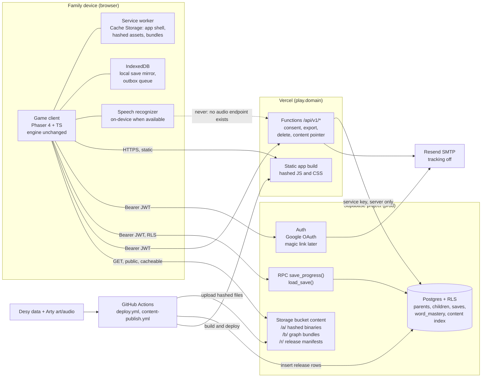
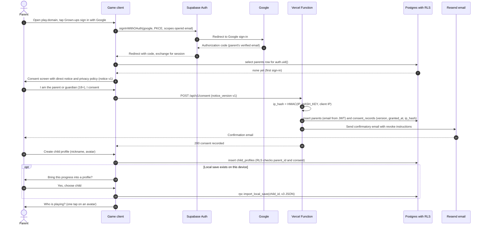
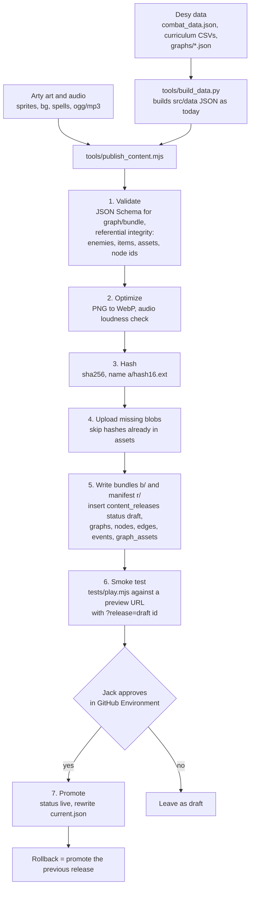

# Architecture proposal: accounts, cloud saves, and a node-graph world

**Status:** design proposal only. Nothing in this document has been built, and no accounts have been created on any service.
**Author:** GameDev, for Jack and the Director. **Date:** 2026-10-02 (PT).
**Scope:** moving the prototype from a static site with local saves to a backend with parent accounts, cloud saves, and content delivered per graph.
**Decided by Jack (2026-10-02):** one parent account keyed by the parent's email, with child profiles under it (each with its own save, items and word mastery, and one-tap switching). **Google sign-in only** for now, with consent captured at first sign-in. Graphs of about 15 to 200 nodes, maze-like, with one graph per dungeon level. This doc comes **before** any accounts or building. **Still a proposal:** the graph and event schema in §6 is **for Desy**, because no graph or event drafts exist yet in `/workspace/desy/` (checked 2026-10-02 PT, §6.1).

Prices and free-tier limits were checked on **2026-10-02 (PT)**. The sources are listed in §17.

---

## Contents

1. [Executive summary and recommendation](#1-executive-summary-and-recommendation)
2. [What exists today (grounded in the code)](#2-what-exists-today-grounded-in-the-code)
3. [Hosting evaluation](#3-hosting-evaluation)
4. [Architecture diagram](#4-architecture-diagram)
5. [Accounts, COPPA and the consent flow](#5-accounts-coppa-and-the-consent-flow)
6. [The world as a node graph (proposal for Desy)](#6-the-world-as-a-node-graph-proposal-for-desy)
7. [Database schema and ER diagram](#7-database-schema-and-er-diagram)
8. [API](#8-api)
9. [Save and sync strategy](#9-save-and-sync-strategy)
10. [Content delivery and the asset pipeline](#10-content-delivery-and-the-asset-pipeline)
11. [Migration from localStorage, and guest mode](#11-migration-from-localstorage-and-guest-mode)
12. [Cost estimate](#12-cost-estimate)
13. [Privacy and security notes](#13-privacy-and-security-notes)
14. [Risks](#14-risks)
15. [Phased plan](#15-phased-plan)
16. [What Jack needs to set up](#16-what-jack-needs-to-set-up)
17. [Open questions, and sources](#17-open-questions-and-sources)

---

## 1. Executive summary and recommendation

**Recommendation in one line:** use **Supabase** for auth, Postgres and asset storage, host the frontend and a few privileged functions on **Vercel** under one custom domain, and keep the game playable as a **local-only guest** exactly as it is today.

| Area | Recommendation | Why |
|---|---|---|
| Auth | **Supabase Auth with Google OAuth only** (decided). One parent account keyed by the parent's email. Child profiles hold only a nickname and an avatar, have no login and no email, and switch with one tap. Magic link can be added later. | Built in, free up to 50,000 MAU, and it ties straight into row-level security (`auth.uid()`). |
| Database | **Supabase Postgres** (Free for development, **Pro at $25/month** once real children's data is stored) | The Free plan pauses after 1 week of inactivity and has no backups. Neither is acceptable for a child's progress. |
| Saves | A **hybrid**: one JSONB snapshot of the game state per child, plus normalized `word_mastery` and `graph_progress` (visited and cleared **bitsets**, about 70 bytes for a 200-node graph) tables and an append-only `progress_events` log. Writes go through one Postgres function, `save_progress()`, with a **version counter**. | The snapshot mirrors `SaveState` (`src/engine/state.ts`), so the client hardly changes. Word mastery is the big, growing part that parents report on, and its counters merge cleanly across devices. |
| Frontend | **Move to Vercel** on a custom domain (for example `play.<domain>`), with **GitHub Pages kept** as the guest build during the move | GitHub Pages can't set response headers (CSP, `immutable` caching, service-worker scope), it has no preview deploys, and its terms rule out "sensitive transactions" and SaaS. Pages *could* stay technically (bearer tokens plus CORS work, see §3.4), but it's the weaker choice. |
| Functions | **Vercel Functions** only for privileged, rare operations: consent confirmation, export, account deletion, and the content release pointer. Gameplay saves go **directly to Supabase** (an RPC call under RLS). | Fewer hops and no cold start on the hot path. Saves don't count against the 1M Vercel function invocations a month on Hobby. |
| Assets | **Supabase Storage** (a public `content` bucket) with **content-hashed** file names. Move binaries to **Cloudflare R2** if monthly egress passes about 200 GB. | One vendor while small. R2 egress is free. Because the URLs are hashed and listed in manifests, switching later only means changing the manifest base URL. |
| World | **One graph per overworld section or dungeon level** (about 15 nodes early, about 200 late, maze-like). Levels are linked by stair or portal edges, and towns, villages and inns can sit anywhere. The client loads **one graph's bundle** at a time and preloads the adjacent graphs. Assets are deduplicated by content hash into common, realm and graph bundles. | Matches Jack's scale decision and Desy's Miitopia direction, and generalizes the current `mapNodes` data. |
| Speech | **No audio ever reaches our servers.** There is no endpoint that accepts audio. In account mode, recognition should run **on-device** (`processLocally = true`, Chrome 139+). Cloud recognition by the browser needs a separate parent toggle. | Today Chrome's default recognizer sends audio to Google. The consent screen already says so (`src/ui/screens.ts`), so "processed in the browser" is only true with on-device mode. |
| Cost | About **$1–26/month at 100 MAU**, **$26–46 at 1,000**, and **$56–76 at 10,000** (§12) | The main fixed cost is Supabase Pro. Vercel Pro ($20) is needed only if the project becomes commercial. |

**What doesn't change:** the engine (`src/engine/*`), the battle rules, the spec v3.7 numbers, guest play, the consent screen for guests, and engine-neutral JSON content.

---

## 2. What exists today (grounded in the code)

### 2.1 Save module: `src/engine/state.ts`

- One global `S: SaveState`, stored in `localStorage` under the key **`chinese-rpg-proto-v3`** with `version: 3`. `load()` accepts only version 3 and back-fills `spells` and `quests`. `save()` writes the whole object on every call. `resetAll()` and `replaceState()` exist as well.
- `SaveState` fields: `version`, `consent {given, speech, at}`, `level`, `exp`, `hp`, `mp`, `gold`, `inv` (consumable id → count), `gear[]`, `equip {weapon, armor, shield, charm}`, `skills[]`, `skillsEquipped[]`, `slotsSeen`, `courage`, `lastDefeatLoc`, **`where`** (`'town'` or a location id), **`lastInn {place, node}`**, `practice`, **`locs`** (per location: `unlocked`, `bossDefeated`, `pathCleared`, `previewSeen`, `patrolsLeft`, `approachArmed`, `bossCheckpoint`, `patrolsFought`), **`prog`** (word mastery: item id → `{seen, recentMiss, ways: {rZE, rEZ, sZE, sEZ}}`, where each way is `{c, a, box, last, due, wrongRun, pc?}`), `stats`, `log` (the last 300 answers), `spells[]`, and `quests` (id → `{s: 'active'|'claimed', n, base?, at, done?}`).
- `save()` is called about 40 times across `src/ui/screens.ts`, `src/engine/battle.ts`, `src/engine/quests.ts` and `src/ui/practice.ts`: shop purchases, equipping, battle end, the boss checkpoint, inn rest (`screens.ts`, the inn handler), quest `accept()` and `claim()`, `onKill()`, delivery on arrival (`onArrive()`), the Return Feather, and defeat.
- Audio settings live separately under `chinese-rpg-audio-v1` (`src/audio/audio.ts`). They are device preferences and stay local.
- **Size:** there are 1,051 curriculum items in `desy/core-curriculum.csv`, 268 of them in the build now. A full `prog` record is about 340 bytes per item, so about **360 KB** for the whole curriculum. The rest of the state is under 10 KB. That gap is the reason for the hybrid schema in §7.
- **Debug:** `DEBUG` (`src/ui/dom.ts`) is on for `?debug` **in production too**, and the debug panel can set HP, MP, tier gear, spells, quests, unlocks and cleared paths. This matters for anti-cheat (§9.6).

### 2.2 Content and data loading: `src/data.ts`

- Static JSON imports bundled by Vite: `balance`, `items` (`items` plus `pools` keyed by location), `enemies`, `locations`, `shop` (gear and consumables), `skills`, `spells` (`rules`, `spells`, `falloff`), `quests` (`rules`, `quests`) and `towns`. `src/data/spellfx.json` is imported by `src/phaser/spellfx.ts`, and `src/data/v3.json` (companion, chests, drops, practice, safety nets) is generated alongside them. These are built by `tools/build_data.py` from Desy's `/workspace/desy/data/combat_data.json`, `curriculum_location_pools.csv`, `core-curriculum.csv` and `enemies.json`, plus Arty's sprite manifest.
- Items carry `id` (for example `C001`), `zh`, `trad`, `en`, `enPrimary`, `type`, `pos`, `topic`, `loc` (Desy's pool id, for example `L1.1`), `speaking`, `reading`, `altZh` and `altEn`.
- Today all content ships inside the JS bundle. Adding a realm means a code deploy.

### 2.3 World map and locations

- `src/data/locations.json` has 2 locations, `meadow` (tier 1, Desy pool `L1.1`) and `forest` (tier 2, `L2.1`). Each has `roster`, `boss`, `elite`, `packs`, `scripted` (fight number → enemies), `pathFights: 8`, `unlockRequires`, `bossReward`, and **`mapNodes`**: 13 positioned nodes with `kind` set to `inn | fight | gate | boss` (inn, 4 fights, inn, 4 fights, inn, gate, boss).
- `src/data/towns.json` lists 9 towns (`town`, `zh`, `en`, `G`, `realmLocs`, `inBuild`, `hub`, `arriveAt`, `gearSetPrice`). Towns 1–2 are in the build, and both use the `village` hub.
- `worldMap()` in `src/ui/screens.ts` shows location cards, and `locationScreen()` walks a hero token along `mapNodes`. This is already a linear graph, so the node graph generalizes it (§6).

### 2.4 Assets and audio

- `public/` is 31 MB in 148 files: `bg/` (9.8 MB), `sprites/` (6.7 MB, with Arty's `sprites/manifest.json`: 17 sheets with `frameWidth`, `frameHeight`, `origin` and `animations`), `spells/` (4.9 MB: `icons/` plus `fx/manifest.json`), and `audio/` (9.1 MB, `.ogg` and `.mp3` pairs).
- `public/assets-manifest.json` is generated by `tools/sync_assets.py` and has the keys `bg`, `sfx`, `music`, `vo`, `spellIcons` and `spellFx`. Audio entries are `{urls: [ogg, mp3], loopStart, loopEnd, volume}`. `src/assets.ts` reads it, and `src/phaser/view.ts` loads only the files it lists. Background keys follow `bg_battle_<realm slug>[_boss]` and `bg_map_<realm slug>`.
- File names are **not content-hashed**: Vite copies `public/` as-is. On GitHub Pages they're served with a short default cache lifetime that we can't change.

### 2.5 Hosting and consent

- `.github/workflows/deploy.yml`: on a push to `main` it runs `npm ci`, then `npm run build:ci` (`tsc && vite build`, which skips the `prebuild` sync scripts because the source art exists only locally), then uploads `dist` to Pages.
- `consentScreen()` (`src/ui/screens.ts`): a parent check (one multiplication question) and a speech checkbox. Its copy says: *"In Chrome the voice audio is sent to Google's speech service… This game does not record or store audio"* and *"Progress is saved only in this browser."* That copy has to change in account mode (§5.6).

---

## 3. Hosting evaluation

### 3.1 Free tiers and entry prices (checked 2026-10-02 PT)

| Service | Free tier | First paid tier | Gotchas for this project |
|---|---|---|---|
| **Vercel** Hobby / Pro | 1M function invocations, 4 active-CPU hours, 100 GB Fast Data Transfer, 1M CDN requests a month. Runtime logs kept for 1 hour. | Pro **$20/month** per developer seat, with a $20 usage credit | Hobby is **"non-commercial, personal use only"**. Going over a Hobby limit pauses the feature for 30 days, with no option to pay. |
| **Vercel Blob** | 1 GB storage, 10 GB data transfer, 10K simple and 2K advanced operations a month (Hobby) | $0.023/GB-month, $0.40 per 1M simple operations, $5 per 1M advanced operations | 10K simple operations is tiny, and dashboard browsing counts as operations. A Hobby store is blocked for 30 days if you exceed it. |
| **Supabase** Free / Pro | 50,000 MAU, 500 MB database, 1 GB file storage, 5 GB egress plus 5 GB cached egress, 2 projects, unlimited API requests | Pro **$25/month**: 100K MAU, 8 GB disk, 100 GB storage, 250 GB egress plus 250 GB cached egress, daily backups for 7 days. Micro compute is included. | Free projects **pause after 1 week of inactivity** and have **no backups**. The built-in SMTP sends **only to project team members, 2 emails an hour**, so custom SMTP is mandatory. |
| **Neon** Free / Launch | 100 CU-hours per project, 1 GB storage per project, 5 GB egress. Scales to zero after 5 min. Auth (managed Better Auth) up to 60K MAU, 5 GB object storage. | Launch: pay as you go, $0.106/CU-hour, $0.35/GB-month | A great serverless Postgres with branching, but auth, RLS wiring and storage would be more pieces for us to assemble. Cold starts after 5 min idle. |
| **Cloudflare R2** | 10 GB-month, 1M Class A and 10M Class B operations a month, **egress free** | $0.015/GB-month, $4.50 per 1M Class A, $0.36 per 1M Class B | Another account and DNS to manage. Best price for large binaries at scale. |
| **GitHub Pages** (today) | 1 GB site, soft limit of 100 GB bandwidth a month | n/a | No custom headers. Not allowed for SaaS or "sensitive transactions like sending passwords". |
| **Resend** (consent confirmations now, magic links if added later) | 3,000 emails a month, 100 a day | Pro $20/month for 50,000 | Open and link tracking must be **turned off** (§5.5). |

### 3.2 Postgres: Neon or Supabase

| | Supabase | Neon |
|---|---|---|
| Auth with magic link and Google | Built in, mature, with RLS helpers (`auth.uid()`) | Neon Auth (managed Better Auth) is newer. Otherwise a third party such as Auth.js or Clerk. |
| Row-level security from the browser | PostgREST plus RLS: the browser can call RPCs safely with the publishable key | A Data API exists, but most apps put an API layer (Vercel Functions) in front |
| Storage | Included (S3-compatible, with a CDN) | Object storage included (5 GB free) |
| Idle behaviour | Free plan **pauses after 7 days**, Pro never pauses | Scales to zero after 5 min and wakes on connect (cold-start latency) |
| Branching for previews | Pro add-on | Excellent, the core feature |
| Fit | **Better**: one vendor for auth, DB and storage, and less code for a one-developer project that Jack reviews | Better if we wanted raw Postgres behind our own API |

**Verdict: Supabase.** We considered it seriously as auth plus DB plus storage in one, and it covers all three. Neon would mean writing and securing our own auth and API layer.

### 3.3 Asset storage and CDN

| | Supabase Storage | Vercel Blob | Cloudflare R2 |
|---|---|---|---|
| Fit now (31 MB, 2 locations) | ✅ Inside the Pro quotas (100 GB storage, 250 GB cached egress) | ⚠ The Hobby operation limits are too small | ✅ Free |
| Fit at 10K MAU (about 400 GB/month egress, §12) | About $4.50/month over quota | Billed per GB of transfer and per request | **$0 egress** |
| Cache control | Set per object on upload (`cacheControl`) | Automatic | Through the Cloudflare cache rules on a custom domain |
| Vendors to manage | Already there | Already there (Vercel) | +1 (Cloudflare) |

**Verdict:** **Supabase Storage first.** Move to **R2** behind `cdn.<domain>` when egress passes about 200 GB a month or we leave Supabase Pro quotas. Vercel Blob is the weakest fit for many small game files.

### 3.4 Can the GitHub Pages frontend stay?

**Technically yes, but it's not recommended past Phase 2.**

| Concern | GitHub Pages (`zenjax7.github.io`) | Vercel (`play.<domain>`) |
|---|---|---|
| **CORS** | Supabase Auth and REST accept browser calls from any origin with the publishable key, and the Pages URL just goes on the Auth redirect allowlist. Any Vercel Function would need CORS headers that allow the Pages origin and the `Authorization` header (a preflight on every call). | The Vercel Functions are same-origin (`/api/*`), so no CORS is needed. Supabase calls are cross-origin either way and that's fine. |
| **Cookies or tokens** | `github.io` is on the Public Suffix List, so a cookie from any API host is third-party and is blocked by Safari and Firefox. **Only bearer tokens work** (supabase-js keeps the session in `localStorage` and sends `Authorization: Bearer`). | Bearer tokens work too. httpOnly cookies are possible later through `@supabase/ssr` on a custom domain, which helps against token theft by XSS. |
| **Custom domain** | Pages supports a custom domain (CNAME). Pages on `play.<domain>` plus an API on `api.<domain>` would make the two same-site. | Native, with automatic TLS |
| **Headers** | **None**: we can't set `Content-Security-Policy`, `Cache-Control: immutable`, `Permissions-Policy` (microphone), or `Service-Worker-Allowed` | Full control through `vercel.json` |
| **Preview deploys** | No | One per PR, with preview environment variables pointing at the dev Supabase project |
| **Terms** | "Not … for … SaaS" and "shouldn't be used for sensitive transactions like sending passwords" | Hobby is non-commercial, and Pro allows commercial use |

**Plan:** in Phase 3 the Vercel deploy becomes the account build at `play.<domain>`. Pages keeps serving the guest-only build until accounts are stable, then becomes a redirect page (Phase 6). Vercel's build command must be **`npm run build:ci`**, because `npm run build` runs the local-only `prebuild` sync scripts.

---

## 4. Architecture diagram



The dotted line is there on purpose: **no path carries audio to our servers.**

---

## 5. Accounts, COPPA and the consent flow

> **Decided (Jack, 2026-10-02):** the **parent's email is the account's profile key**, and each child is a profile under it. Children need no email. That suits COPPA too: a child's email would be "online contact information" collected from a child, while the parent's (Google-verified) email serves as both the login and the consent channel.

### 5.1 Model (decided by Jack, 2026-10-02)

- **One parent account, keyed by the parent's email.** It's a Supabase Auth user created by **Google OAuth** (scopes `openid email` only). `parents.email` is unique and is the account's profile key. Internally the row PK is still `auth.users.id` (a UUID), so a changed Google email doesn't orphan anything. **Magic link is optional and for later**: Supabase supports it, and adding it is a settings change plus one button (§16).
- **Child profiles under it**: a `nickname` (with a hint not to use a real name, and a filter that blocks emails, phone numbers and URLs) and an `avatar` (a preset id). **Children need no email and have no login.** Each child has **a separate save, items and word mastery** (its own `saves`, `word_mastery`, `graph_progress` and `progress_events` rows).
- **Switching is one tap**: the profile picker ("Who's playing?") shows each child's avatar and nickname. Tapping one loads that child's save. There's no PIN between children.
- **Parent area** (consent, export, delete, speech mode, restore): behind a parent gate, which is Google re-authentication (`prompt=login`) or an optional 4-digit parent PIN (bcrypt hash).
- **Limit**: proposed at 6 child profiles per parent (open, §17.1).

#### 5.1.1 Later: linking a child's own email at 13+ (designed, not built)

- Columns that exist from day one but stay **null**: `child_profiles.linked_email citext null`, `linked_auth_user uuid null` (FK → `auth.users`), `link_status text check in ('none','invited','linked') default 'none'`, `linked_at timestamptz null`. A partial unique index applies `where linked_email is not null`.
- **Upgrade flow (future):** (1) The parent opens the parent area → "My child is 13 or older: give them their own sign-in", and attests to the age. (2) The parent enters the teen's email. We store it in `linked_email` with `link_status = 'invited'` and send an invite. (3) The teen signs in with Google using that email. A Function checks that the email matches and sets `linked_auth_user` and `link_status = 'linked'`. (4) RLS adds `or linked_auth_user = auth.uid()` to the child-scoped policies. The save, items and mastery carry over unchanged, because they belong to the child profile and not to the login.
- Open points before building it (§17.1): does the parent keep view or delete rights after linking, can the teen detach from the parent account, and do state teen-privacy laws (for example for under-16s) add requirements? **No child email is ever collected before 13**, and nothing in the 13+ flow is implemented now.

### 5.2 COPPA reasoning

| Principle | What this design does |
|---|---|
| **Verifiable parental consent (VPC)** | Before any child profile can store data on the server, the parent completes **"email plus"** consent (16 CFR 312.5(b)(2)(viii)). This method is allowed only when the operator does **not "disclose"** children's personal information. We don't: no ads, no sale, no sharing. Supabase, Vercel and Resend act as service providers (counsel to confirm). Steps: (1) the parent signs in, reads the direct notice, and ticks the consent. (2) We record it. (3) A **confirmatory email** goes out after receipt and tells the parent how to revoke consent. The parent's email is collected first under the 312.5(c)(1) exception (collected only to get consent). If consent isn't completed within 14 days, we delete it. |
| **Data minimization** | Per parent: the Google-verified email and consent records, with the IP stored only as a keyed hash. Per child: a nickname, an avatar, game progress, word mastery and coarse event logs. No real name, birthday, location, photo, contacts, chat, or voice. The answer log (`S.log`, 300 entries) and speech transcripts (`srLog`) **stay on the device**. The server gets only correct and attempt counts. No analytics SDK and no third-party scripts (the fonts are already self-hosted in `src/fonts/`). |
| **Persistent identifiers** | The child profile UUID and session tokens are used **only for internal operations** (saving progress and security). There's no cross-site tracking and no advertising IDs. |
| **Parental review, export and deletion** | The parent area shows each child's progress, a **JSON export** (`GET /api/v1/children/:id/export`), **delete child** and **delete account**. Deletion is a hard delete of every row for that child or account within 24 hours, with backups aging out within 7 days on Pro. One audit tombstone stays, holding no personal information. |
| **Revoking consent** | Revoking stops collection right away, makes the profile local-only, and offers deletion. |
| **No ads, no tracking** | None of these, ever, in child surfaces: ads, behavioural profiling, marketing email, or open and click tracking in email. Vercel Web Analytics and Speed Insights stay **off**. |
| **Retention (required by the 2025 amended Rule)** | A written policy: save history for 30 days, event logs for 12 months (then aggregated), and inactive accounts deleted after 18 months with a warning email 30 days before (Jack to confirm the period). |
| **Security program (required by the 2025 amended Rule)** | §13: RLS, least-privilege keys, 2FA on every vendor account, backups, and an incident plan. |
| **Schools** | Out of scope. School consent has different rules (`docs/design/research-tech-market.md`). |

*This is an engineering reading of the Rule, not legal advice.* `docs/design/plan.md` (Decision 7) already says counsel reviews any change to the privacy posture before accounts go live. A safe-harbor program (PRIVO, kidSAFE, iKeepSafe) is worth pricing.

### 5.3 Speech audio: the exact statement

> **The game's servers never receive, store or process audio.** No API endpoint accepts audio, the CSP `connect-src` allows only our own origins, and nothing records the microphone. Speech is turned into text by the **browser's own recognizer**, and the game keeps only whether the answer was right.

What "processed in the browser" means, precisely:

- **Today** (`src/engine/speech.ts`, using `SpeechRecognition`/`webkitSpeechRecognition` with default settings): **Chrome may send the audio to Google's speech service**, and Safari sends it to Apple. The current consent screen says this. It's the browser vendor's service, not ours, but it is audio leaving the device.
- **Account mode (proposed)**: set `recognition.processLocally = true` and check `SpeechRecognition.available({langs: ['zh-CN','en-US'], processLocally: true})`. If a language pack is missing, offer `SpeechRecognition.install(...)` (Chrome 139+, MDN "processLocally"). With on-device recognition, **audio never leaves the device at all**.
- **If on-device isn't available** (Safari, older Chrome): speaking questions are **off by default** and the game uses tapping. A parent may turn on *"Use the browser's online speech service (audio goes to Google or Apple, not to us)"* as a **separate, recorded consent** (`consent_records.kind = 'speech_cloud'`). Counsel should confirm whether the 312.5(c)(9) audio exception covers this.

### 5.4 Auth flow and parent consent at first sign-in (sequence)

Consent is captured **at first sign-in**: a consent screen, and a stored `consent_records` row with the **notice version, a timestamp and an IP hash**. The IP hash is `HMAC-SHA256(IP_HASH_KEY, client IP)`, computed in the Vercel Function from the `x-forwarded-for` header Vercel sets. **The raw IP is never stored.** The hash lets us show that a consent came from the same network as later activity without keeping the address.



- On later sign-ins, if `notice_version` has gone up (the privacy notice changed materially), the consent screen shows again and writes a new record.
- The confirmatory email (step 14) is the "plus" in email plus, sent to the parent's Google-verified address. Its revoke link opens the parent area and needs a signed-in session.

### 5.5 Email

- With Google-only sign-in, **Supabase sends no auth email**, so no Supabase SMTP is needed for now. Our own Functions send a few transactional emails through **Resend** (the API, from `send.<domain>` with SPF, DKIM and DMARC): the consent confirmation, a revocation receipt, the deletion confirmation, and the inactive-account warning (§5.2).
- **Turn off open and click tracking** in Resend. Templates: plain text plus minimal HTML, no images, no marketing.
- **Later, if magic link is added:** set Resend as Supabase's custom SMTP (the built-in SMTP sends only to team members, 2 an hour), allow 5 emails an hour per address, and add a CAPTCHA on the parent sign-in form only if abuse shows up.

### 5.6 Consent-screen copy in account mode

`consentScreen()` stays as it is for **guest mode**. Account mode replaces "Progress is saved only in this browser" with: *"Progress is saved to your family account. We store your email, your children's nicknames and avatars, and game progress. No ads, no tracking, no audio. You can export or delete everything at any time."* The final wording comes from counsel.

---

## 6. The world as a node graph (proposal for Desy)

### 6.1 What exists in Desy's files

On 2026-10-02 (PT) I searched `/workspace/desy/` for `graph`, `node`, `edge`, `event` and `miitopia`. **No graph or event schema drafts exist.** What's there:

- `chinese-rpg-design-memo.md` §1.2 and the Region row: *"Pick a stage on a world map, and the party auto-walks with occasional path/chest choices… At the end of each stage you stop at an inn"*, and *"3–4 short linear stages (Miitopia-style path with 1–2 branch choices)"*.
- `ui-layout-review.md`: *"Put the nodes on the painted path… Place the 13 nodes (inn, 4 fights, inn, 4 fights, inn, patrol gate, boss)… Keep node positions as data per background"*. That's today's `mapNodes`.
- `data/curriculum_locations.csv`: 20 locations, ids `L1.1`…, each with a `realm_no` and a pool.

So **everything below is a draft for Desy** to accept, change or replace. It's written to cover today's `mapNodes`, `scripted`, `unlockRequires`, gate readiness and `bossReward` with nothing lost.

### 6.2 Concepts and scale (confirmed by Jack, 2026-10-02)

- **Scale:** about **15 nodes per graph in the early realms**, growing to about **200 in the final realm**. Graphs are **maze-like**: forks, dead ends, loops, and shortcuts that open later.
- **Hierarchy:** realm → graphs. A graph is one of these kinds:
  - `overworld`: a realm's surface map (or part of it)
  - `dungeon_level`: **one graph per dungeon level**, with `dungeon` (for example `goblin_caves`) and `level` (1, 2, 3…). Levels link through **`stairs`** or **`portal`** edges.
  - `world`: optional. It links the realms' overworlds, if Desy wants a top-level map.
- **Towns, villages and inns are node types that can sit anywhere**, including inside an overworld maze or deep in a dungeon level. An `inn` is a rest and save point and the **respawn point**. A `town` or `village` opens the hub screen (shop, quest board, inn, magic shop).
- **Edges** have a `kind`: `path` (the default, two-way), `oneway`, `stairs` and `portal` (they cross to another graph: `to: {graph, node}`), `shortcut` (locked until opened, for example by a lever or by clearing a node, and then **open for good**), and `exit` (leaves the realm).
- **Stable node index:** every node has an `id` (a readable string) **and** an `idx` (a small integer, 0…n−1). Both are **never reused** once released. `idx` drives the compact bitsets in the save (§6.4).
- **Loading unit = one graph** (one dungeon level or one overworld section), never a whole realm (§10.6).
- **Bundle**: everything a graph needs, as one JSON file plus the hashed asset URLs it lists. Shared assets sit in a common or realm bundle and are deduplicated by content hash (§10.3).

Today's `meadow` and `forest` become two small `overworld` graphs (13 nodes each, from `mapNodes`).

### 6.3 Draft schema (JSON, engine-neutral)

```jsonc
// DRAFT FOR DESY: /workspace/desy/graphs/goblin_caves_L2.json (proposed path)
{
  "schema": "graph/0.2",
  "id": "goblin_caves_L2",              // stable forever, because saves reference it
  "kind": "dungeon_level",              // "overworld" | "dungeon_level" | "world"
  "realm": 3, "dungeon": "goblin_caves", "level": 2,
  "title": { "zh": "哥布林洞穴 2层", "en": "Goblin Caves, Level 2" },
  "pool": "L3.2", "recLevel": [12, 14],
  "background": { "map": "bg_map_r3_goblin_caves", "battle": "bg_battle_r3_goblin_caves" },
  "music": { "map": "mus_cave", "battle": "mus_battle_field", "boss": "mus_battle_boss" },
  "unlock": { "all": [ { "bossDefeated": "goblin_caves_L1_boss" } ] },
  "entry": "up1",
  "idxMax": 57,                         // highest idx ever used (retired idx values are never reused)
  "nodes": [
    { "id": "up1",     "idx": 0,  "kind": "stairs_up",   "x": 120, "y": 600 },
    { "id": "n01",     "idx": 1,  "kind": "fight",       "x": 210, "y": 560 },
    { "id": "n02",     "idx": 2,  "kind": "fork",        "x": 300, "y": 520 },
    { "id": "inn_deep","idx": 3,  "kind": "inn",         "x": 380, "y": 470, "save": true },     // inns can sit anywhere
    { "id": "vil_mole","idx": 4,  "kind": "village",     "x": 460, "y": 430, "hub": "mole_village" },
    { "id": "lever3",  "idx": 5,  "kind": "lever",       "x": 520, "y": 610 },
    { "id": "chest7",  "idx": 6,  "kind": "chest",       "x": 560, "y": 380, "table": "chest_t3" },
    { "id": "boss",    "idx": 7,  "kind": "boss",        "x": 900, "y": 160, "fight": { "enemies": ["goblin_chief"] } },
    { "id": "down1",   "idx": 8,  "kind": "stairs_down", "x": 960, "y": 120 }
    // … up to about 200 nodes in the final realm
  ],
  "edges": [
    { "id": "e1", "from": "up1",  "to": "n01" },
    { "id": "e2", "from": "n01",  "to": "n02" },
    { "id": "e3", "from": "n02",  "to": "inn_deep" },
    { "id": "e4", "from": "n02",  "to": "lever3", "label": { "zh": "小路", "en": "Side tunnel" } },
    { "id": "s1", "from": "lever3", "to": "up1", "kind": "shortcut", "opens": { "on": "enter", "node": "lever3" } },
    { "id": "g1", "from": "chest7", "to": "boss", "cond": { "wordsReady": { "pool": "L3.2", "n": 30 } } },
    { "id": "x_up",   "from": "up1",   "kind": "stairs", "to": { "graph": "goblin_caves_L1", "node": "down1" } },
    { "id": "x_down", "from": "down1", "kind": "stairs", "to": { "graph": "goblin_caves_L3", "node": "up1" },
      "cond": { "bossDefeated": "goblin_caves_L2_boss" } }
  ],
  "roster": [ { "enemy": "goblin", "weight": 3 }, { "enemy": "cave_bat", "weight": 2 } ],
  "events": [
    { "id": "ev_intro", "node": "up1", "on": "firstEnter", "do": [ { "dialogue": "dlg_l2_intro" } ] },
    { "id": "ev_boss_reward", "node": "boss", "on": "clear", "once": true,
      "do": [ { "defeatBoss": "goblin_caves_L2_boss" }, { "giveGear": "goblin_buckler" }, { "setFlag": "caves_l2_cleared" } ] }
  ],
  "dialogue": {
    "dlg_l2_intro": [ { "speaker": "xiaolong", "zh": "这里很黑!", "en": "It's dark down here!", "vo": "vo_dlg_l2_intro_1" } ]
  },
  "npcs": { "xiaolong": { "name": { "zh": "小龙", "en": "Little Dragon" }, "sprite": "companion_dragon" } }
}
```

(The enemy, gear and pool ids in this example are placeholders for realm 3. Today's `meadow` converts the same way: 13 nodes with `idx` 0–12, and `scripted` fights become `fight.enemies` on the matching node.)

**Node kinds (draft):** `town`, `village`, `inn` (all three can sit anywhere), `fight`, `elite`, `boss`, `gate` (passable when its outgoing edge's `cond` holds), `chest`, `npc` (dialogue, quest giver), `shop`, `lever` (opens a shortcut), `fork`, `stairs_up`, `stairs_down`, `portal`, `exit`.
**Edge kinds:** `path`, `oneway`, `shortcut`, `stairs`, `portal`, `exit`.
**Triggers:** `enter`, `firstEnter`, `clear` (fight won), `leave`, `rest` (at an inn).
**Conditions:** `all` / `any` / `not`, `flag`, `questActive`, `questClaimed`, `bossDefeated`, `wordsReady {pool, n}`, `levelAtLeast`, `hasItem`, `shortcutOpen`.
**Actions:** `dialogue`, `toast`, `fight`, `giveItem`, `giveGear`, `giveSkill`, `giveGold`, `startQuest`, `setFlag`, `openShortcut`, `defeatBoss`, `unlockGraph`, `heal` (inns only, per spec), `teleport`.

### 6.4 Save state for a graph world

The snapshot (`saves.state`) holds **where the hero is** and the realm-wide facts. **Per-graph visit and clear sets** live in their own table (`graph_progress`, §7.2), so a 200-node maze doesn't make every save bigger.

```ts
// in saves.state (the snapshot)
pos:       { realm: 3, graph: 'goblin_caves_L2', node: 'n02', dungeon: 'goblin_caves', level: 2 },  // dungeon and level are null on an overworld
lastInn:   { graph: 'goblin_caves_L2', node: 'inn_deep' },   // the respawn point (defeat and Return Feather)
shortcuts: ['goblin_caves_L2:s1'],                           // opened shortcut edges, "graph:edge" (grow-only)
bosses:    ['meadow_boss', 'forest_boss', 'goblin_caves_L1_boss'],  // defeated bosses (grow-only)
flags:     ['caves_l2_intro_seen'], eventsDone: ['goblin_caves_L2:ev_boss_reward'],
graphState:{ 'goblin_caves_L2': { patrolsLeft: 0, approachArmed: true, bossCheckpoint: false } }  // only non-default values

// per graph, in graph_progress (sent as deltas only for graphs that changed)
{ graph: 'goblin_caves_L2', n: 58, visited: 'AAH4…', cleared: 'AAB8…' }   // base64url bitsets indexed by node idx
```

**Why bitsets, and how compact they are.** A set of `n` nodes is `ceil(n/8)` bytes:

| Nodes in the graph | Bitset (bytes) | base64url (chars) | Both sets (visited + cleared) | The same as an array of ids like `"n047"` |
|---|---|---|---|---|
| 15 (early realm) | 2 | 3 | about 6 bytes | about 100 bytes |
| 200 (final realm) | 25 | 34 | **about 70 bytes** | about 1.4 KB |

- Even a long game (say 20 realms × about 8 graphs = about 160 graphs) is about **11 KB** of bitsets in total, and a single save only sends the one or two graphs that changed.
- Bits are addressed by **`idx`**, which never changes or gets reused. A graph that grows just gets longer bitsets (missing bits read as 0). A removed node's bit is simply ignored.
- Visited, cleared, shortcuts and bosses **only grow**, so they merge across devices with a bitwise **OR** or a set union, with no conflict (§9.4).
- On the server, `graph_progress` also stores `visited_n` and `cleared_n` (popcounts) for parent reports and indexing.
- `S.locs` (today's `LocState`) maps to `graph_progress` (`pathCleared` → the cleared bits) plus `graphState` (the patrol and checkpoint fields). `where` → `pos`, and `lastInn {place, node}` → `lastInn {graph, node}`.

**Rule for Desy:** node ids, `idx` values, edge ids and event ids are **never reused** once released. A rename ships in the release manifest's `renames` map (§10.2), and the converter test suite checks old saves against it.

### 6.5 Questions for Desy

These are listed in §17.2.

---

## 7. Database schema and ER diagram

### 7.1 Normalized or snapshot? A hybrid, and why

| Data | Storage | Reasoning |
|---|---|---|
| Game state: level, EXP, HP, MP, gold, `inv`, `gear`, `equip`, skills, spells, `quests`, `practice`, `pos` (realm, graph, node, dungeon level), `lastInn`, `shortcuts`, `bosses`, flags, `graphState`, `stats` | **One JSONB snapshot** per child (`saves.state`), with a `version` counter | It matches `SaveState` one-to-one, so the client only swaps `save()` for an adapter. It's small (under 10 KB), always read and written as a whole, and its shape changes often while Desy iterates. Normalizing it would mean a migration for every spec bump. |
| Word mastery (`prog`) | **Normalized** `word_mastery` table: one row per (child, item), with the 4 ways as JSONB | It's the big part (up to about 360 KB per child) and grows with the curriculum, so sending only the changed words each save keeps payloads small. It's what parent reports query ("how many words are proficient?"). Its counters (`a`, `c`) only ever increase, so **deltas merge across devices** without conflicts (§9.4). |
| Visited and cleared nodes per graph | **Normalized** `graph_progress`: one row per (child, graph) with two **bitsets** indexed by node `idx` | Up to about 160 graphs × 200 nodes, but a save touches only 1–2 graphs, so deltas stay tiny. The sets only grow, so they merge with a bitwise OR across devices. Popcounts give parent reports for free (§6.4). |
| Quests and inventory | **Inside the snapshot**, exposed as **SQL views** (`v_quests`, `v_inventory`) through `jsonb_each` | There are few rows (about 10 quests per town and about 10 item kinds), they change together with gold, and they must stay consistent with it in the same write. The views give parent reports and admin queries a table shape without dual writes. |
| Progress events (quest given or claimed, node entered, inn rest, boss defeated, level up) | **Append-only** `progress_events` | Audit trail, plausibility checks (§9.6), and the parent timeline. It's not used to rebuild state. |
| Old snapshots | `save_history` (the last 20 per child, 30 days) | Restore after a bad conflict merge or a bug. It's what the parent's "restore yesterday's save" button uses. |

### 7.2 Tables

All tables live in schema `public`, all have RLS on, `id uuid default gen_random_uuid()`, and `created_at timestamptz default now()`. Text ids for content (`'meadow'`, `'q1_bounty'`, `'C001'`) match the JSON ids.

**Accounts and consent**

| Table | Columns | Notes |
|---|---|---|
| `parents` | `id uuid PK = auth.users.id`, `email citext unique not null`, `display_name text null`, `consent_status text check in ('none','confirmed_pending','confirmed','revoked')`, `consent_version text`, `parent_pin_hash text null`, `role text default 'parent' check in ('parent','dev')`, `locale text default 'en'`, `last_active_at timestamptz`, `deleted_at timestamptz null` | **Email is the account's profile key** (unique, the Google-verified address, copied from `auth.users.email` by a trigger), but not the row PK. |
| `child_profiles` | `id uuid PK`, `parent_id uuid FK → parents on delete cascade`, `nickname text check (char_length between 1 and 16)`, `avatar text` (a preset id), `speech_mode text check in ('off','on_device','cloud') default 'on_device'`, `sort int` (picker order), `created_at`, `archived_at null`, **later, 13+ only, always null for now:** `linked_email citext null`, `linked_auth_user uuid null FK → auth.users`, `link_status text default 'none' check in ('none','invited','linked')`, `linked_at timestamptz null` | No PII. A nickname filter blocks emails, phone numbers and URLs. The link columns support the future teen upgrade (§5.1.1), and a check constraint keeps them null until that feature ships. |
| `consent_records` | `id`, `parent_id FK`, `kind text check in ('vpc_email_plus','speech_cloud','privacy_notice')`, `notice_version text not null`, `granted_at timestamptz not null`, **`ip_hash text not null`** (HMAC-SHA256 with `IP_HASH_KEY`, never the raw IP), `user_agent_family text` (for example `Chrome/macOS`), `auth_provider text` (`google`), `confirm_email_sent_at`, `revoked_at null`, `method_detail jsonb` (for example the email message id) | Append-only. The proof of consent. Kept for the life of the account, then a tombstone. |

**Saves and progress**

| Table | Columns | Notes |
|---|---|---|
| `saves` | `child_id uuid PK FK → child_profiles on delete cascade`, `version int not null default 0`, `schema int not null` (4), `content_release text`, `state jsonb not null`, `progress_key int[]` (§9.4), **`pos_realm smallint`, `pos_graph text`, `pos_node text`, `pos_level smallint null`, `last_inn_graph text`, `last_inn_node text`, `bosses text[]`, `shortcuts text[]`** (copied out of `state` by the RPC for indexing and reports), `updated_at`, `updated_by_device text`, `flags text[] default '{}'` | Exactly one row per child. Updated only through `save_progress()`. |
| `graph_progress` | `child_id FK`, `graph_id text`, `node_count smallint` (the graph's `idxMax + 1` when written), `visited bytea`, `cleared bytea`, `visited_n smallint`, `cleared_n smallint`, `first_at`, `updated_at`; **PK (child_id, graph_id)** | Bitsets indexed by node `idx` (§6.4). The RPC merges with a bitwise OR, so it never conflicts. |
| `save_history` | `id bigserial`, `child_id FK`, `version int`, `state jsonb`, `trigger text`, `saved_at` | Trimmed to 20 rows and 30 days by a nightly job. |
| `word_mastery` | `child_id FK`, `item_id text` (for example `'C001'`), `seen bool`, `recent_miss int`, `ways jsonb` (`{rZE:{c,a,box,last,due,wrongRun,pc}, …}`), `proficient bool`, `updated_at`; **PK (child_id, item_id)** | `proficient` is computed in `save_progress()` with the same rule as `proficient()` in `src/engine/learning.ts` (every active way `c ≥ B.learning.proficientCorrect`). |
| `progress_events` | `id bigserial`, `child_id FK`, `client_id text`, `client_seq bigint`, `at timestamptz`, `type text` (`quest_given`, `quest_claimed`, `node_enter`, `inn_rest`, `boss_defeated`, `level_up`, `import`), `graph_id text`, `node_id text`, `data jsonb`; **unique (child_id, client_id, client_seq)** | The unique key makes retries idempotent. |
| `devices` | `id text PK` (a random id the client makes once), `parent_id FK`, `last_seen_at`, `user_agent_family text` | Lets "sign out other devices" work. Holds no fingerprinting data. |
| *view* `v_quests` | `child_id, quest_id, s, n, accepted_at, done_at` from `saves.state->'quests'` | Read-only. |
| *view* `v_inventory` | `child_id, kind ('consumable'|'gear'|'spell'), item_id, qty, equipped_slot` | Read-only. |

**Content (written only by the publish job; readable by anyone)**

| Table | Columns | Notes |
|---|---|---|
| `content_releases` | `id text PK` (for example `'2026-11-01.1'`), `status text check in ('draft','live','retired')`, `manifest_path text`, `manifest_sha256 text`, `min_client text`, `renames jsonb`, `notes text`, `published_by text`, `published_at` | Exactly one row is `live`. Promote and roll back by flipping the status. |
| `graphs` | `release_id FK`, `id text`, `kind text` (`overworld`, `dungeon_level`, `world`), `realm smallint`, `dungeon_id text null`, `level smallint null`, `node_count smallint`, `idx_max smallint`, `adj text[]` (graphs linked by stairs, portals or exits), `title_zh`, `title_en`, `bundle_path text`, `bundle_sha256 text`, `bundle_bytes int`, `asset_bytes int`; **PK (release_id, id)** | One row per graph per release. |
| `graph_nodes` | `release_id`, `graph_id`, `id text`, **`idx smallint`**, `kind text` (including `town`, `village`, `inn`, `stairs_up`, `stairs_down`, `portal`, `lever`), `x int`, `y int`, `data jsonb`; **PK (release_id, graph_id, id)**, **unique (release_id, graph_id, idx)** | An index of the bundle, for validation and admin queries. |
| `graph_edges` | `release_id`, `graph_id`, `id text`, `kind text` (`path`, `oneway`, `shortcut`, `stairs`, `portal`, `exit`), `from_node`, `to_node`, `to_graph text null`, `cond jsonb`, `opens jsonb null`, `label jsonb`; **PK (release_id, graph_id, id)** | Cross-graph edges (`to_graph` set) feed `graphs.adj` and preloading. |
| `graph_events` | `release_id`, `graph_id`, `id text`, `node_id`, `trigger text`, `cond jsonb`, `actions jsonb`, `once bool` | |
| `assets` | `sha256 text PK`, `path text` (`a/<sha256-16>.<ext>`), `mime text`, `bytes int`, `first_release text` | Shared across releases. Upload is skipped when the hash already exists. |
| `graph_assets` | `release_id`, `graph_id` (a graph id, or the pseudo-graphs `common` and `realm-<n>`), `key text` (for example `bg_battle_r1_starter_meadow`), `asset_sha256 FK → assets`, `role text` (`bg`, `sprite`, `music`, `sfx`, `vo`, `spell_icon`, `spell_fx`), `preload bool` | The per-graph manifest, in table form. A file used by several graphs is one `assets` row (deduplicated by hash) referenced from each. |

**Audit and operations**

| Table | Columns | Notes |
|---|---|---|
| `audit_log` | `id bigserial`, `at`, `actor_type text` (`parent`, `system`, `ci`, `admin`), `actor_id uuid null`, `child_id uuid null`, `action text` (`consent_granted`, `consent_revoked`, `child_created`, `child_deleted`, `account_deleted`, `export`, `import`, `save_flagged`, `release_promoted`, `restore`), `details jsonb` | No email or nickname in `details`. On account deletion, `actor_id` is replaced with a salted hash (a tombstone). Kept for 2 years. |
| `rate_limits` | `bucket text`, `subject uuid`, `window_start timestamptz`, `count int`; **PK (bucket, subject, window_start)** | A fixed-window counter used by the RPCs and Functions. |

### 7.3 ER diagram

```mermaid
erDiagram
  PARENTS ||--o{ CHILD_PROFILES : has
  PARENTS ||--o{ CONSENT_RECORDS : gives
  PARENTS ||--o{ DEVICES : uses
  CHILD_PROFILES ||--|| SAVES : "current save"
  CHILD_PROFILES ||--o{ SAVE_HISTORY : "older saves"
  CHILD_PROFILES ||--o{ WORD_MASTERY : learns
  CHILD_PROFILES ||--o{ PROGRESS_EVENTS : logs
  CHILD_PROFILES ||--o{ GRAPH_PROGRESS : explores
  GRAPHS ||--o{ GRAPH_PROGRESS : "tracked in"
  CONTENT_RELEASES ||--o{ GRAPHS : contains
  GRAPHS ||--o{ GRAPH_NODES : has
  GRAPHS ||--o{ GRAPH_EDGES : has
  GRAPHS ||--o{ GRAPH_EVENTS : has
  GRAPHS ||--o{ GRAPH_ASSETS : lists
  ASSETS ||--o{ GRAPH_ASSETS : "used by"
  SAVES }o--|| CONTENT_RELEASES : "made against"

  PARENTS {
    uuid id PK
    citext email UK
    text consent_status
    text parent_pin_hash
    timestamptz last_active_at
  }
  CHILD_PROFILES {
    uuid id PK
    uuid parent_id FK
    text nickname
    text avatar
    text speech_mode
    citext linked_email "null until 13+ link"
    uuid linked_auth_user "null until 13+ link"
  }
  CONSENT_RECORDS {
    uuid id PK
    uuid parent_id FK
    text kind
    text notice_version
    timestamptz granted_at
    text ip_hash
    timestamptz revoked_at
  }
  DEVICES {
    text id PK
    uuid parent_id FK
    timestamptz last_seen_at
  }
  SAVES {
    uuid child_id PK
    int version
    int schema
    text content_release FK
    jsonb state
    smallint pos_realm
    text pos_graph
    text pos_node
    smallint pos_level
    text last_inn_node
    timestamptz updated_at
  }
  GRAPH_PROGRESS {
    uuid child_id PK
    text graph_id PK
    bytea visited
    bytea cleared
    smallint visited_n
    smallint cleared_n
  }
  SAVE_HISTORY {
    bigint id PK
    uuid child_id FK
    int version
    jsonb state
    text trigger
  }
  WORD_MASTERY {
    uuid child_id PK
    text item_id PK
    jsonb ways
    bool proficient
  }
  PROGRESS_EVENTS {
    bigint id PK
    uuid child_id FK
    text client_id
    bigint client_seq
    text type
    text graph_id
    text node_id
  }
  CONTENT_RELEASES {
    text id PK
    text status
    text manifest_sha256
    jsonb renames
  }
  GRAPHS {
    text release_id PK
    text id PK
    text kind
    smallint realm
    text dungeon_id
    smallint level
    text bundle_sha256
  }
  GRAPH_NODES {
    text graph_id PK
    text id PK
    smallint idx UK
    text kind
    jsonb data
  }
  GRAPH_EDGES {
    text graph_id PK
    text id PK
    text kind
    text from_node
    text to_node
    text to_graph
    jsonb cond
  }
  GRAPH_EVENTS {
    text graph_id FK
    text id PK
    text node_id
    text trigger
    jsonb actions
  }
  ASSETS {
    text sha256 PK
    text path
    text mime
    int bytes
  }
  GRAPH_ASSETS {
    text graph_id FK
    text key
    text asset_sha256 FK
    text role
  }
  AUDIT_LOG {
    bigint id PK
    text actor_type
    uuid child_id
    text action
    jsonb details
  }
```



(`AUDIT_LOG` is standalone on purpose: it has no foreign keys, so it survives deletions as tombstones.)

### 7.4 Row-level security (sketch)

```sql
alter table child_profiles enable row level security;
create policy own_children on child_profiles
  for all using (parent_id = auth.uid()) with check (parent_id = auth.uid()
    and exists (select 1 from parents p where p.id = auth.uid() and p.consent_status in ('confirmed_pending','confirmed')));

-- saves, word_mastery, progress_events, save_history: readable through the child's parent; writes only via RPC
create policy read_own on saves for select
  using (exists (select 1 from child_profiles c where c.id = saves.child_id and c.parent_id = auth.uid()));
revoke insert, update, delete on saves, word_mastery, progress_events, save_history from anon, authenticated;

-- content tables: public read of live releases only; writes only by the service key (publish job)
create policy read_live on graphs for select
  using (exists (select 1 from content_releases r where r.id = graphs.release_id and r.status = 'live'));
```

`save_progress()` and `import_local_save()` are `security definer` functions with `set search_path = public`. Each starts by checking `child.parent_id = auth.uid()`, then the rate limit, then the version.

### 7.5 Indexing (sized for 200-node mazes)

| Table | Index | Serves |
|---|---|---|
| `parents` | `unique (email)` | Sign-in lookup, the profile key |
| `child_profiles` | `(parent_id)`; `unique (linked_email) where linked_email is not null`; `(linked_auth_user) where linked_auth_user is not null` | The profile picker, the RLS check, the future teen link |
| `saves` | PK `(child_id)`; `(pos_graph)`; `gin (bosses)` | Load and save by child. Ops queries ("who is in graph X before a release that changes it?"). Reports on bosses |
| `graph_progress` | PK `(child_id, graph_id)`; `(graph_id)` | Load all of a child's graphs in one scan, and save-time upserts. Per-graph stats |
| `word_mastery` | PK `(child_id, item_id)`; `(child_id) where proficient` | Load, mastery upserts, and the parent's "words proficient" count |
| `progress_events` | `unique (child_id, client_id, client_seq)`; `(child_id, at desc)` | Idempotent retries, the parent timeline |
| `save_history` | `(child_id, saved_at desc)` | Restore, nightly trim |
| `consent_records` | `(parent_id, granted_at desc)` | The current consent and its version |
| `audit_log` | `(at)`; `(child_id, at) where child_id is not null` | Retention purge, per-child audit |
| `graphs` | PK `(release_id, id)`; `(release_id, realm)`; `(release_id, dungeon_id, level) where dungeon_id is not null` | The world map, per-realm listing, dungeon level order |
| `graph_nodes` | PK `(release_id, graph_id, id)`; `unique (release_id, graph_id, idx)`; `(release_id, kind) where kind in ('town','village','inn')` | Bitset ↔ id mapping, validation, "where are the inns and towns" (respawn and fast-travel lists) |
| `graph_edges` | PK `(release_id, graph_id, id)`; `(release_id, graph_id, from_node)`; `(release_id, to_graph) where to_graph is not null` | Adjacency, and the **cross-graph links used for preloading** (stairs, portals, exits) |
| `graph_assets` | PK `(release_id, graph_id, key)`; `(asset_sha256)` | The per-graph manifest. "Which graphs use this file" (dedup, promotion to a shared bundle) |
| `rate_limits` | PK `(bucket, subject, window_start)` | Fixed-window counters, purged hourly |

**Volume check:** a full release with about 160 graphs averaging about 80 nodes is about 13,000 `graph_nodes` rows and about 16,000 `graph_edges` rows. That's trivial for Postgres. Index rows for retired releases are deleted after 90 days, and their bundles stay in storage for old clients. On the player side, `graph_progress` grows by at most one row per graph the child has entered (≤ about 160 per child), and each row is under 100 bytes.

---

## 8. API

Two surfaces: **Supabase** (Auth, plus RPCs over PostgREST, called with supabase-js and the user's JWT) and **Vercel Functions** under `/api/v1` (same-origin, `Authorization: Bearer <supabase access token>`, verified with the project's JWT keys). The content files themselves are plain static GETs from storage.

### 8.1 Endpoints

| # | Method and path | Auth | Rate limit | Purpose |
|---|---|---|---|---|
| 1 | Supabase `signInWithOAuth('google')` (PKCE) | none | Supabase auth rate limits (defaults) | Parent sign-in, the only method for now. `signInWithOtp` (magic link) can be added later. |
| 2 | `GET /rest/v1/parents?select=*,child_profiles(*)` | JWT | 60/min per user (PostgREST, under RLS) | Account plus children |
| 3 | `POST /api/v1/consent` | JWT | 5/day per parent | At first sign-in: create the `parents` row, record consent (version, timestamp, IP hash), send the confirmatory email |
| 4 | `POST /api/v1/consent/revoke` | JWT plus parent gate | 5/day | Revoke |
| 5 | `POST /rest/v1/child_profiles` / `PATCH` | JWT (RLS, consent required) | 20/day per parent | Create or rename a child |
| 6 | `POST /rest/v1/rpc/load_save` | JWT | 60/min per child | The snapshot plus all word mastery |
| 7 | `POST /rest/v1/rpc/save_progress` | JWT | **10 per 10 s burst and 600/hour per child** | The gameplay save (§9) |
| 8 | `POST /rest/v1/rpc/import_local_save` | JWT | 3/day per child | Import a localStorage v3 save |
| 9 | `POST /rest/v1/rpc/restore_save` | JWT plus parent gate | 10/day | Restore from `save_history` |
| 10 | `GET /api/v1/children/:id/export` | JWT plus parent gate | 5/day per parent | A JSON export of everything we hold |
| 11 | `DELETE /api/v1/children/:id` | JWT plus parent gate | 10/day | Hard-delete a child |
| 12 | `DELETE /api/v1/account` | JWT plus parent gate plus a fresh Google re-auth (`prompt=login`, under 10 min old) | 3/day | Delete the account and all children, then delete the auth user (service key) |
| 13 | `GET /api/v1/content/current` | none | Vercel WAF: 120/min per IP | The live release pointer (ETag, `max-age=60`) |
| 14 | `GET <storage>/content/r/<release>.json`, `/b/<graph>.<hash>.json`, `/a/<hash>.<ext>` | none | CDN | Manifests, bundles, binaries |

Rate limits in RPCs use `rate_limits` (a fixed window). Going over returns `429`-equivalent JSON (`{error: 'rate_limited', retryAfterMs}`), and the client keeps the save in its outbox and retries with backoff. Vercel Functions use the same table. Hobby also gets 1M WAF rate-limit requests a month.

### 8.2 Shapes

**`save_progress` request**

```jsonc
{
  "p_child": "8a0c…-uuid",
  "p_base_version": 41,                 // the version the client last synced
  "p_device": "dev_5f2c9a",             // a random id per install
  "p_trigger": "node_enter",            // quest_given | quest_claimed | node_enter | inn_rest | flush | import
  "p_content_release": "2026-11-01.1",
  "p_state": { "schema": 4, "level": 5, "exp": 37, "hp": 41, "mp": 18, "gold": 212,
               "inv": { "honey": 2, "feather": 1 }, "gear": ["wood_sword", "cloth_tunic"],
               "equip": { "weapon": "wood_sword", "armor": "cloth_tunic", "shield": null, "charm": null },
               "skills": ["insight", "heal", "double"], "skillsEquipped": ["insight", "heal"], "spells": ["small_fireball"],
               "quests": { "q1_bounty": { "s": "active", "n": 5, "at": 1790000000000 } },
               "pos": { "realm": 1, "graph": "meadow", "node": "f2", "dungeon": null, "level": null },
               "lastInn": { "graph": "meadow", "node": "inn_a" },
               "shortcuts": [], "bosses": [], "graphState": { "meadow": { "patrolsLeft": 0, "approachArmed": true } },
               "flags": [], "eventsDone": [], "courage": 0, "stats": { "battles": 12, "wins": 11 } },
  "p_graphs": [                         // only graphs whose bitsets changed; the server ORs them in
    { "graph": "meadow", "n": 13, "visited": "BwA", "cleared": "AgA" }
  ],
  "p_mastery": [                        // only words changed since the last ack, as DELTAS
    { "item": "C001", "seen": true, "recentMiss": 0,
      "ways": { "rZE": { "da": 2, "dc": 2, "box": 2, "last": 1790000300000, "due": 1790003900000, "wrongRun": 0 } } }
  ],
  "p_events": [ { "seq": 1031, "at": 1790000300000, "type": "node_enter", "graph": "meadow", "node": "f2" } ]
}
```

**Response**

```jsonc
// accepted
{ "ok": true, "version": 42, "ackSeq": 1031, "flags": [] }
// version conflict (another device saved first): the mastery and events ARE applied, the snapshot is not
{ "ok": false, "conflict": true, "version": 43, "server": { "state": { … }, "updatedAt": "2026-11-03T02:14:09Z", "device": "dev_91ab" },
  "ackSeq": 1031 }
// rejected
{ "ok": false, "error": "rate_limited", "retryAfterMs": 4000 }
```

**`load_save` response:** `{ version, schema, contentRelease, state, mastery: [{ item, seen, recentMiss, ways }], updatedAt }`.

**`GET /api/v1/content/current` response** (an `ETag` header, and `304` on `If-None-Match`):

```json
{ "release": "2026-11-01.1", "manifest": "https://<project>.supabase.co/storage/v1/object/public/content/r/2026-11-01.1.json",
  "manifestSha256": "9f1c…", "minClient": "1.4.0" }
```

**Export** (`application/json`, `Content-Disposition: attachment`): `{ exportedAt, parent: { email, createdAt }, consent: [...], children: [{ nickname, avatar, save, mastery, events, history }] }`.

**Errors** always look like `{ ok: false, error: '<code>', message: '<short English text>' }`. The codes are `unauthorized`, `forbidden`, `no_consent`, `rate_limited`, `conflict`, `invalid_state`, `not_found`.

---

## 9. Save and sync strategy

### 9.1 Two layers

1. **Local (every `save()` call, as today):** the current ~40 `save()` calls keep writing the local mirror right away. In account mode the mirror moves from `localStorage` to IndexedDB, keyed by child id. That keeps the game crash-safe and offline-safe.
2. **Cloud (on triggers):** a `SaveSync` module (new, `src/net/sync.ts`) marks the state dirty and **pushes only on the required triggers**:

| Trigger | Where it fires today | Push |
|---|---|---|
| **Quest given** | `accept()` in `src/engine/quests.ts` | Right away |
| **Quest completed** | `claim()` and the delivery inside `onArrive()` | Right away |
| **Graph node change** | the hero token's `walk()` / entering a node in `locationScreen()`, plus `enterLocation`, `worldMap` and `town()`, and later the graph runtime's `enterNode()` | Debounced by 2 s, so a run of node steps through a maze becomes one push |
| **Graph change** (stairs, portal, exit, a new dungeon level) | the graph runtime's `enterGraph()` | Right away, so the new `pos` (realm, graph, level) and the old graph's bitsets are safe before the next bundle loads |
| **Shortcut opened, boss defeated** | `openShortcut` and `defeatBoss` actions | Right away |
| **Inn** | the inn rest handler (`screens.ts`, "HP and MP restored"), the Return Feather, waking after a defeat (`applyDefeat()`) | Right away |
| **Safety flushes** | `visibilitychange → hidden`, `pagehide`, every 60 s while dirty, and on reconnect (`online`) | `fetch(..., {keepalive: true})`. `sendBeacon` is ruled out because it can't send the auth header. |

Shop purchases, equipping and battle results are saved locally right away and reach the cloud with the next trigger. The worst case if a device is lost mid-session is about one node's worth of progress.

### 9.2 Offline queue (outbox)

IndexedDB store `outbox/<childId>`:

- `pendingState`: **only the latest snapshot** (each new one replaces the old, since snapshots coalesce).
- `pendingMastery`: per (item, way) **summed deltas** (`da`, `dc`) plus the newest `box`, `due`, `last` and `wrongRun`.
- `pendingEvents`: append-only, each with a per-device monotonic `seq`.
- `baseVersion`: the last version the server acknowledged.

A flush sends one `save_progress` with all three. On `ok` it clears what was acknowledged (`ackSeq`). On a network error it keeps everything and retries with exponential backoff (1 s → 2 s → … capped at 60 s). Events are idempotent through `(child_id, client_id, client_seq)`. The UI shows a small cloud icon: ☁️✓ synced, ☁️… pending, ☁️✗ offline with the number of saves waiting. It never blocks play.

Ask for durable storage once with `navigator.storage.persist()`. Safari can still evict script-writable storage after 7 days without a visit (§14), so flush as soon as the device is online.

### 9.3 Conflict detection: a version counter

`saves.version` goes up by 1 on each accepted snapshot. The client sends `p_base_version`. If it equals the server's version, the snapshot is accepted. If the server's is higher, another device saved in between, which is a **conflict**.

**Why a version counter rather than plain last-writer-wins on timestamps:** device clocks on family tablets are often wrong, and a tablet that was offline for a day would otherwise overwrite newer progress just because it synced later. A counter makes conflicts *visible*, and they're rare, because one child plays on one device at a time.

### 9.4 Conflict resolution

1. **Word mastery never conflicts.** The server applies deltas: `a += da`, `c += dc` (capped at the rules' maximum), and `box`, `due`, `last` and `wrongRun` come from whichever side has the newer `last`. Learning on both devices is kept.
2. **Graph progress never conflicts.** The visited and cleared bitsets are merged with a bitwise **OR**, and `shortcuts` and `bosses` with a set union. They only ever grow.
3. **Events never conflict.** They're appended.
4. **Snapshot: furthest progress wins**, and the losing copy is kept. The server compares a monotonic **progress key**, stored as `saves.progress_key int[]`: `[bosses defeated, quests claimed, level, exp, nodes cleared, battles]`, compared in that order.
   - If the incoming key is greater, the incoming snapshot is accepted, and the server copy goes to `save_history` with `trigger = 'conflict_lost'`.
   - Otherwise the server keeps its copy and returns `conflict: true` with it. The client adopts the server state, puts its own copy in `save_history` through a `flush` with `trigger = 'conflict_lost'`, and shows a toast: *"Your adventure from another device was loaded."*
   - The parent area can restore any `save_history` entry (`restore_save`).
4. Gold and potions from the losing branch are lost unless a parent restores them. That's acceptable for a single-player kids' game and much simpler than merging inventories field by field.

### 9.5 Load on start

Sign-in → "Who's playing?" → `load_save`. If the local mirror has `version > server` (offline play that never synced), push it first. If the local copy is older, take the server's. A migration step (`schema` 3 → 4, §11) runs before the engine sees the state.

### 9.6 Anti-cheat, at the level that matters

There are no leaderboards, no trading, no PvP and no real-money items, so cheating hurts only the cheater and **the accuracy of the parent's progress report**. Goal: keep data plausible, never punish a child.

- **Plausibility checks in `save_progress()`** (they **flag**, they don't reject):
  - `level` and `exp` match the `expToNext(L) = B.hero.expToNextPerLevel × L` curve
  - gold gained per save ≤ a bound from battles and quests since the last save (the gold tables in `docs/data/combat/economy_prices.csv`)
  - every id in `inv`, `gear`, `spells` and `skills` exists in the content release, and equipped items are owned
  - quest `claimed` appears at most once and only after `quest_given`
  - per save, `da` ≤ 300 and `dc ≤ da` for word mastery
  - `pos.node` exists in the release
- Flagged saves get `saves.flags` plus an `audit_log` row (`save_flagged`). Parent reports show *"some numbers look edited"* instead of hiding the data.
- **Debug panel:** in account mode, `?debug` stays available only for accounts with `parents.role = 'dev'`. Saves made with debug on carry `state.debug = true` and are left out of the parent's reports.
- **Rate limits** (§8.1) stop scripted spam.
- If real-money unlocks or leaderboards ever arrive, move rewards server-side (the server computes battle rewards). That isn't needed now.

---

## 10. Content delivery and the asset pipeline

### 10.1 Layout in storage (bucket `content`, public read)

```
content/
  current.json                       # pointer: { release, manifest, manifestSha256, minClient }  (max-age=60, ETag)
  r/2026-11-01.1.json                # release manifest (immutable)
  b/common.4e1a9c0d.json             # always-loaded: balance, items index, skills, shop, towns, UI sfx, hero sprite, shared music
  b/realm-1.c3d4e5f6.json            # realm-shared: assets used by 2+ graphs of realm 1 (enemy sprites, realm music, tilesets)
  b/meadow.3f9c11ab.json             # one overworld graph
  b/goblin_caves_L1.5a6b7c8d.json    # one bundle per dungeon level
  b/goblin_caves_L2.9e0f1a2b.json
  a/3f9c11ab52e0d1c4.png             # hashed binaries (first 16 hex chars of sha256), immutable
  a/90bd77aa1c3e5f02.ogg
```

### 10.2 Release manifest (versioned)

```jsonc
{
  "schema": "release/1",
  "release": "2026-11-01.1",
  "minClient": "1.4.0",                     // older clients show "Please reload"
  "base": "https://<project>.supabase.co/storage/v1/object/public/content/",
  "common": { "path": "b/common.4e1a9c0d.json", "sha256": "4e1a9c0d…", "bytes": 182344 },
  "realms": { "1": { "path": "b/realm-1.c3d4e5f6.json", "sha256": "c3d4e5f6…", "assetBytes": 4100000 } },
  "graphs": {   // about 200 bytes per graph; about 160 graphs is about 32 KB raw, 8 KB gzip
    "meadow":          { "path": "b/meadow.3f9c11ab.json", "sha256": "3f9c11ab…", "realm": 1, "kind": "overworld",
                         "nodes": 13, "bytes": 61200, "assetBytes": 5750000, "adj": ["forest"] },
    "goblin_caves_L2": { "path": "b/goblin_caves_L2.9e0f1a2b.json", "sha256": "9e0f1a2b…", "realm": 3, "kind": "dungeon_level",
                         "dungeon": "goblin_caves", "level": 2, "nodes": 58, "bytes": 88400, "assetBytes": 1900000,
                         "adj": ["goblin_caves_L1", "goblin_caves_L3"] }
  },
  "renames": { "meadow": { "f_old3": "f3" } }   // node or event id migrations for old saves
}
```

### 10.3 Graph bundle (what the client loads on entering a graph)

A graph bundle holds **everything the graph needs**: the graph (nodes, edges, events, §6.3), the **enemies** it uses (stats from `enemies.json` with sprite keys), **NPCs**, **dialogue**, **backgrounds**, the **spells** sold there, its **quests**, and its **word pool** (the items from `items.json` whose `loc` is in the graph's pool, plus the distractor set).

```jsonc
{
  "schema": "bundle/1", "graph": "meadow", "release": "2026-11-01.1",
  "data": { "graph": { … }, "enemies": { "rabbit": { … }, "rabbitking": { … } }, "npcs": { … }, "dialogue": { … },
            "words": { "pool": ["C001", "C002"], "items": { "C001": { "zh": "你好", "trad": "你好", "en": "hello", "altEn": ["hi"], "speaking": true, "reading": true } } },
            "spells": [ … ], "quests": [ … ] },
  "assets": {
    "bg_map_r1_starter_meadow":    { "url": "a/1b2c…e1.webp", "bytes": 640000, "type": "image/webp", "preload": true },
    "bg_battle_r1_starter_meadow": { "url": "a/3f9c…ab.webp", "bytes": 702000, "type": "image/webp", "preload": true },
    "sprite:rabbit": { "url": "a/77aa…10.png", "frameWidth": 256, "frameHeight": 256, "origin": { "x": 0.5, "y": 0.92 },
                       "animations": { "idle": { "start": 0, "end": 1, "frameRate": 3, "repeat": -1 } } },
    "mus_battle_field": { "urls": ["a/90bd…02.ogg", "a/5e4f…9a.mp3"], "loopStart": 0, "loopEnd": 54.857143, "volume": 0.5 }
  }
}
```

**Deduplication by content hash:** every file is stored once as `a/<hash>` no matter how many graphs use it, and the browser and service-worker caches are keyed by that URL, so a shared file downloads once. At publish time, a file used by 2 or more graphs of one realm moves to that realm's `realm-<n>` bundle, and a file used in 2 or more realms moves to `common`. A graph bundle then lists only its unique files, plus the ids of the shared bundles it needs.

The `assets` block **merges today's three manifests**: `public/assets-manifest.json` (bg, sfx, music, vo, spellIcons, spellFx), `public/sprites/manifest.json` (frame data), and `public/spells/fx/manifest.json`. That way `src/assets.ts` and the Phaser loader in `src/phaser/view.ts` keep their current lookup-by-key code. The key is unchanged, and only the URL becomes hashed.

### 10.4 Caching

| Resource | `Cache-Control` | Validation |
|---|---|---|
| `a/*` binaries, `b/*` bundles, `r/*` manifests (content-hashed or versioned) | `public, max-age=31536000, immutable` | None needed: the name changes when the bytes change |
| `current.json` / `GET /api/v1/content/current` | `public, max-age=60, stale-while-revalidate=600` | `ETag` with `If-None-Match` → `304` |
| App shell (`index.html`) on Vercel | `no-cache` | ETag (Vercel adds it automatically) |
| Vite JS and CSS (already hashed by Vite) | `immutable` | |

Supabase Storage takes `cacheControl` per object at upload time, and the publish script sets it. The client also checks the **sha256** of each bundle against the manifest before using it, so a corrupt or cached-wrong file is refetched.

### 10.5 Offline play: service worker and IndexedDB

- **Service worker** (`public/sw.js`, hand-written or built with `vite-plugin-pwa`/Workbox), served from Vercel with `Service-Worker-Allowed: /`:
  - **Precache** the app shell (Vite output), the fonts, and `common` from the live release. `realm-<n>` is cached on first entry to a realm.
  - **Cache-first** for `a/*` and `b/*` (immutable). **Stale-while-revalidate** for `current.json`.
  - Keep the bundles and assets of **every graph the child has visited in the current realm**, plus the **adjacent** graphs (`adj`). Drop entries from older releases with LRU once the cache passes about 150 MB (`navigator.storage.estimate()`).
- **IndexedDB:** the local save mirror, the outbox (§9.2), and a parsed copy of the bundles for fast start.
- **Offline start:** the app shell comes from the SW and the save from IndexedDB. Any graph already cached is fully playable. The world map shows uncached graphs as *"Needs internet to download"*.

### 10.6 Graph loading and preloading at maze scale

- **Load one graph at a time:** the current overworld section or **the current dungeon level**, never a whole realm. Entering a graph needs `common` (cached once) + `realm-<n>` (cached once per realm) + the graph bundle + the graph's own `preload: true` assets.
- **Adjacent graphs** come from the manifest's `adj` list (built at publish time from `stairs`, `portal` and `exit` edges). On entering a graph, fetch the **bundle JSON** of every adjacent graph right away (about 25 KB gzip each).
- **Adjacent binaries:** when the hero is **within 2 hops** of a node that connects to another graph (a BFS over at most 200 nodes takes microseconds), prefetch that graph's `preload: true` assets with `requestIdleCallback` and `fetch(..., {priority: 'low'})`. Limit this to 3 adjacent graphs at once. The rest stream in on entry behind a short "the stairs creak…" transition.
- **Manifest size at scale:** the release manifest lists only per-graph metadata (about 200 bytes per graph). About 160 graphs is about 32 KB raw, about 8 KB gzip. If it ever passes about 100 KB, split it into one manifest per realm, referenced from the release manifest.
- **Per-graph bundle size at 200 nodes:** nodes about 120 bytes each (24 KB), edges about 60 bytes each (about 15 KB for 250 edges), plus events, dialogue and the word pool, so about **100–150 KB raw, 25–40 KB gzip**. The budget is 200 KB raw, and the publish script fails above it.
- **Binary budget:** at most 10 MB transferred per graph, beyond what's already cached from `common` and `realm`. Most dungeon levels of one dungeon share their art, so a new level usually costs only its unique files. Converting backgrounds from PNG to WebP or AVIF in the publish step should roughly halve today's `public/bg` (9.8 MB), and Arty keeps the PNG masters.
- Phaser loads assets per scene from the bundle's `assets`. The `[ogg, mp3]` order stays, so the browser fetches only the format it can play.

### 10.7 Publishing content (CI)

New workflow **`.github/workflows/content-publish.yml`** (manual `workflow_dispatch`, with a GitHub Environment `content-prod` that needs Jack's approval). A local mode (`node tools/publish_content.mjs --env dev`) runs the same steps from the box, because today Desy's and Arty's sources live in `/workspace/desy` and `/workspace/art`, not in the repo.



- The validation step also checks that **every node id from the previous live release still exists or is in `renames`**, so no save is ever orphaned.
- Uploads use the **service key only inside CI** (a GitHub Environment secret) or from Jack's local `.env`, never in the client.
- Content publishes are **separate from code deploys**: a new location ships without a frontend release, provided `minClient` is met.

---

## 11. Migration from localStorage, and guest mode

### 11.1 Guest mode (keeps working)

- **No sign-in required, ever.** "Play as guest" goes to today's `consentScreen()` (the parent check plus the speech checkbox) and saves to `localStorage` under `chinese-rpg-proto-v3` as now (or under a v4 key after Phase 1, with the v3 key read once and migrated).
- Guests **still get new content**: the content endpoints are public, with no auth. Guests just have no cloud save.
- **Supabase anonymous sign-ins are deliberately not used for guests.** They would create server-side records about a child **before** parental consent.
- A banner on the title screen (shown to grown-ups only, behind the parent check): *"Save progress across devices: create a free family account."*

### 11.2 Import on first sign-in

1. After consent and child creation (§5.4), if `localStorage['chinese-rpg-proto-v3']` exists and shows progress (`level > 1`, or any `prog`, or any `quests`), ask: *"Bring this device's adventure into [nickname]'s profile?"* The options are an existing child, a new child, or "Not now".
2. The client sends the **raw v3 JSON** to `import_local_save(child_id, v3)`. The server converts it (so there's one tested converter) and returns a v4 state:
   - `where: 'town'` → `pos: {realm: 1, graph: 'meadow', node: <its town or village node>}` (or the town of the highest unlocked realm). `where: '<locId>'` → `pos: {realm: tier, graph: locId, node: <the first fight node not cleared>}`.
   - `locs[id].pathCleared = k` → `graph_progress[id].cleared` = the bits of the first *k* fight nodes (the `mapNodes` index becomes `idx`), and `visited` = the same bits plus the inns before them. `bossDefeated` → `bosses`. The patrol and checkpoint fields go to `graphState`.
   - `lastInn {place, node}` → `{graph, node: <the inn node id at that index>}`.
   - `prog` → `word_mastery` rows (deltas from zero). `quests`, `inv`, `gear`, `equip`, `skills`, `spells`, `practice` and `stats` are copied as they are.
   - `consent` is dropped, because the account's `consent_records` replace it. `S.consent.speech` maps to `child_profiles.speech_mode` only after the parent confirms it in the parent area.
   - `log` is **not uploaded** (data minimization).
3. If the child already has cloud progress, the import goes through the §9.4 progress-key rule, and the losing copy goes to `save_history` (so it can be restored).
4. On success the client renames the local key to `chinese-rpg-proto-v3.imported-<date>`, keeps it for 30 days as a backup, and records `importedTo: <childId>` so the import prompt never comes back.
5. `chinese-rpg-audio-v1` stays a device setting.

---

## 12. Cost estimate

**Assumptions:** an MAU is one active child profile. Each plays about 10 sessions of 30 min a month, so about 200 cloud saves (about 8 KB gzip each with mastery deltas). Asset egress is **about 40 MB per MAU per month** (first download of about 25 MB for 2 graphs, plus new graphs and cache misses). The database holds about 0.5 MB per child per year. Sign-in is Google, so email is only consent confirmations and notices, about 0.5 per parent per month. Prices as of 2026-10-02.

| Line item | 100 MAU | 1,000 MAU | 10,000 MAU |
|---|---|---|---|
| Asset egress | 4 GB | 40 GB | 400 GB |
| Save writes (RPC) | 20K/month | 200K/month | 2M/month |
| DB size | about 50 MB | about 0.5 GB | about 5 GB |
| Emails (consent confirmations and notices only, since sign-in is Google) | about 50 | about 500 | about 5,000 |
| **Supabase** | Free $0 *(dev only: pauses, no backups)* or **Pro $25** | **Pro $25** | **Pro $25**, plus compute Small (+$5 net), plus cached egress over 250 GB (150 GB × $0.03 = $4.50) ≈ **$35** |
| **Vercel** | Hobby $0 *(non-commercial)* | Hobby $0, or **Pro $20** if commercial | **Pro $20** (functions are only consent, export and pointer calls, well inside the credit) |
| **Email (Resend)** | Free $0 | Free $0 (3,000/month) | Free $0 (about 170 a day on average, so a busy day can pass the free cap of 100 a day: queue them, or **Pro $20**) |
| **Storage/CDN** | in Supabase | in Supabase | in Supabase (above), or **R2 ≈ $0–1** if moved (egress free, storage under 10 GB) |
| **Domain** | about $1/month (≈ $12/year) | about $1 | about $1 |
| **Total / month** | **$1 (all free tiers) – $26 (recommended)** | **$26 – $46** | **≈ $56 – $76** |

Optional: a Supabase custom auth domain at $10/month (the Google consent screen then shows `auth.<domain>` instead of the Supabase project URL). A COPPA safe harbor costs far more than the hosting and has to be quoted.

---
## 13. Privacy and security notes

### 13.1 Keys: which live where

| Key | Where it lives | Exposure |
|---|---|---|
| `VITE_SUPABASE_URL`, `VITE_SUPABASE_PUBLISHABLE_KEY` (the "anon" key in older projects) | Vercel env (all environments) **and** baked into the browser bundle | **Public by design.** It grants only what RLS allows. It's fine in the built JS, but still not committed to git (it comes from env at build time). |
| `SUPABASE_SECRET_KEY` (the "service_role" key in older projects) | **Vercel env, Production and Preview, marked Sensitive.** Also the GitHub Environment secret `content-prod` for publishing. | **Never** in the client, the repo, logs, or `VITE_*` variables. Bypasses RLS. |
| `SUPABASE_JWT_ISSUER` / JWKS URL | Vercel env | Used by Functions to verify tokens |
| `SUPABASE_ACCESS_TOKEN`, `SUPABASE_DB_PASSWORD`, `SUPABASE_PROJECT_REF` | GitHub Environment secrets (for `supabase db push` migrations) | CI only |
| Google OAuth client secret | **Supabase dashboard only** (Auth → Providers → Google) | Never in Vercel or the repo |
| Resend SMTP password (only if magic link is added later) | **Supabase dashboard only** (Auth → SMTP) | |
| `RESEND_API_KEY` (consent confirmations sent from a Function) | Vercel env, Sensitive | |
| `IP_HASH_KEY` (the HMAC key for `consent_records.ip_hash`) | Vercel env, Sensitive | Rotating it only stops new hashes matching old ones |
| `PIN_PEPPER`, `AUDIT_HASH_SALT` | Vercel env, Sensitive | |
| `CRON_SECRET` (nightly retention job) | Vercel env | |

The repo is **public**. Add `.env`, `.env.*` and `!.env.example` to `.gitignore` in Phase 1. Commit a `.env.example` with names only. Add a secret scan (gitleaks) to CI on every push and PR.

### 13.2 Row-level security

- RLS on **every** table, with default deny. Children's data is reachable only through `child_profiles.parent_id = auth.uid()` (§7.4).
- Clients get **no direct insert, update or delete** on `saves`, `word_mastery`, `progress_events` or `save_history`. They write only through `security definer` RPCs that check ownership, consent, the rate limit and plausibility.
- Content tables: public `select` on `live` releases only. Writes need the secret key (CI).
- A pgTAP or SQL test suite in CI: "user A can't read user B's child" for every table.

### 13.3 Other measures

- **CSP** (a Vercel header): `default-src 'self'`, with `connect-src 'self' https://<project>.supabase.co`, `img-src`/`media-src 'self' <content base> blob: data:`, and `frame-ancestors 'none'`. **No third-party scripts.**
- `Permissions-Policy: microphone=(self), camera=(), geolocation=()`.
- Auth: PKCE flow, refresh-token rotation on, a 1-hour access-token lifetime, a long refresh lifetime for family devices, and "sign out everywhere" in the parent area.
- The parent PIN is hashed (bcrypt with a pepper) and locks for 15 min after 5 failures.
- Logs: Vercel runtime logs are kept for 1 hour on Hobby and 1 day on Pro. Never log request bodies, emails or nicknames.
- **2FA on every vendor account** (GitHub, Vercel, Supabase, Google Cloud, Resend, the registrar).
- Backups: Supabase Pro daily backups (7 days). A restore drill once per phase.
- Incident plan: a written page covering who to contact, how to rotate keys (Supabase lets you roll keys), and how to notify parents.

---

## 14. Risks

| Risk | Likelihood | Impact | Mitigation |
|---|---|---|---|
| COPPA misstep (consent method, notice wording, the speech recognizer as a "disclosure") | Medium | **High** (up to $53,088 per violation, per the FTC FAQ) | Counsel reviews before any real child account exists. On-device speech by default. Email plus only while there's no disclosure. Consider a safe harbor. |
| Supabase Free pauses or has no backups | High on Free | High | Pro from the first real family |
| Google-only sign-in shuts out parents without a Google account | Medium | Medium | Magic link is designed in and is a settings change plus one button. Add it when a family asks. |
| 200-node maze graphs make bundles, saves or the map UI heavy | Medium | Medium | One graph per level, bitsets (about 70 bytes per graph), a 200 KB bundle budget enforced at publish, BFS-based preloading of adjacent levels only |
| Consent emails land in spam | Low | Low | Resend with SPF, DKIM and DMARC on `send.<domain>`, plain templates |
| Safari evicts IndexedDB or the SW cache after 7 days unused | Medium | Medium (unsynced offline progress lost) | Flush the outbox whenever online, call `storage.persist()`, show the sync status icon |
| The graph schema changes after saves exist | High (Desy is iterating) | Medium | Stable ids, `renames` in the manifest, `schema` and `content_release` on every save, a converter test suite |
| Two devices play the same child offline | Low | Low | Version counter, progress-key rule, `save_history` restore |
| Vercel Hobby non-commercial clause or GitHub Pages terms | Medium | Medium | Pro ($20) on the day anything is sold |
| Leaking the secret key in a public repo | Low | **High** | Env only, gitleaks in CI, key rotation documented |
| Engine refactor (`S` global → per-child state) breaks tests | Medium | Medium | Phase 1 is a pure client refactor with `tests/play.mjs` green before any backend work |
| Content bundles get too big for school or Chromebook networks | Medium | Medium | A 10 MB per graph budget, WebP, preload only `preload: true` assets |
| Vendor lock-in | Low | Low | Plain Postgres (`pg_dump`), S3-compatible storage, hashed URLs make moving storage easy |

---

## 15. Phased plan

Sizes: **S** ≈ 1–2 days, **M** ≈ 3–5 days, **L** ≈ 1–2 weeks of agent work, plus Jack's review time.

| Phase | Goal | Work | Size | Exit criteria |
|---|---|---|---|---|
| **0. Decisions and setup** | Unblock | Jack answers §17.1, does the §16 setup, and engages counsel. Desy answers §17.2. | S (Jack) | Answers recorded, accounts exist, keys are in env |
| **1. Save layer refactor (no backend)** | Make saves pluggable | `SaveStore` interface (`LocalStore` now, `CloudStore` later). Per-child local saves (the profile picker works offline for guests too). SaveState **v4** (`pos` with realm, graph, node and level, `lastInn` by node id, `shortcuts`, `bosses`, `flags`, and per-graph bitsets). v3 → v4 migration. IndexedDB mirror and outbox. Trigger hooks in `quests.ts`, the inn and node changes. Gate `?debug`. Add `.env*` to `.gitignore`. | M | `npm test` green, and old v3 saves load |
| **2. Node graph runtime and bundles (static)** | Desy's world model | Converter from `locations.json` `mapNodes` to graph JSON (with stable `idx`). Graph runtime (nodes, edges including stairs, portals and shortcuts, conditions, events, multi-level dungeons, towns, villages and inns anywhere). A 200-node synthetic maze as a test fixture. Bundle loader with hashes. Service worker. Still served from the static build. | L | Meadow and Forest play the same through graphs, and play offline after the first visit |
| **3. Accounts and cloud saves** | Requirement 1 and 2 | Supabase schema and migrations, RLS, `save_progress`, `load_save`, `import_local_save`. Google sign-in. The first-sign-in consent screen plus the `/api/v1/consent` Function (version, timestamp, IP hash). "Who's playing?". The Vercel project at `play.<domain>`. | L | Two test parents can't see each other's data (RLS tests). Import works. Guest still works. |
| **4. Content publishing** | Requirement 4 | `tools/publish_content.mjs`, `content-publish.yml`, release pointer, promote and rollback, WebP conversion, preloading adjacent graphs and levels, asset dedup into common and realm bundles, the 200 KB bundle budget check | M | A new release goes live without a code deploy, and a rollback works |
| **5. Parent area and COPPA ops** | Requirement 2 | Export, delete child and account, revoke, speech mode, PIN, restore from history. Retention cron. Privacy notice and direct notice text from counsel. | M | Counsel signs off. A deletion drill passes. |
| **6. Hardening and launch to families** | Go live | Plausibility flags, rate limits, CSP, gitleaks in CI, a backup restore drill, a load test (~100 concurrent saves). Pages becomes a redirect. | M | Jack approves the go-live checklist |

Phases 1–2 need no accounts and can start now. Phase 3 needs §16 done.

---

## 16. What Jack needs to set up

**Order (decided):** this document comes first. Jack has **no Vercel account yet**, and **nothing below should be created until Jack has approved this doc**. Phases 1–2 (§15) need none of it. Jack does all of this himself: agents never create accounts or sign up for anything. Turn on **2FA everywhere**. The suggested order: Supabase dev project → Google OAuth client → Vercel (first account) → domain and DNS → Resend → Supabase prod (Pro) → GitHub Environments → counsel before the first real family.

1. **Domain** (any registrar, for example Cloudflare Registrar): buy `<domain>`. DNS records:
   - `play` → `CNAME cname.vercel-dns.com` (Vercel shows the exact target when you add the domain)
   - `send` → the MX, SPF (`TXT v=spf1 include:…`) and DKIM records that Resend shows, and `_dmarc` → `TXT v=DMARC1; p=quarantine; rua=mailto:<you>`
   - *(later, if R2)* `cdn` → the R2 custom domain. *(optional, $10/month)* `auth` → the Supabase custom domain.
2. **Supabase** (supabase.com): an organization with two projects, **`chinese-rpg-dev`** (Free) and **`chinese-rpg-prod`** (**Pro, $25/month**, from the first real family). Region: a US West region. Then in each project:
   - Auth → URL configuration: Site URL `https://play.<domain>`. Redirect allowlist: `https://play.<domain>/**`, `https://*-<vercel-team-slug>.vercel.app/**` (dev project only, for preview deploys), `http://localhost:5173/**` (dev only), and `https://zenjax7.github.io/chinese-rpg/**` (only while Pages is still used).
   - Auth → Providers: **Google on** (step 3). **Email off** for now (magic link later). If it's turned on later, also set Auth → SMTP to Resend's SMTP credentials and Auth → Rate limits to about 5 emails an hour per address.
   - Storage: create a public bucket **`content`**.
   - Copy the **Project URL**, the **publishable key** and the **secret key** (into the env vars in step 5 only).
3. **Google Cloud Console**: a project, then OAuth consent screen (External, app name, support email, privacy policy URL, scopes `openid` and `email` only), then Credentials → **OAuth client ID (Web)** with the authorized redirect URI `https://<project-ref>.supabase.co/auth/v1/callback` (and the dev project's). Paste the client ID and secret into **Supabase → Auth → Google** only.
4. **Resend**: create an account, add the domain `send.<domain>`, verify the DNS, create an **API key** (sending only) for the consent emails, and **turn off open and click tracking**.
5. **Vercel**: **create Jack's first Vercel account** (sign up with GitHub as `zenjax7`; Hobby, or Pro if the project is or will be commercial) and **import `zenjax7/chinese-rpg`** (a personal-account repo, which Hobby allows). Framework Vite, build command **`npm run build:ci`**, output `dist`. Add the domain `play.<domain>`. Environment variables:

   | Name | Production | Preview | Sensitive |
   |---|---|---|---|
   | `VITE_SUPABASE_URL` | prod project URL | dev project URL | no |
   | `VITE_SUPABASE_PUBLISHABLE_KEY` | prod publishable key | dev publishable key | no |
   | `VITE_CONTENT_POINTER_URL` | `https://play.<domain>/api/v1/content/current` | the same on the preview URL | no |
   | `SUPABASE_URL` | prod URL | dev URL | no |
   | `SUPABASE_SECRET_KEY` | prod secret key | dev secret key | **yes** |
   | `RESEND_API_KEY` | key | test key | **yes** |
   | `PIN_PEPPER`, `AUDIT_HASH_SALT`, `IP_HASH_KEY` | random 32 bytes each | different random values | **yes** |
   | `CRON_SECRET` | random | random | **yes** |

   Keep **Web Analytics and Speed Insights off**.
6. **GitHub** (`zenjax7/chinese-rpg` → Settings → Environments): create **`content-prod`** (required reviewer: Jack) and **`content-dev`**, with the secrets `SUPABASE_URL`, `SUPABASE_SECRET_KEY`, `SUPABASE_ACCESS_TOKEN`, `SUPABASE_DB_PASSWORD` and `SUPABASE_PROJECT_REF`. Leave the existing Pages deploy as it is until Phase 6.
7. **Counsel**: review the privacy policy, the direct notice, the email-plus flow, the speech wording (§5.3) and the retention periods. Sign DPAs with Supabase, Vercel and Resend (each offers a standard DPA). Optionally get a safe-harbor quote.

---

## 17. Open questions, and sources

### 17.1 For Jack

**Decided (Jack, 2026-10-02):**

- ✅ **Accounts:** one parent account keyed by the parent's email, with child profiles under it. Each child has a separate save, items and word mastery. Switching is one tap in a profile picker (nickname and avatar). Children need no email. An optional email link at 13+ is designed (§5.1.1) but not built.
- ✅ **Sign-in:** **Google OAuth only** for now. Consent is captured at first sign-in (a consent screen and a stored record with the version, timestamp and IP hash). Magic link is optional, for later.
- ✅ **Order:** this doc comes first, before any accounts or building. Jack has no Vercel account yet.
- ✅ **Graph scale:** about 15 nodes per graph early, about 200 in the final realm. Graphs are maze-like, each dungeon level is its own graph linked by stairs or portals, and towns, villages and inns can sit anywhere.

**Still open:**

1. **Commercial or not, and when?** This decides Vercel Hobby or Pro, and whether GitHub Pages is acceptable even for the guest build.
2. **Domain name** for `play.<domain>` and `send.<domain>`.
3. **Speech in account mode:** on-device only (Chrome 139+ with a language pack, otherwise tapping), or also allow the browser's cloud recognizer with a separate parent consent?
4. **Supabase Pro ($25/month)** from the first real family? (Recommended: yes, for backups and no pausing.)
5. **Retention:** delete inactive accounts after 18 months? Keep save history 30 days and events 12 months?
6. **Conflict rule:** is "furthest progress wins, the loser is kept for restore" acceptable?
7. **Guest mode:** keep it forever (recommended), or limit it once accounts exist?
8. **Parent-area gate:** Google re-auth, an optional PIN, or both? And a maximum number of children per parent (proposed: 6)?
9. **Parents without a Google account:** OK to exclude them until magic link is added?
10. **Teen link at 13+ (later):** does the parent keep view or delete rights after linking, and can the teen detach?
11. **Counsel and safe harbor:** budget and timing? Accounts shouldn't go live before review.
12. **GitHub Pages:** after the move, keep it as a redirect or take it down?
13. **Parent email digest** (weekly progress): wanted later? It's allowed as a notice to the parent, and it's off by default.

### 17.2 For Desy (graph and events)

Already settled by Jack: one graph per dungeon level, stairs or portal edges between levels, about 15 to about 200 nodes, maze-like layouts, and towns, villages and inns anywhere.

1. **Overworlds:** is a realm's overworld one graph, or several sections? (At about 200 nodes, one graph is still fine to load. Splitting is about the art.) Do you want a top-level `world` graph that links the realms?
2. **Node kinds:** is the list in §6.3 right? What's the difference between a `town` and a `village` (services offered)? Anything missing, such as a shrine, puzzle, mini-boss, or rest spot without healing?
3. **Mazes:** are dead ends, loops and one-way drops allowed? Can the hero walk back freely (today's `walkBackEncounterChance`)? Is there fog of war (only visited nodes shown)?
4. **Shortcuts:** opened by a lever node, by clearing a node, or by an event? Two-way once opened?
5. **Stairs and portals:** always two-way? Can a portal skip levels or link realms (fast travel between inns or towns)?
6. **Respawn:** always the last inn used, or can a town also be a respawn point? What happens on defeat deep in a dungeon level with no inn on it?
7. **Events:** is the trigger list (`enter`, `firstEnter`, `clear`, `leave`, `rest`) and the action list enough? What dialogue format do you want (speaker, lines in zh and en, a portrait, a VO key)?
8. **Patrol gate:** keep it as an edge condition (`wordsReady {pool, n}`) with patrol fights as events on the gate node?
9. **Layout:** do node `x` and `y` live in the graph file, or in a per-background layout file owned by Arty? At 200 nodes, does a level scroll or zoom, or does it fit one 1280×720 frame?
10. **Word pools:** per graph (`pool: "L1.1"`), per dungeon, or per node (slices)?
11. **Ids:** can you commit to stable node ids, `idx` values, edge ids and event ids that are never reused, with renames in a `renames` map? (Our publish script can assign `idx` automatically and keep it stable, so you only maintain ids.)
12. **Quests:** do they stay on town boards (`quests.json`), or can NPC nodes give them? Do quest kill counts care which graph or level they happen in?
13. **Chests and random encounters:** chests as nodes, as events, or both? Random encounters on edges?
14. **Authoring:** one JSON file per graph in `/workspace/desy/graphs/`, checked against a JSON Schema that GameDev provides? Or CSV for nodes and edges plus JSON for events?

### 17.3 Sources (all checked 2026-10-02 PT)

| Topic | URL |
|---|---|
| Vercel pricing (Hobby and Pro allotments, Pro $20) | https://vercel.com/pricing |
| Vercel Hobby plan (included usage, non-commercial only) | https://vercel.com/docs/plans/hobby |
| Vercel limits | https://vercel.com/docs/limits |
| Vercel Blob pricing and limits | https://vercel.com/docs/vercel-blob/usage-and-pricing |
| Supabase pricing (Free and Pro quotas, pausing, compute) | https://supabase.com/pricing |
| Supabase custom SMTP (the default SMTP sends only to team addresses, 2 an hour) | https://supabase.com/docs/guides/auth/auth-smtp |
| Neon pricing (Free plan, Launch, Auth MAU) | https://neon.com/pricing |
| Cloudflare R2 pricing (free tier, free egress) | https://developers.cloudflare.com/r2/pricing/ |
| GitHub Pages limits and terms | https://docs.github.com/en/pages/getting-started-with-github-pages/github-pages-limits |
| Resend pricing | https://resend.com/pricing |
| Web Speech `processLocally` (on-device recognition) | https://developer.mozilla.org/en-US/docs/Web/API/SpeechRecognition/processLocally |
| COPPA Rule, 16 CFR 312.5 (VPC methods, including email plus at (b)(2)(viii), and the exceptions) | https://www.ecfr.gov/current/title-16/chapter-I/subchapter-C/part-312/section-312.5 |
| COPPA 2025 amendments (Federal Register) | https://www.federalregister.gov/documents/2025/04/22/2025-05904/childrens-online-privacy-protection-rule |
| FTC COPPA FAQ (voice recordings, penalties) | https://www.ftc.gov/business-guidance/resources/complying-coppa-frequently-asked-questions |

Background in this repo: `docs/design/plan.md` (Decision 7, privacy posture), `docs/design/research-tech-market.md` (COPPA and speech research), `docs/design/combat-spec.md` and `docs/design/spells.md` (game systems: quests, items, gear, spells, gold, EXP and level, word mastery, inns).
