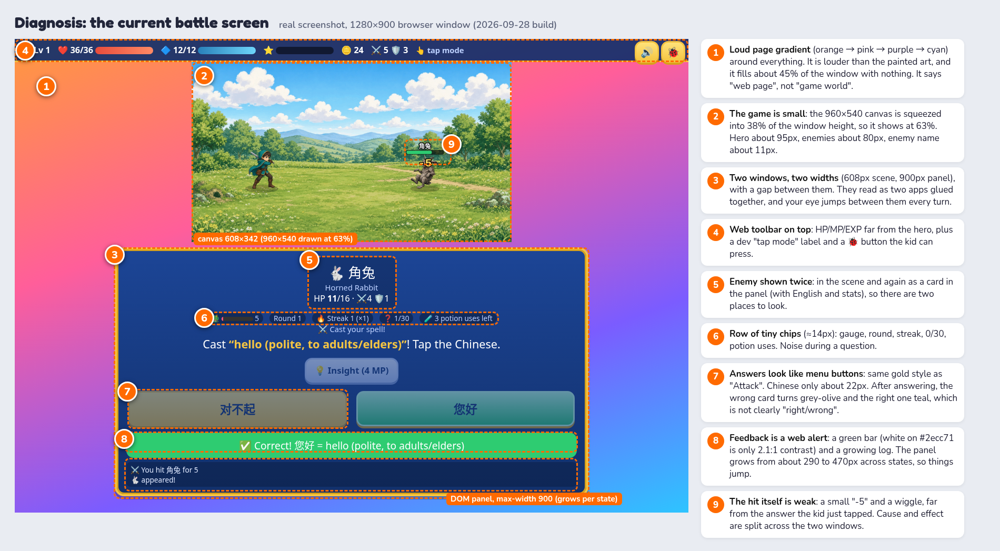
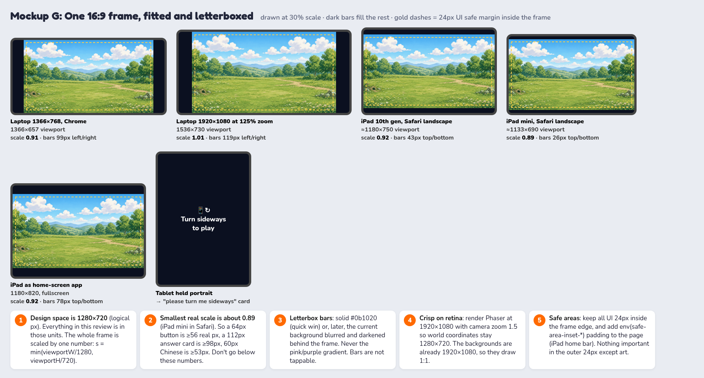
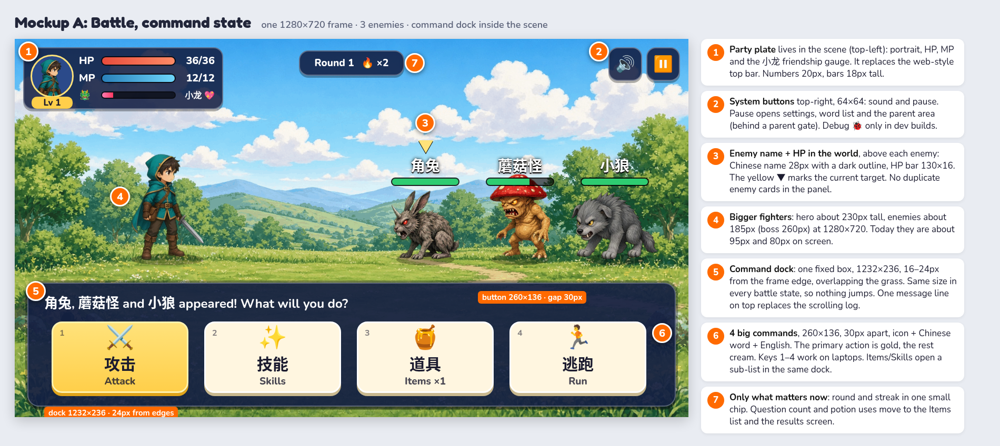
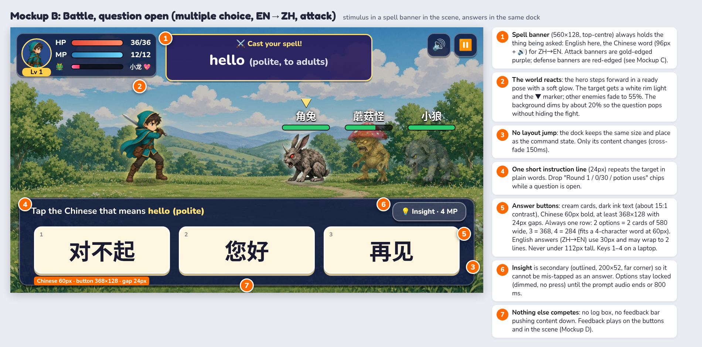
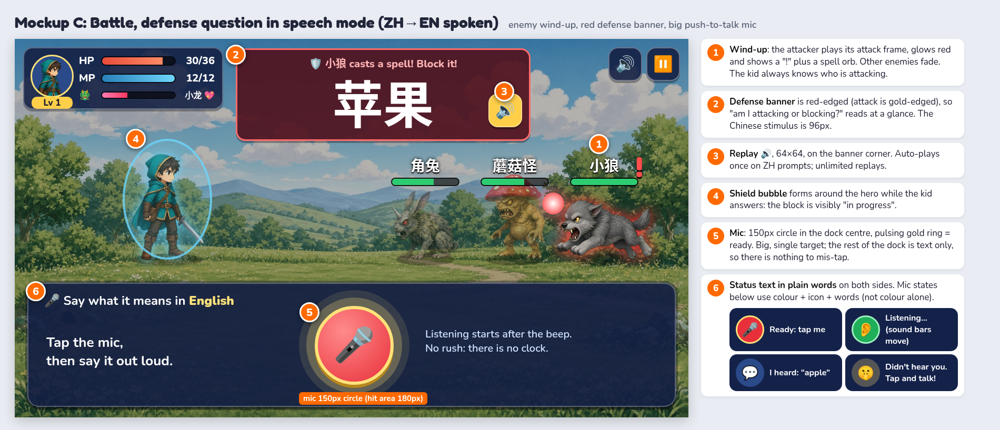
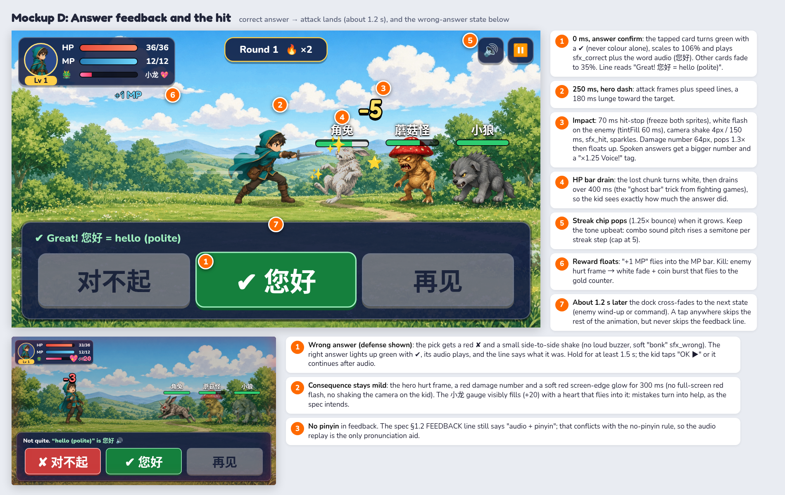
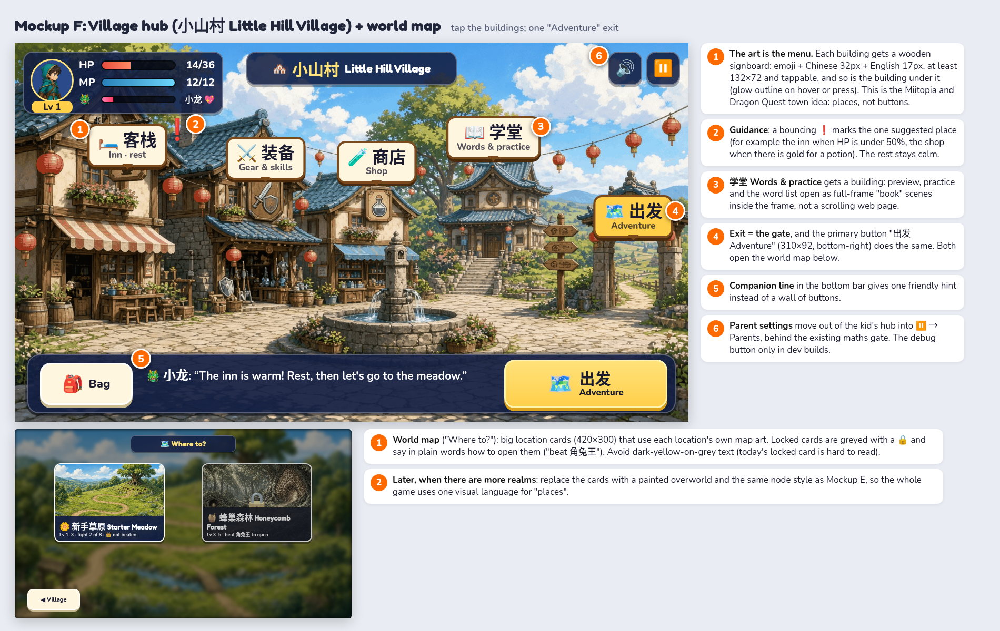
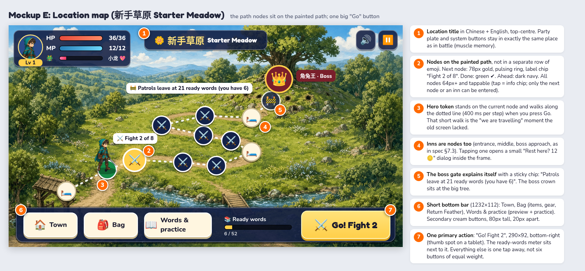

# Chinese Quest: UI layout and game-feel review

*For Jack and GameDev · 29 Sep 2026 · based on the 2026-09-28 build (`/workspace/chinese-rpg/prototype`) and the screenshots in `chinese-rpg/shots/`*

**In one line:** today the game is a small picture on a web page with a web form under it. It should be **one 16:9 game frame** where the menu, the question and the feedback all live **inside the scene**, the way they do in Dragon Quest, Pokémon, Miitopia and Prodigy.

All sizes below are in **logical px in a 1280×720 frame** (see §2). The smallest real scale on our target devices is about 0.89 (iPad mini in Safari), so each number is still big enough after scaling.

---

## 1. Diagnosis: why it looks bad



**The main problem is structure, not colours.** Right now three unrelated layers are stacked down the page: a web toolbar, a small canvas, and a DOM panel. The code shows this: `#game` is fixed at `38vh`, the 960×540 canvas is `Scale.FIT` into it, and `#ui` is a separate scrolling `<div>` (max-width 900px) below it. The result:

1. **It reads as a website.** The orange → pink → purple → cyan gradient is louder than the painted art and covers about 45% of the window. A game screen should end at the edge of the game world. Classic JRPGs, Pokémon and Prodigy all put a dark or scene-coloured frame around the play area, never a bright page background.
2. **The game is small.** At a 1280×900 window the canvas shows at 63% (608×342). The hero is about 95px tall, enemies about 80px, and the enemy name about 11px. The monsters are the reward and the stars of the screen, and they look like thumbnails.
3. **Two windows, two widths, one gap.** A 608px scene over a 900px panel looks like two apps glued together. Every turn the kid's eyes jump from the answer (bottom) to the hit (top) and back. Cause (my answer) and effect (the hit) are in different boxes, which weakens the core "I knew the word, so I hit hard" feeling.
4. **Everything is equally loud.** A toolbar with 8 stats, a debug "tap mode" label, the 🐞 button, an enemy card that repeats what the scene shows, a row of five 14px chips (gauge, round, streak, 0/30, potion uses) and a log. A 10-year-old has to find the question among all that.
5. **The layout jumps.** The panel grows from about 290px (menu) to about 470px (after answering) because the feedback bar and log are added below. Buttons move under the kid's finger, and the page can scroll.
6. **Answers look like menu buttons.** The answer cards use the same gold style as "Attack", and the Chinese is only about 22px. After answering, "wrong" turns grey-olive and "right" turns teal, which doesn't clearly say right or wrong.
7. **Feedback is a web alert, not a game moment.** A green bar (white on `#2ecc71` is 2.1:1 contrast, below the 3:1 minimum for large text), a text log, a small "-5" and a wiggle. There's no hit-stop, no flash, no shake, and no sense of impact.
8. **The village and map are menus under a picture.** The village art is non-interactive and the real choices are 8 flat buttons. The map art has a beautiful winding path, but progress is a row of emoji circles in the panel instead of nodes on that path. "Parent settings" sits in the kid's hub.

**What's already good (keep it):** the painted backgrounds and sprites are strong, the gold-on-navy "RPG window" style is a sound base, the no-pinyin/no-timer rules suit the audience, the spec's input lock after audio is right, and SFX already exist for hit/miss/block/correct/wrong.

---

## 2. The frame: one 16:9 stage, scaled as a whole



**Rules**

- **Design space is 1280×720.** Scale the whole frame by one number, `s = min(viewportW/1280, viewportH/720)`, centre it, and fill the rest with letterbox bars.
- **Letterbox colour:** solid `#0b1020` now. Later, optionally, the current background blurred and darkened behind the frame. Never the gradient.
- **Measured scales:** laptop 1366×768 Chrome 0.91 · 1920×1080 at 125% about 1.0 · iPad 10th gen Safari 0.92 · iPad mini Safari 0.89 · iPad home-screen app 0.92. If a device lands below 0.85, keep the frame anyway: never reflow the UI.
- **Portrait:** show a friendly "Turn sideways to play 📱↻" card. Don't try to lay out a portrait version.
- **Safe margins:** keep all UI at least 24px inside the frame. Add `padding: env(safe-area-inset-*)` on the page wrapper for the iPad home indicator (`<meta name="viewport" content="width=device-width, initial-scale=1, viewport-fit=cover">`). Also set `touch-action: manipulation` and `user-select: none` on the stage to kill double-tap zoom and text selection.
- **Crisp art on retina:** render Phaser at **1920×1080** with `cameras.main.setZoom(1.5)` and `centerOn(640, 360)`. World coordinates stay in 1280×720 and the 1920×1080 backgrounds draw 1:1. (Today's 960×540 canvas is upscaled about 2× on an iPad and looks soft.)

**Implementation: keep DOM for text, but put it inside the frame.** DOM text renders Chinese crisply, supports `lang`, accessibility and the speech API, so keep it. Just stop laying it out as a page:

```html
<div id="stage">            <!-- fills the viewport, background #0b1020 -->
  <div id="game"></div>      <!-- Phaser canvas, Scale.FIT, autoCenter CENTER_BOTH -->
  <div id="frame-ui"></div>  <!-- 1280×720 box, absolutely positioned over the canvas -->
</div>
```

```ts
// after Phaser boots and on every game.scale 'resize' event:
const r = game.canvas.getBoundingClientRect();
const s = r.width / 1280;
Object.assign(frameUi.style, { left: r.left + 'px', top: r.top + 'px', width: '1280px', height: '720px',
  transform: `scale(${s})`, transformOrigin: '0 0', position: 'fixed' });
```

All panels (`.panel`, modal, toasts, dialogs) become absolutely positioned children of `#frame-ui` in 1280×720 coordinates. `#hud`, `#ui` as a scrolling column, the page gradient and the `38vh` rule go away. The modal backdrop covers the frame, not the page.

**Layers (bottom to top)**

| z | layer | what | where it lives |
|---|---|---|---|
| 0 | letterbox | `#0b1020` | page |
| 1 | background art | location backdrop (dimmed 20% during a question) | Phaser |
| 2 | actors | hero, companion, enemies, shadows | Phaser |
| 3 | world UI | enemy names + HP bars, target ▼, damage numbers, spell orbs, particles | Phaser (use the CJK web font, see §3) |
| 4 | HUD | party plate (top-left), system buttons (top-right), location title / round chip (top-centre) | DOM in frame |
| 5 | dock + spell banner | commands, question, answers, mic, feedback line | DOM in frame |
| 6 | dialogs | inn, shop, bag, results, level-up | DOM in frame, dims layers 1–5 |
| 7 | toasts, pause, parent gate, "rotate" card | | DOM in frame |

---

## 3. Type, sizes, tap targets and colour

**Fonts**

- **Chinese:** **Noto Sans SC** (SIL OFL, full Simplified coverage), weights 500 and 700, self-hosted as `woff2`. To keep it small, subset it to the curriculum characters plus UI strings (for example `pyftsubset` over `core-curriculum.csv`), or use Google Fonts' sliced unicode-range files. Fallbacks: `"PingFang SC", "Microsoft YaHei", "Noto Sans CJK SC", sans-serif`.
  - Optional later: **LXGW WenKai** (OFL, Kai style) for the big question word only, because it's closer to the 楷体 shapes in school textbooks. Test it with kids first; sans is the safer default.
- **Always set `lang="zh-CN"`** on Chinese elements. The page is `lang="en"`, so some browsers pick Japanese glyph shapes from a CJK fallback (for example 骨, 直, 关). That's wrong for learners.
- **English/UI:** a rounded, very legible face: **Nunito** (body, 700–800) and **Fredoka** or **Baloo 2** (titles, numbers). Drop Trebuchet and Comic Sans.
- **Phaser text** (enemy names, "我来帮你!"): wait for `document.fonts.load('700 28px "Noto Sans SC"')` before creating text objects, or they bake in the fallback font. Add `stroke: '#000', strokeThickness: 6` and `padding` to avoid clipping.

**Minimum sizes (logical px at 1280×720; real px at 0.89 in brackets)**

| element | size |
|---|---|
| Question word, Chinese (ZH→EN, spell banner) | **96px** (85) |
| Answer card, Chinese (EN→ZH) | **60px bold** (53); 1–4 characters fit on a 284px card |
| Answer card, English (ZH→EN) | 30px bold, may wrap to 2 lines (27) |
| Chinese anywhere else (enemy names, signs, feedback line) | **≥ 28px** (25) |
| English body / instructions | 22–26px (≥ 20) |
| Tertiary labels (key hints, captions) | ≥ 16px, never carry key information |
| Line height | Chinese 1.2, English 1.35 |

**Tap targets (logical px)**

| target | minimum | spacing |
|---|---|---|
| Answer cards | **112px tall** (use 128), ≥ 284px wide | 24px |
| Battle commands | 260×136 | 30px |
| Mic | 150px circle, hit area 180px | nothing else tappable within 40px |
| Primary buttons (Go!, Adventure) | 290×92 | 20px |
| Secondary buttons, signs, map nodes | ≥ 64×64 (about 57 real px, above the 48px guideline) | ≥ 16px |
| System buttons (sound, pause) | 64×64, top-right corner | 8px |

Also: put a press state on every button (translateY 4px + shadow shrink, 80 ms), keep keyboard keys 1–4 / Enter / Space for laptops, and ignore a second tap within 300 ms (kids double-tap).

**Colour and contrast**

| use | colours | contrast |
|---|---|---|
| Panels | navy `rgba(18,30,66,.92)`, 2px `#ffffff47` border, 6px dark drop edge | white text 15:1 |
| Highlight text on panels | gold `#ffe27a` | 11.9:1 |
| Answer cards | cream `#fff6e0`, ink `#1b1b2f` | 15.7:1 |
| Primary action | gold `#ffcf4a` gradient, ink text | 11.5:1 |
| Correct | green `#15803d`, white text, **✔ icon** | 5.0:1 |
| Wrong | red `#c93c3c`, white text, **✘ icon** | 5.0:1 |
| Attack banner / defense banner | gold edge on purple / red edge on dark red | |

Never signal state by colour alone: always add ✔ / ✘ / 🔒 icons and words. That covers colour-blind kids (about 1 in 12 boys).

---

## 4. Battle screen

### 4.1 Command state



| region | rect (x, y, w, h) | contents |
|---|---|---|
| Party plate | 16, 16, 380, 118 | portrait, Lv, HP bar + number, MP bar + number, 小龙 friendship gauge (hearts; glows at 100) |
| Round chip | centred, y 22, 200×48 | "Round 1 · 🔥 ×2", only in the command state |
| System buttons | 1128 and 1200, y 16, 64×64 | 🔊, ⏸️ (pause → settings, word list, parents behind the maths gate) |
| Fighters | feet line y = 420 | hero x 290 (about 230px tall); enemies 1: x 900 · 2: 820/1040 · 3: 780/960/1140 (about 185px; boss about 260px, in the middle slot) |
| Enemy name + HP | above each enemy | Chinese name 28px (outlined) + HP bar 130×16. No English, no stats (those go to a tap-and-hold info card). |
| Dock | 24, 464, 1232, 236 | **same rect in every battle state** |
| Message line | dock top, 24px | one line ("角兔 appeared! What will you do?"), typewriter at about 40 chars/s, tap to finish |
| Commands | 4 × 260×136, 30px gaps | ⚔️ 攻击 Attack (gold) · ✨ 技能 Skills · 🍯 道具 Items · 🏃 逃跑 Run (cream). Skills/Items/target choice open as a list **inside the dock**, with a "◀ Back" button. |

Notes:
- Target choice: when there are 2–3 enemies, tap the enemy itself (the whole sprite is the hit area, ≥ 160×180) or use the ◀ ▶ keys. Show ▼ over the current target. Don't show a separate "Which enemy?" button list.
- The log becomes the message line. Keep the full log behind a small 📜 button in the pause menu for Jack and debugging.
- Remove the question count (0/30) and potion uses from the battle screen. Show potion uses in the Items list ("2 of 3 left this battle"), and questions on the results screen.
- Reserve a companion slot: 小龙 stands behind the hero (x 150, smaller, 60% scale) so the team attack starts from the scene, not a toast.

### 4.2 Question open: multiple choice



- **Spell banner** (420, 18, 560×128; 176 tall when it holds a 96px word) at the top centre **always holds the stimulus**: English for EN→ZH, the Chinese word with a 🔊 button for ZH→EN. Its edge colour tells the turn: **gold = I'm casting** (attack), **red = enemy is casting at me** (defense).
- **The dock holds the answer area only:** one 24px instruction line, then the answer cards in **one row**. 2 options: 580 wide · 3: 368 · 4: 284 · always 128 tall.
- **The scene reacts:** hero steps forward in a ready pose (the hero sheet's frame 2), target gets a white rim glow + ▼, other enemies fade to 55%, background dims 20%. The fight stays visible; it isn't hidden behind a modal.
- **Insight 💡** is a small outlined button (200×52) in the dock's top-right corner, visually different from answers.
- **Input lock** (spec §1.2): cards appear at 60% opacity with no press state until the prompt audio ends or 800 ms. Then they "wake up" (opacity to 100%, a 1.03 scale bump). Don't use a countdown bar anywhere: no timers.
- Options must not reorder or move once shown. The dock content cross-fades (150 ms); the dock itself never resizes.

### 4.3 Question open: speech mode



- The attacker telegraphs: attack frame, red glow, "!" and a spell orb. A shield bubble forms around the hero while the kid answers a defense question.
- Dock centre: a **150px mic** (hit area 180px) with a pulsing gold ring when ready. Left: "Tap the mic, then say it out loud." Right: "Listening starts after the beep. No rush." Don't put any other button in the dock in speech mode.
- **Mic states** (colour + icon + words): Ready 🎤 red/gold pulse → Listening 👂 green, with a live sound-level ring or bars (the kid sees that the game hears them) → I heard: "apple" 💬 shown for 800 ms before grading → technical failure 🤫 "Didn't hear you. Tap and talk!" (spec §9.1 re-prompt, same question).
- A soft "beep" plays when listening starts. Duck the music by 60% while the prompt audio plays and while listening.
- If speech gets paused for the session, show the spec's friendly banner as a toast inside the frame, then switch to cards. Never show a raw error.

### 4.4 Feedback and the hit



**Correct (attack)**

1. **0 ms:** the tapped card turns green with ✔ and scales to 106%. `sfx_correct` plays, then the word audio (您好). Other cards fade to 35%. The message line reads "✔ Great! 您好 = hello (polite)".
2. **250 ms:** the dock dims slightly and the hero dashes (attack frames + speed lines, 180 ms lunge).
3. **Impact:** a 70 ms hit-stop (pause the actor tweens and animations), a white flash on the enemy (`setTint(0xffffff).setTintMode(Phaser.TintModes.FILL)` for 60 ms; note `setTintFill` is a no-op in Phaser 4), `cameras.main.shake(150, 0.004)`, `sfx_hit`, sparkles. A 64px damage number pops to 1.3× and floats up. For a spoken answer, the number is bigger and gets a "×1.25 🎤 Voice!" tag.
4. **HP "ghost bar":** the lost chunk turns white, then drains over 400 ms.
5. **Rewards fly to the HUD:** "+1 MP" into the MP bar. The streak chip bounces. The streak sound pitch goes up one step per streak level (cap at 5).
6. **About 1.2 s:** go to the next state. Tapping anywhere speeds up the animation, but the feedback line always stays at least 800 ms.

**Correct (defense):** the shield bubble flashes bright blue, `sfx_block`, "🛡️ Blocked!" floats over the hero, and the enemy recoils.

**Wrong (either turn):** the picked card shakes side to side (3 × 6px, 200 ms) with a red ✘, and a soft `sfx_wrong` ("bonk", not a buzzer). The correct card lights green with ✔ and its audio plays. The line says "Not quite. “hello (polite)” is 您好 🔊". Hold this for **at least 1.5 s**, then show a small "OK ▶" button (or continue after the audio). The consequence is animated but mild: a miss whiff, or the hero's hurt frame with a red number and a 300 ms soft red edge glow. Don't shake the camera and don't flash the full screen red on the kid's mistake. A heart flies into the 小龙 gauge (+20), so the mistake visibly turns into help.

**Companion team attack:** when the gauge is full, 小龙 dashes in from behind the hero with a 28px "我来帮你!" speech bubble, then the hit uses the same juice as above (1.5 s, spec §6.6).

**Victory / defeat:** victory = enemies fade with a coin burst, then `stg_victory` and a results card inside the frame (EXP bar filling, gold counting up, words that improved shown as Chinese 40px chips). Defeat = a soft fade to the inn with a warm line from the innkeeper. No "GAME OVER" screen.

**Sound mix:** music -6 dB under SFX. Word audio always wins: duck music and SFX while a word plays. Keep the mute button in the same corner on every screen.

---

## 5. Turn state flow (what the screen shows)

| state | dock | banner | scene | exits to |
|---|---|---|---|---|
| ROUND_START | message line | – | idle anims, round chip | COMPANION_CHECK |
| COMPANION_CHECK (gauge full) | "小龙 is ready!" | – | team attack, 1.5 s | CHECK_END |
| HERO_ACTION_SELECT | 4 commands | – | ▼ on default target | TARGET_SELECT / ASK / potion / flee |
| TARGET_SELECT (2–3 foes) | "Tap an enemy" + ◀ Back | – | enemies bob, ▼ follows the finger | ASK |
| PROMPT_PLAY (locked) | instruction + cards at 60% / mic disabled | stimulus (+ audio) | hero ready pose, dim 20% | INPUT_UNLOCKED |
| INPUT_UNLOCKED / AWAIT_ANSWER | cards live / mic pulsing | stimulus | – | GRADE |
| SPEECH_LISTEN | mic green + level ring | stimulus | – | SPEECH_RESULT |
| GRADE + FEEDBACK | ✔/✘ cards, feedback line | stays | hit or miss juice | RESOLVE |
| ENEMY WIND-UP (per enemy) | "角兔 is casting!" (400 ms) | red banner appears | attacker glows, "!" | PROMPT_PLAY (defense) |
| CHECK_END → VICTORY/DEFEAT | results card in the frame | – | fade out | MAP / INN |

Timings: state changes cross-fade in 150 ms, and the whole attack sequence runs 1.2–1.5 s. A full 3-enemy round should take about 25–40 s of mostly thinking time.

---

## 6. Village, world map and location map

### 6.1 Village hub and world map



- **The art is the menu.** Put a wooden signboard on each building: emoji + Chinese 32px + English 17px, at least 132×72. The building under the sign is also tappable and glows on press. The current art already matches: cup sign = 🛏️ 客栈 Inn, sword-and-shield sign = ⚔️ 装备 Gear & skills, potion sign = 🧪 商店 Shop, the temple at the back = 📖 学堂 Words & practice, the arch gate = 🗺️ 出发 Adventure.
- **One suggestion at a time:** a bouncing ❗ over the place the kid probably needs (inn when HP < 50%, shop when they can afford a potion, 学堂 for a new location's preview).
- **Bottom bar** (24, 592, 1232×112): 🎒 Bag · a companion hint line ("The inn is warm! Rest, then let's go to the meadow.") · primary **出发 Adventure** (310×92, bottom-right).
- Inn, shop, gear and bag open as **dialogs inside the frame** (max 1000×560, centred, dims the scene), each with a big ✕ (64×64) top-right.
- **World map ("Where to?"):** big location cards (420×300) with the location's own map art, name in Chinese + English, level range and progress. Locked cards are greyed with 🔒 and say in plain words how to open them ("beat 角兔王"). Today's dark-yellow text on a grey locked card is hard to read. When more realms exist, switch to a painted overworld with the same node style as the location map.
- **Parent settings** move to ⏸️ → Parents (behind the existing maths gate). The 🐞 debug button only in dev builds (`import.meta.env.DEV`).

### 6.2 Location map



- **Put the nodes on the painted path.** The meadow art already has a path with stepping stones. Place the 13 nodes (inn, 4 fights, inn, 4 fights, inn, patrol gate, boss) along it. Keep node positions as data per background, for example `locations.json → mapNodes: [{x, y, kind}]` in 1280×720 coordinates, joined by a dotted line.
- **Node styles:** next = 78px gold with a pulsing ring and a "Fight 2 of 8" chip · done = green ✔ · ahead = navy ⚔️ · inn = cream 🛏️ · patrol gate = 🚧 with a sticky chip "Patrols leave at 21 ready words (you have 6)" · boss = 92px crown at the big tree with a name chip.
- **The hero token** stands on the current node and walks the dotted line (400 ms per node) when you press Go. This short "journey" beat makes progress feel physical.
- **Bottom bar:** 🏠 Town · 🎒 Bag (items, gear, Return Feather) · 📖 Words & practice · the "Ready words 6/52" meter · primary **⚔️ Go! Fight 2** (290×92, bottom-right). Today's 8 equal buttons collapse into 1 primary + 3 secondary.
- Tapping a node shows its info chip. Only the next node or an inn can be entered.

### 6.3 Preview, practice and word list

These are currently long scrolling web pages (a table of 52 rows). Keep them inside the frame as a **"book" dialog** (1100×600) with pages instead of scrolling: 8 word cards per page (Chinese 44px, 🔊 64×64, English 20px, a progress pip). Big ◀ ▶ page arrows (72×72). Practice modes become 5 big tiles (240×200) on one page, with the "needs speech" tile clearly locked (🔒 + words), not a faded button.

---

## 7. References (principles, not copies)

- **Dragon Quest / Final Fantasy (classic):** one bordered window family, always in the same place, with the menu over the bottom of the scene. Short message lines instead of logs. Players learn where to look, and it never moves.
- **Pokémon:** enemy name + HP bar live next to the monster. The "ghost" HP drain and a short hit flash make every hit legible. Attack/defense framing is clear from who is animated.
- **Miitopia:** big, readable characters, generous animation on every action, and the companion/friendship system shown in the scene with hearts. Kid-friendly failure (help arrives instead of punishment).
- **Prodigy:** a math question before each spell, placed over the battle so the monster stays in view. Big answer tiles and immediate, noisy, positive feedback. It's the closest analogue to our core loop, and also a reminder to keep the spell animation short so the question rhythm isn't lost.
- **Octopath Traveler:** a strong "weak point / break" read on the enemy itself. Useful later for showing Tired 😪 on the enemy (spec's Tired state) instead of in the log.

---

## 8. Prioritised change list

### Quick wins (about 1–2 days in total, no new art)

1. **Kill the page look:** body background `#0b1020`. Remove the gradient. Hide 🐞 and the "tap mode" label outside dev builds.
2. **Make the game big:** switch the canvas to 1280×720 logical (1920×1080 render + camera zoom 1.5), `Scale.FIT` to the full viewport, centred. Remove `#game { flex: 0 0 38vh }`.
3. **Overlay the UI on the frame:** add `#frame-ui` synced to the canvas rect (snippet in §2). Move the battle panel into it as a fixed dock (24, 464, 1232×236), and move `#toasts` and `#modal` inside it too.
4. **Fixed-size dock:** remove the log box and the feedback bar from the battle flow. Show feedback as the dock's message line and as ✔/✘ on the cards, so the dock never changes height.
5. **Bigger Chinese:** answer cards 60px (EN→ZH) / 30px English (ZH→EN), min height 128. Question word 96px. Enemy names 28px. Add `lang="zh-CN"` and the Noto Sans SC web font.
6. **Distinct answer cards:** cream cards with ink text. Right = `#15803d` + ✔, wrong = `#c93c3c` + ✘ (replaces the grey/teal and the 2.1:1 green bar).
7. **Remove the duplicate enemy card and the chip row** from the battle panel. Move potion uses into the Items list and the question count to results.
8. **Cheap juice:** white fill-tint flash (Phaser 4 `setTintMode(FILL)`), 70 ms hit-stop, camera shake 150 ms, damage numbers at 64px with a pop, and a wrong-card shake. All in `view.ts`, using the existing SFX.

### Medium (about 3–5 days)

9. **Party plate in the frame** replacing `#hud`: HP/MP/friendship gauge, with rewards that fly into it.
10. **Spell banner** (attack gold / defense red) with 🔊 replay, plus enemy wind-up telegraphs and the defense shield bubble.
11. **Command dock with 4 big bilingual commands** and in-dock sub-lists (Skills, Items). Tap-the-enemy targeting with ▼.
12. **Speech UI:** 150px mic, live sound-level ring, "I heard: …" step, beep cue, music ducking.
13. **HP ghost bar, streak chip bounce, pitch-rising streak sound, coin burst on kills, results card in the frame.**
14. **Location map nodes on the painted path** (a `mapNodes` data field per location) with the walking hero token and a single "Go!" button.
15. **Parent settings and word list behind ⏸️.** A "rotate to landscape" card. Safe-area padding.

### Bigger (1–2 weeks, some need art)

16. **Interactive village**: building signboards, hotspots, ❗ guidance, and dialogs in the frame for inn, shop and gear.
17. **World map** location cards (then later a painted overworld).
18. **Preview/practice as a paged "book"** inside the frame instead of scrolling pages.
19. **Companion on screen** (小龙 sprite behind the hero, dash-in team attack with a "我来帮你!" bubble). Needs a sprite.
20. **Polish art:** a panel frame 9-slice (wood or gold trim) to replace CSS borders, a mic/listening animation, hit sparks and shield VFX sprites, and a blurred-background letterbox.

---

## 9. Open points and conflicts to decide

- **Pinyin in feedback:** spec v3 §1.2 still says FEEDBACK shows "the correct answer + audio + pinyin". That conflicts with the no-pinyin rule. This review assumes **no pinyin, audio only**. Please update the spec line. (The older `proto-boss.png` screenshot also showed pinyin under enemy names. The current build doesn't.)
- **Bilingual command labels (攻击 / 技能 / 道具 / 逃跑):** I propose them as free incidental vocabulary. If Jack wants English-only menus, keep the same layout and drop the Chinese line.
- **4-option rows:** the meadow uses 3 options (`mcOptions: 3`). The one-row layout supports up to 4. If later tiers go above 4, switch to a 2×3 grid by making the dock 300px tall **for that location only** (still fixed within a battle).
- **Skipping animations:** I suggest tap-to-speed-up but never skipping the feedback line. Check whether that fits the anti-guess-spam rules (§1.4).

---

### Files

- Review: `/workspace/desy/ui-layout-review.md`
- Images: `../images/ui-review/diagnosis.png`, `../images/ui-review/scaling.png`, `../images/ui-review/battle-command.png`, `../images/ui-review/battle-question-mc.png`, `../images/ui-review/battle-question-speech.png`, `../images/ui-review/battle-feedback.png`, `../images/ui-review/map.png`, `../images/ui-review/village.png`
- Mockup sources (HTML/CSS; they use the real game art from `prototype/dist`): `ui-review/src/*.html` (kept in Desy's workspace, not in the repo). Re-render with `node ui-review/src/render.mjs <name>` (uses the prototype's `playwright-core` and `/usr/bin/google-chrome`).
